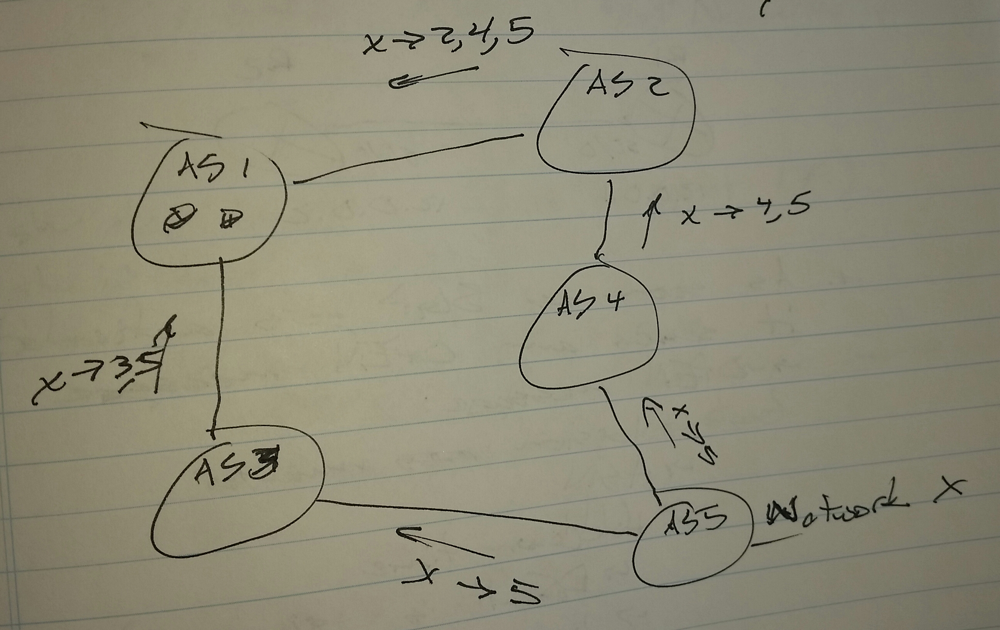
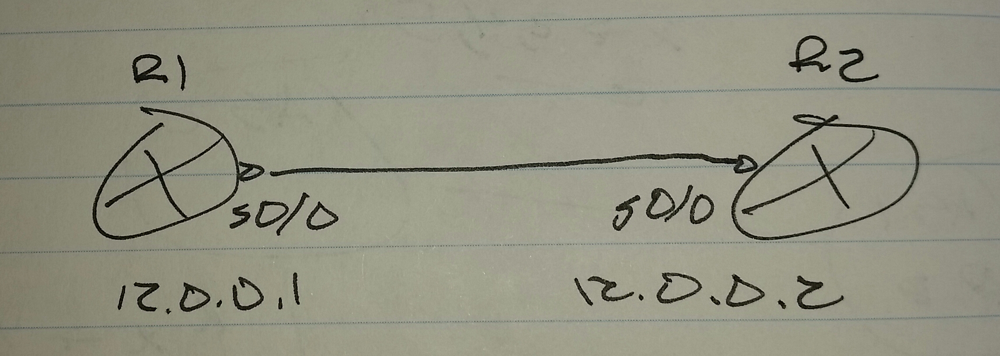
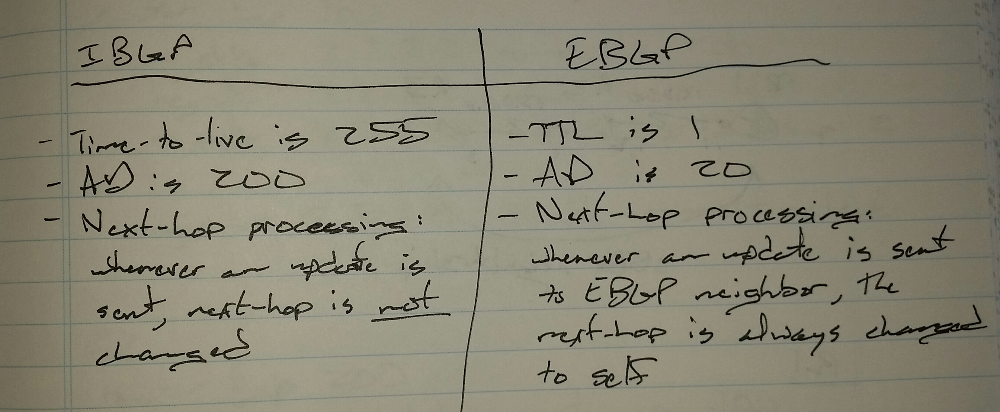
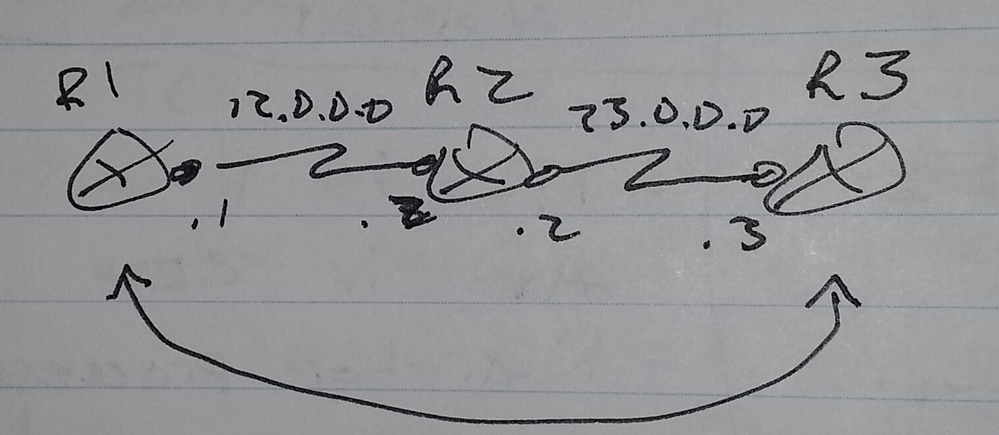
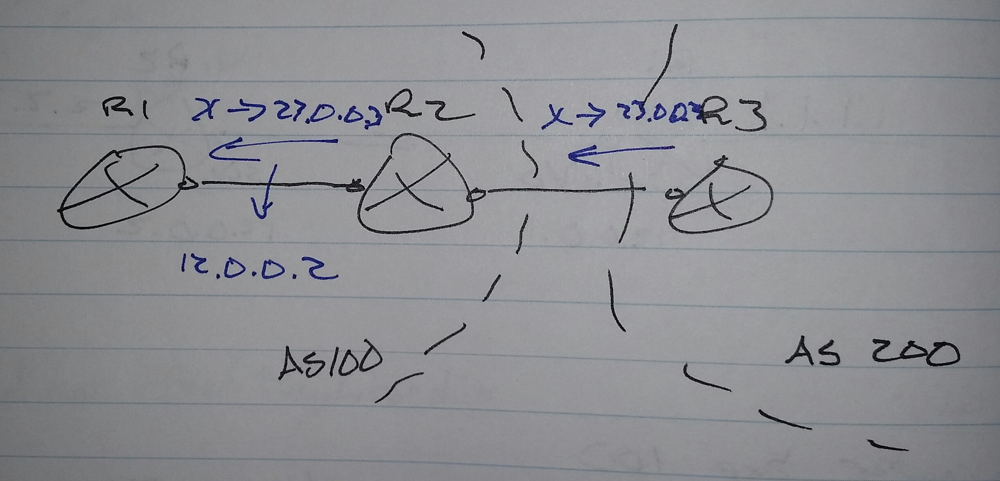
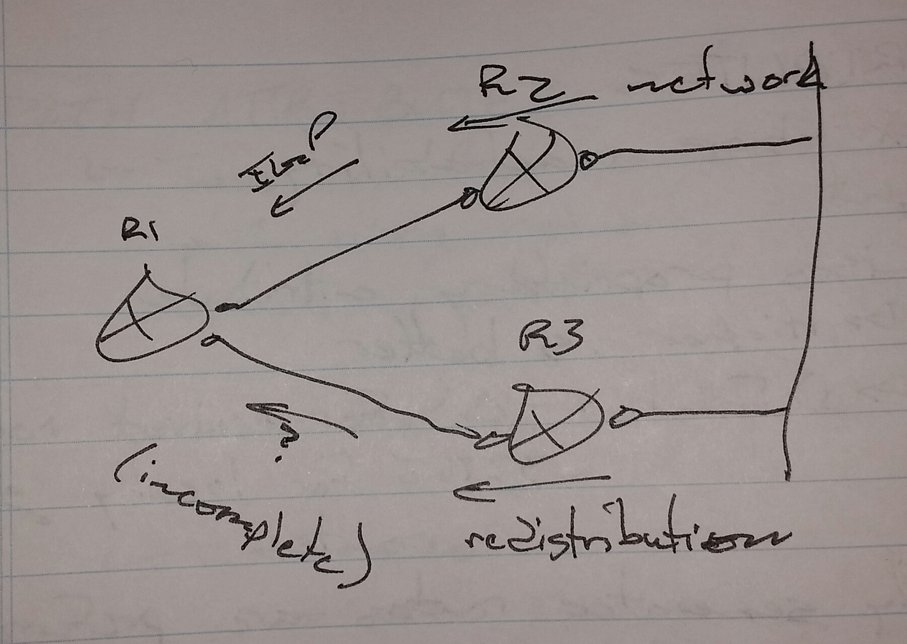
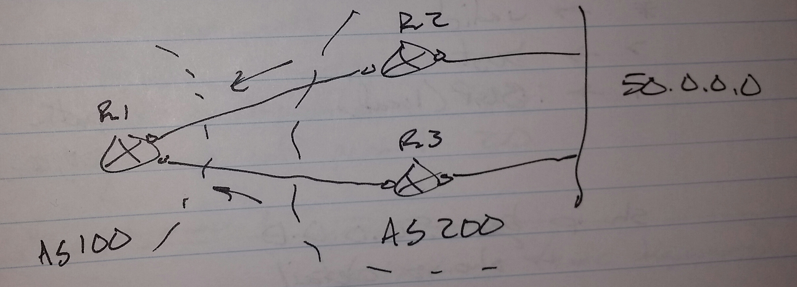
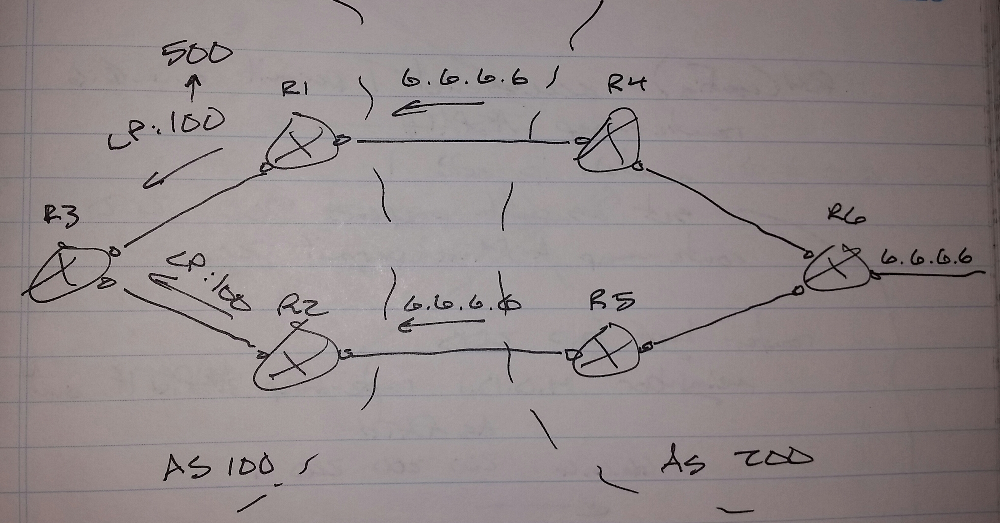

# BGP - Class Notes

**BGP \- Border Gateway Protocol** \(25 Aug 2014\)
Labs: BGP 1 \- 6

\- Exterior Gateway Protocol
     \-\> Designed for expandability\! Task 4.3
router eigrp 1
 passive\-interface e0/1.35
\- IGPs created for fast convergience

\- BGP main feature

     \-\> Scalability

\- BGP version 4 \(1993\)

     \-\> Supports aggregation \(supernetting\)

     \-\> Has been updated with many "capabilities" over the years

\- TCP port 179

     \-\> To form neighborship

\- 4 message types

     \-\> Open

     \-\> Update

     \-\> Notification

     \-\> Keepalive

\- BGP metric is Path Attribute

\- Uses Autonomous System Number to identify an organization / administrative boundary

\- Path Vector Protocol

      \- or \-

\- Distance Vector Protocol

\- BGP compares the AS sequence and decides the best path

     \-\> Ordered list of organizations crossed

\- Support MD5 authentication

\- Supports aggregation \(summarization\) and default routing

\- Summarization is the single biggest topic within BGP

\- Supports advanced filtering with the help of Regular Expressions

\- Two types of neighborship

     \-\> Internal

     \-\> External

**Neighborship Formation**

As soon as BGP gets activated, it sends an OPEN message

\- Open message

     \-\> Version number

     \-\> ASB

     \-\> Holddown time

          \-\> Default is 180 seconds

          \-\> Lower is better if there is a conflict between neighbor configurations

     \-\> Router\-id

     \-\> Options

          \-\> MD5 hash

          \-\> Capabilities list

          \-\> Any specific feature

**Finite State Machine \(FSM\)**

1. IDLE

     \-\> No TCP synchronize message sent or received

2. CONNECT

     \-\> TCP sync message sent

3. ACTIVE

     \-\> TCP is actively trying to synchronize

Steps 1 \- 3 are TCP based

4. OPENSENT

     \-\> BGP OPEN message is sent

5. OPENCONFIRM

     \-\> BGP OPEN message is received and the local side agrees to the parameters

6. ESTABLISHED

     \-\> BGP neighborship is up

Step 4 \- 6 are BGP based

sh tcp brief

     \-\> look for port 179

sh ip bgp summary

     \-\> shows neighbor state

     \-\> ESTABLISHED is not shown, a numerical value is shown instead

R1\(config\)\# router bgp 100

neighbor 12.0.0.2 remotes\-as 200

     \-\> TCP Destination \- 12.0.0.2

     \-\> TCP Source \- 12.0.0.1

R2\(config\)\# router bgp 200

neighbor 12.0.0.1 remotes\-as 100

     \-\> TCP Destination \- 12.0.0.1

     \-\> TCP Source \- 12.0.0.2

Neighbor IP address is the TCP Destination

\- Local exit interface IP address is the TCP Source

\- Source must match the other end's neighbor configuration

Assume the loopbacks of R1 and R2 are reachable from each other

R1\(config\)\# router bgp 100

neighbor 2.2.2.2 remote\-as 200

neighbor 2.2.2.2 update\-source lo0

     \-\> TCP Destination \- 2.2.2.2

     \-\> TCP Source \- 1.1.1.1

R2\(config\)\# router bgp 200

neighbor 1.1.1.1 remote\-as 100

neighbor 1.1.1.1 update\-source lo0

     \-\> TCP Destination \- 1.1.1.1

     \-\> TCP Source \- 2.2.2.2

**Multihop eBGP Neighborship**

R1\(config\)\# router bgp 100

neighbor 23.0.0.3 remote\-as 200

neighbor 23.0.0.3 ebgp\-multihop 2

R3\(config\)\# router bgp 200

neighbor 12.0.0.1 remote\-as 100

neighbor 12.0.0.1 ebgp\-multihop 2

eBGP checks to see if the neighbor is on a directly connected network

\- If not, an OPEN message is never sent

**eBGP Neighbor over Loopback**

Assume there is a router between R1 and R2

R1\(config\)\# router bgp 100
neighbor 2.2.2.2 remote\-as 200
neighbor 2.2.2.2 update\-source lo0
\! neighbor 2.2.2.2 ebgp\-multihop

neighbor 2.2.2.2 disable\-connect\-check

R2\(config\)\# router bgp 200

neighbor 1.1.1.1 remote\-as 100

neighbor 1.1.1.1 update\-source lo0

\! neighbor 1.1.1.1 ebgp\-multihop

neighbor 1.1.1.1 disable\-connect\-check

**BGP Authentication**

router bgp 100

neighbor \<IP address\> password \<password\>

**Changing Next\-hop Processing**

Next\-hop should be changed to "self" on edge routers towards iBGP neighbors

router bgp 100

neighbor 12.0.0.1 remote\-as 100

neighbor 12.0.0.1 next\-hop\-self

To set it back to default

neighbor \<IP address\> next\-hop\-unchanged

**Database Exchange**

\- UPDATE packets are used

     \-\> Network Layer Reachability Information \(NLRI\)

          \-\> network / subnet mask

     \-\> PATH\-Attribute

     \-\> WITHDRAWN Routes

\- When updates are received, the information is kept in the BGP table

sh ip bgp

To advertise or introduce networks into BGP

\- "network" command

\- redistribution

The network command checks the routing table for the existence of the network

\- If the network exists \(by any means\), it will be advertised by BGP

\- If the network does not exist, BGP ignores the network command

**PATH ATTRIBUTES**

\- These are BGP parameters associated with every network received in the UPDATE packet

\- Helps BGP to decide the best route

\- Two types

     \-\> Well Known

          \-\> Mandatory

               \- Every UPDATE packet must have the attribute

               \- next\-hop, origin, as\-path

          \-\> Discretionary

               \- Every BGP device recognizes the attribute, but it may or may not be present in the UPDATE packet

               \- local\-preference

     \-\> Optional

          \-\> Transitive

               \- May not be recognized by the receiving router, but will be sent further

               \- community

          \-\> Non\-transitive

               \- May not be recognized by the receiving router and will be dropped if not

               \- MED \(multi\-exit descriminator\)

**PATH ATTRIBUTES Preference / Priority / Whatever**

1. Next\-hop reachability

2. Weight

     \-\> Cisco proprietary attribute

          \-\> Higher is better

          \-\> Default is 0 for received routes, \-32768 for locally generated routes

     \-\> This is only locally significant

3. Locally generated routes are preferred over remote routes

4. Local preference

     \-\> Open attribute \(not Cisco proprietary\)

     \-\> Higher is better

     \-\> Default is 100 for every route

     \-\> Significant only in the local AS

     \-\> 0 \- 4294967295 \(2^32\)

5. AS\_PATH

     \-\> AS sequence

     \-\> lower number of organizations traversed, the better the route is

6. Origin

     \-\> Internal

          \-\>Originated by "network" command

          \-\> IGP

     \-\> External

          \-\> EGP

               \-\> "The" Exterior Gateway Protocol

               \-\> Old

               \-\> Should never see

               \-\> Run to the proctor

          \-\> Incomplete

          \-\> IGP \> EGP \> Incomplete

7. Multi\-exit Discriminator \(MED\)

     \-\> Also known as "metric" in Cisco

     \-\> 32 bit variable

     \-\> 0 \- 4294967295

     \-\> Default is 0 for received routes

     \-\> Equal to the metric of IGP for redistributed routes

     \-\> Lower is better

8. Neighbor Type

     \-\> eBGP \> iBGP

9. IGP cost to reach next hop in case both are iBGP neighbors

10. Oldest eBGP neighbor is preferred if there are multiple

11. If IGP cost is also the same, the lower router\-id neighbor is preferred

**Manipulating PATH ATTRIBUTE for best path selection**

\- Outgoing update manipulation

     \-\> Suggests a preferred route to a neighbor

     \-\> Neighbor can ignore

     \-\> AS\-PATH, ORIGIN, MED

\- Incoming update manipulation

     \-\> Changing local route / AS decision on the best route

     \-\> Weight, LOCAL\_PREFERENCE, AS\-PATH, ORIGIN

Weight

     \-\> Locally significant

     \-\> Only affects local router's decision

Scenario \-\> Change the "weight" attribute so it always elects R2 as next\-hop to reach 50.0.0.0.

R1\(config\)\# access\-list 1 permite 50.0.0.0
 route\-map WEIGHT
  match ip add 1
  set weight 200
 route\-map WEIGHT permit 10
     \-\> The router\-map permit statement is needed, otherwise all other routes are denied \(dropped\)
 router bgp 100
 neighbor 12.0.0.2 remote\-as 200
 neighbor 12.0.0.2 route\-map WEIGHT in

Soft BGP reset \(TCP connection not reset\)
 clear ip bgp \* soft \[ in | out \]

Otherwise:
clear ip bgp 12.0.0.2 \[ in | out \]
clear ip bgp \*

sh ip bgp
      \-\> shows BGP table
                      next\-hop    weight
\*\> 50.0.0.0     12.0.0.2     200
\*                    12.0.0.3

\* \-\> valid
\> \-\> best
i \- iBGP

path
300,200,100,i

sh ip bgp 50.0.0.0
     \-\> shows more detail

Scenario \-\> To reach R6 lo0 network, all routers of AS 100 must choose R1 as exit point.

R1\(config\)\# access\-list 1 permit 6.6.6.6
 router\-map LP
  match ip add 1
  set local\-preference 50
 route\-map LP permit 20
router bgp 100
 neighbor 14.0.0.4 remote\-as 200
 neighbor 14.0.0.4 route\-map LP in

Scenario \- \> Configure AS 200 in a way that AS 100 always uses R2 as the exit point to reach 6.6.6.6. \(Using AS\-PATH\)

Before:

6.6.6.6     200 i

R4\(config\)\# access\-list 1 permit 6.6.6.6
 route\-map ASPATH
  match ip add 1
  set as\-path prepend 200 200
 route\-map ASPATH permit 20
router bgp 200
 neighbor 14.0.0.1 remotes\-as 100
 neighbor 14.0.0.1 route\-map ASPATH out

After:
               AS\-PATH
6.6.6.6     200 200 200 i

In "route\-map ASPATH", "set origin incomplete" also works.

Scenario \- \> Configure AS 200 in a way that AS 100 always uses R2 as the exit point to reach 6.6.6.6. \(Using MED\)

R4\(config\)\# access\-list 1 permit 6.6.6.6
 route\-map MED
  match ip add 1
 route\-map MED permit 20
 router bgp 200
  neighbor 14.0.0.1 remote\-as 100
  neighbor 14.0.0.1 route\-map MED out

**Missing \(0\) MED**
 \- The default MED \(0\) is best
 \- The behavior can be changed so that missing MED \(0\) will be considered worst
 \- If MED is then configured between 2 or more routers, lower is better

router bgp 100
 bgp bestpath med missing\-as\-worst

MED Comparison
 \- MED is compared only if the incoming updates are from the same AS
     \-\> This can be disable

router bgp 100
 bgp always\-compare\-med

In the lab, you should never have to change the router\-id to influence elections or the selection of routes.
