# BGP Aggregation - Class Notes

**BGP Aggregation** \(26 Aug 2014\)

Lab:  BGP 1 \- 6

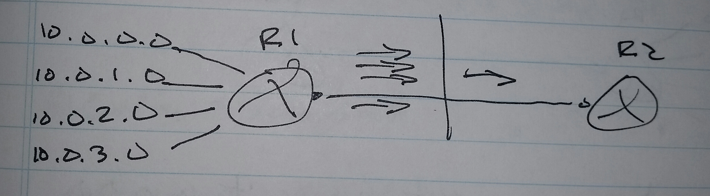

R1\(config\)\# router bgp 100

 aggregate\-address 10.0.0.0 255.255.255.252.0 summary\-only

**summary\-only**

 \- Optional

 \- Suppresses the specific routes and sends the summary route only

     \-\> Otherwise the specific routes and the summary route will be sent

**suppress\-map**

 \- Can suppress specific routes and leak other routes

 \- Any routes which are permitted in this map will be suppress and any routes that are denied will be leaked

 \- Also sends the summary route

Scnario \-\> On R1, create a summary route and also leak 10.0.1.0 and 10.0.3.0 specific routes to R2 as well.

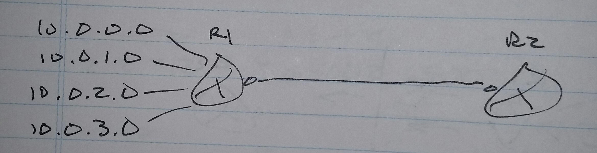

R1\(config\)\# access\-list 10 permit 10.0.0.0

 access\-list 10 permit 10.0.2.0

 route\-map SUPPRESS

 match ip add 10

router bgp 100

 aggregate\-address 10.0.0.0 255.255.252.0 summary\-only suppress\-map SUPPRESS

     \-\> "summary\-only" is optional in this example

**unsurpress\-map**

 \- Leaks specific routes which are permitted

 \- Neighbor specific command

Scenario \-\> Summarize 10.0.0.0 network on R1 and make sure R2 always chooses R3 as the next\-hop to reach 10.0.2.0 /24;  everything else can go directly to R1.

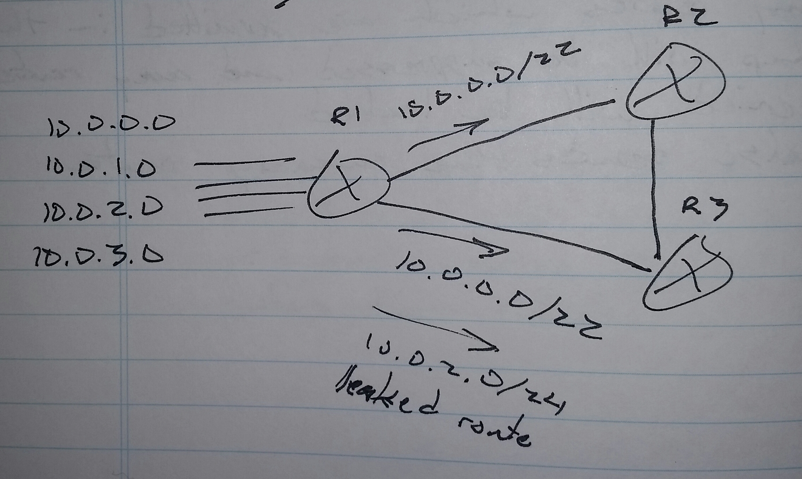

R1\(config\)\# access\-list 10 permit 10.0.2.0

 route\-map UNSURPRESS

 match ip add 10

router bgp 100

 aggregate\-address 10.0.0.0 255.255.252.0 summary\-only

 neighbor 13.0.0.3 unsupress\-map UNSURPRESS

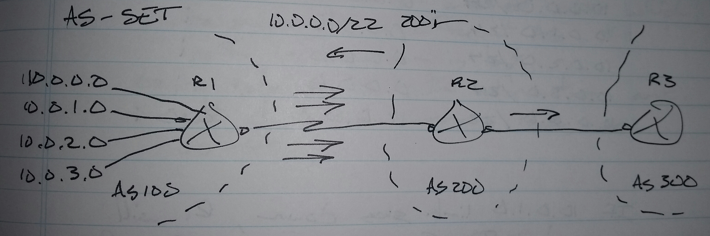

**AS\-SET**

 \- Whenever a router summarizes the specific routes of another router which belongs to a different AS, the path information is lost

 \- To retain the path information and add it to the summary route, use as\-set.

If R2 creates a summary address, the summary address will be sent back to R1.

     \-\> Usually not a good thing

R2\# sh ip bgp

                      next\-hop         as\-path

10.0.0.0          12.0.0.1          100 i

10.0.1.0          12.0.0.1          100 i

10.0.2.0          12.0.0.1          100 i

10.0.3.0          12.0.0.1          100 i

R2\(config\)\# router bgp 100

 aggregate\-address 10.0.0.0 255.255.252.0 summary\-only

R2\# sh ip bgp

                           next\-hop         as\-path

10.0.0.0 /24          12.0.0.1          100 i

10.0.1.0 /24          12.0.0.1          100 i

10.0.2.0 /24          12.0.0.1          100 i

10.0.3.0 /24          12.0.0.1          100 i

10.0.0.0 /22          0.0.0.0            i

R3\# sh ip bgp

                           next\-hop         as\-path

10.0.0.0 /22          0.0.0.0            i

R1\# sh ip bgp

                           next\-hop         as\-path

10.0.0.0 /24          0.0.0.0            i

10.0.1.0 /24          0.0.0.0            i

10.0.2.0 /24          0.0.0.0            i

10.0.3.0 /24          0.0.0.0            i

10.0.0.0 /22          12.0.0.2          200 i

If 10.0.1.0 link goes down, R1 will send traffic for 10.0.1.0 to R2;  R2 will send traffic back to R1, creating a loop.

R2\(config\)\# router bgp 100

 aggregate\-address 10.0.0.0 255.255.252.0 summary\-only as\-set

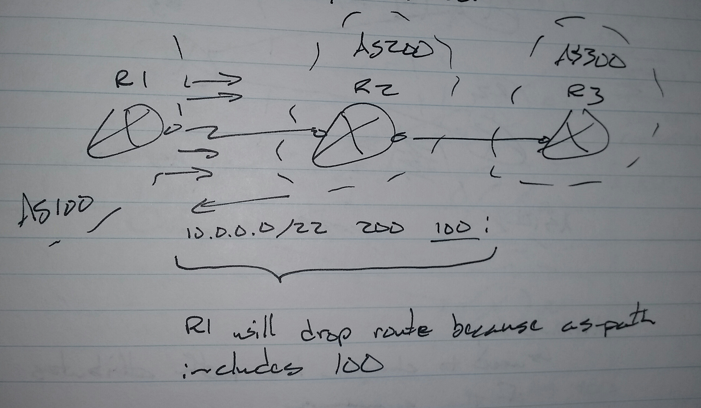

e.g.

10.0.0.0 /24          500 i

10.0.1.0 /24          600 i

10.0.2.0 /24          700 i

10.0.3.0 /24          800 i

10.0.0.0 /22          500 600 700 800 i

     \-\> Combined when as\-set is used

**Attibute\-map**

 \- Used to change the path attributes of the summary

     \-\> but it cannot AS\-PATH

R2\(config\)\# route\-map ATTRIBUTE

 set origin incomplete

router bgp 100

 aggregate\-address 10.0.0.0 255.255.252.0 summary\-only attribute\-map ATTRIBUTE as\-set

     \-\> as\-set used in case a reflected route is created

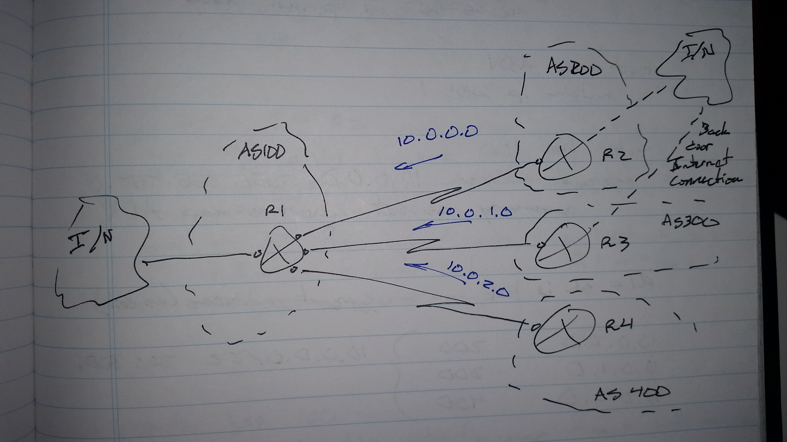

**Advertise\-map**

R1\# sh ip bgp

10.0.0.0          200

10.0.1.0          300

10.0.2.0          400

 \- aggregate address

10.0.0.0 /22     200 300 400 i

     \-\> Will be dropped by AS 200, 300, and 400

Scenario \-\> R1 should create a summary address for 10.0.0.0, 10.0.1.0, and 10.0.2.0 and this summary address should retain the AS\-PATH information of AS 200 and AS 300.

R1\(config\)\# access\-list 1 deny 10.0.2.0

 access\-list 1 permit any

route\-map ADV

 match ip add 1

router bgp 100

 aggregate\-address 10.0.0.0 255.255.252.0 summary\-only as\-set advertise\-map ADV

R1\# sh ip bgp

10.0.0.0          200

10.0.1.0          300

10.0.2.0          400

 \- aggregate address

10.0.0.0 /22     200 300 i

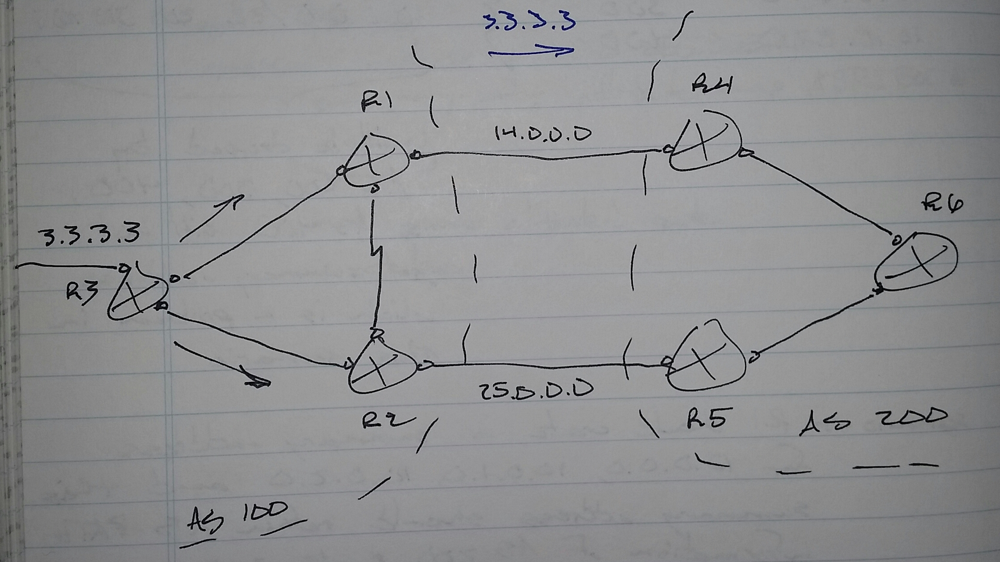

**Conditional Advertising**

 \- Advertise a route when a condition is true

Condition \#1

 \- R2 would advertise loopback 0 of R3 only if the link between R1 \<\-\> R4 is down 

 \- non\-exist\-map

Condition \#2

 \- R2 would advertise loopback 0 of R3 only if the link between R1 \<\-\> R4 is up

 \- exist\-map

router bgp 100

 neighbor \<IP address\> advertise\-map \<map\> exist\-map \<map2\>

router bgp 100

 neighbor \<IP address\> advertise\-map \<map\> non\-exist\-map \<map2\>

R2\(config\)\# access\-list 1 permit 3.3.3.3

 access\-list 2 permit 14.0.0.0

route\-map MAP1

 match ip add 1

route\-map MAP2

 match ip add 2

router bgp 100

 neighbor 25.0.0.5 advertise\-map MAP1 non\-exist\-map MAP2

MAP1 \- The route \(3.3.3.3\)

MAP2 \- Link between R1 \<\-\> R4

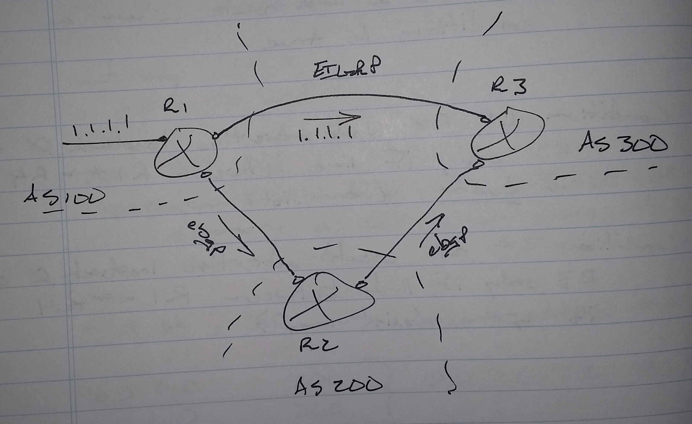

**BGP Backdoor Link**

 \- How could you prefer EIGRP over eBGP for traffic between R1 \<\-\> R3?

     \-\> You can lower the AD of EIGRP, but that can have devastating consequences.

 \- If two organizations have a backdoor connection over an IGP, BGP can be configured to make it's own routes less desirable for some destinations by increasing the AD selectively from 20 to 200

R3\(config\)\# router bgp 300

 network 1.1.1.1 mask 255.255.255.255 backdoor

The network statement does not advertise the network

 \- When the network is received in an update, the AD is increased to 200

 \- The EIGRP route gets added to the routing table

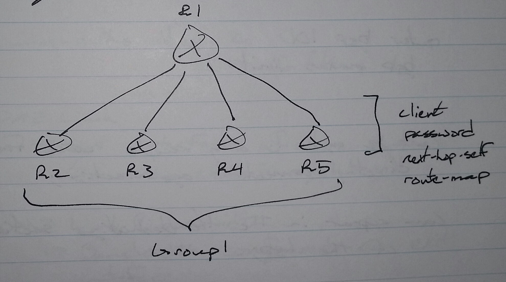

**Peer Groups**

 \- Allows a BGP router to group it's neighbors who have similar configurations and require similar treatment

 \- Benefits

     \-\> Less configuration

     \-\> Outgoing updates to these neighbors do need separate processing

 \- Drawback

     \-\> Cannot have customized filtering or route\-map \(processing\) on outgoing updates

R1\(config\)\# router bgp 100

 neighbor GROUP1 peer\-group

 neighbor GROUP1 remote\-as 100

 neighbor GROUP1 update\-source lo0

 neighbor 2.2.2.2 peer\-group GROUP1

 neighbor 3.3.3.3 peer\-group GROUP1

 neighbor 4.4.4.4 peer\-group GROUP1

 neighbor 5.5.5.5 peer\-group GROUP1

**MAXAS\-LIMIT**

 \- Feature limits the incoming updates according to the AS\-PATH

 \- Can be used to only accept routes from a directly connected organization

 \- Can appear in the troubleshooting portion of the R&S lab

router bgp 100

 bgp maxas\-limit 1

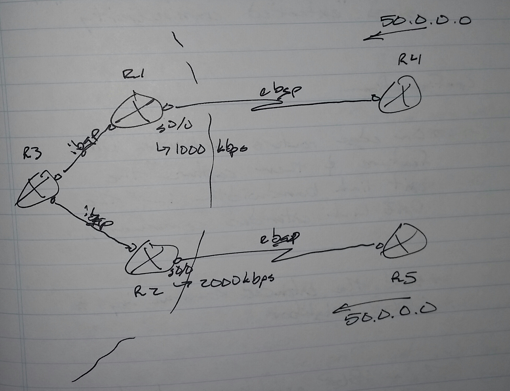

**Unequal\-cost Load Balancing in BGP**

 \- DMZ Link Bandwidth

 

maximum\-paths ibgp 2

 \- Default is 1

1. DMZ Link

 \- Exit interface of edge routers

     \-\> Towards eBGP neighbor

2. DMZ Link Bandwidth

 \- Bandwidth configured on exit interface

3. Any internal router which has an iBGP neighbor with more than one edge router can use DMZ Link feature to load\-balance according to the DMZ Link Bandwidth

4. DMZ Link Bandwidth information is sent to the iBGP neighbor by using "extended community"

Configuration

 \- On the edge routers, activate the DMZ Link feature and then capture the exit link bandwidth in the DMZ Link extended  community

 \- Send the extended community to the iBGP neighbor

 \- On the iBGP neighbor, activate the DMZ Link feature and enable multi\-path selection

R1\(config\)\# router bgp 100

 bgp dmzlink\-bw

 neighbor 14.0.0.4 dmzlink\-bw

 neighbor 13.0.0.3 send\-community extended

R3\(config\)\# router bgp 100

 bgp dmzlink\-bw

 maximum\-paths ibgp 2

R3\# clear ip bgp \*

     \-\> Or wait up to 60 seconds

sh ip bgp 50.0.0.0

 Route1 \-\> via R1 \-\> multipath, DMZ bandwidth

 Route2 \-\> via R2 \-\> multipath, DMZ bandwidth

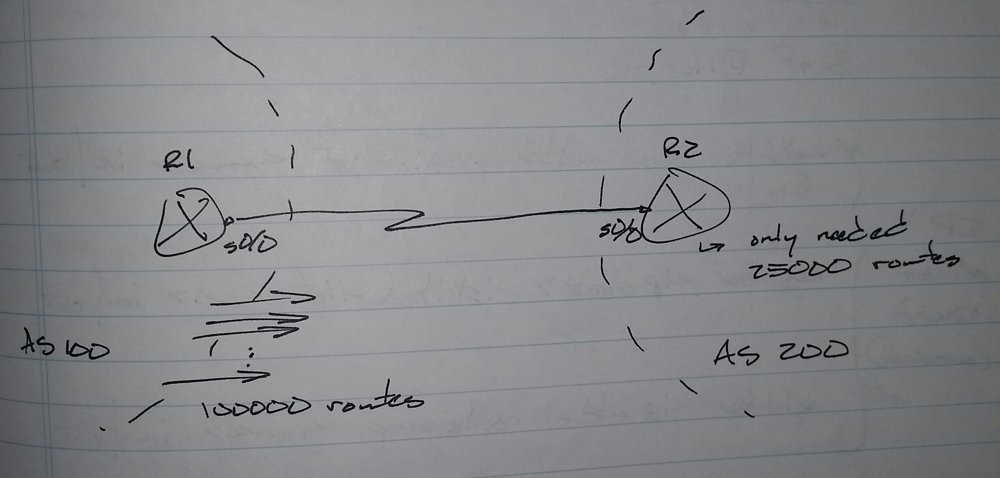

**Outbound Route Filtering**

1. Activate ORF on both sides

2. Apply the prefix\-list incoming direction on receiving router

3. Because of ORF, the prefix\-list will be sent to the other router to be applied outbound

R1\(config\)\# router bgp

 neighbor 12.0.0.2 capability orf prefix\-list receive

R3\(config\)\# router bgp 200

 neighbor 12.0.0.1 capability orf prefix\-list send

 neighbor 12.0.0.1 prefix\-list ABC in

sh ip bgp neighbor 12.0.0.1

