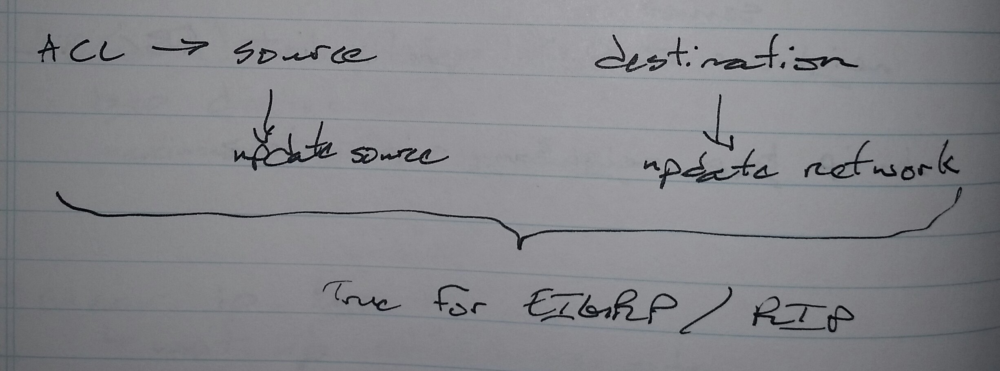
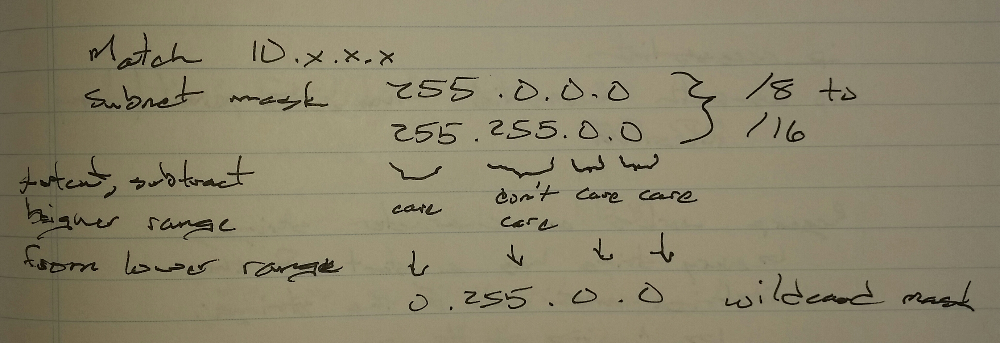
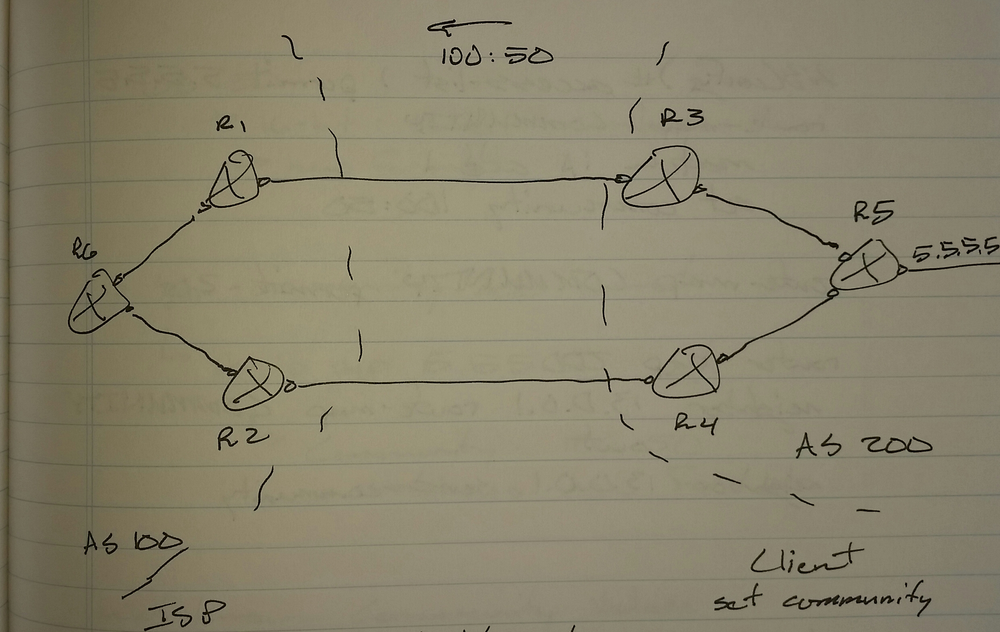
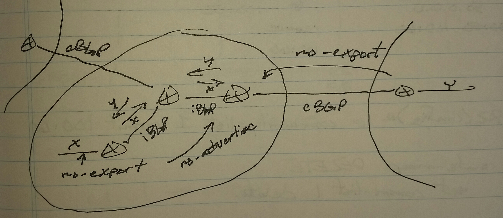
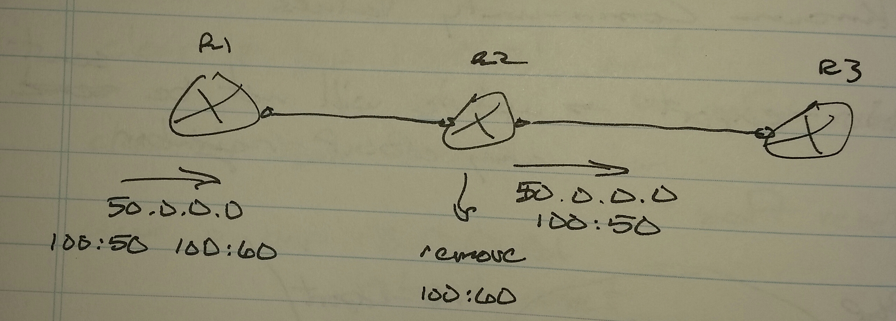
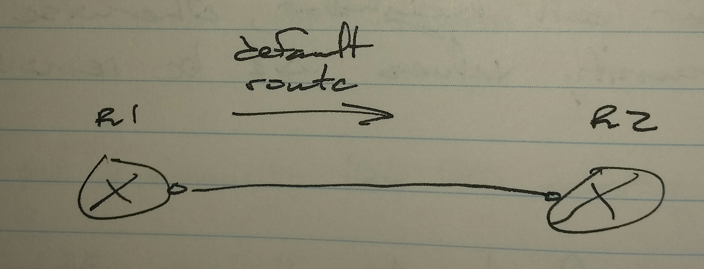
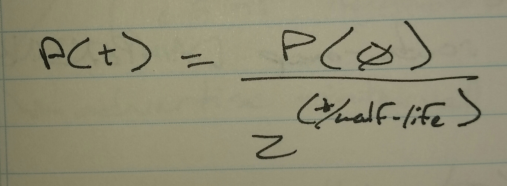
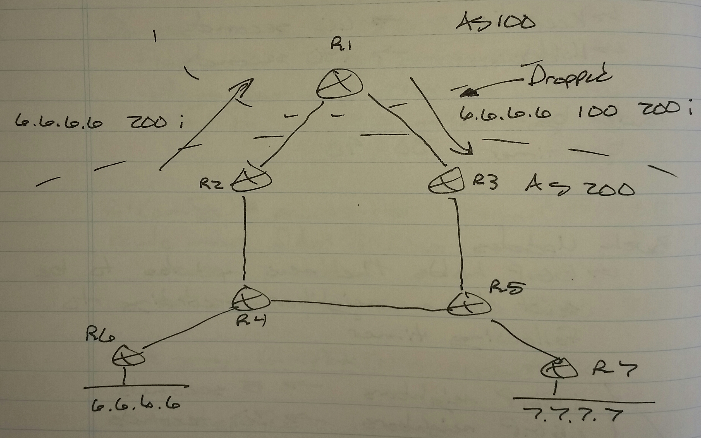

# BGP Filtering - Class Notes

`classnotes`

**BGP Filtering** \(27 Aug 2014\)
Lab:  BGP 1 \- 6

IP address based \(numerical\):
 \- neighbor \<ip add\> prefix\-list \<name\> in | out
 \- neighbor \<ip add\> distribute\-list \<acl\> in | out
 \- neighbor \<ip add\> route\-map \<name\> in | out

AS Path based \(string\):
 \- neighbor \<ip add\> filter\-list \<as\-path acl number\> in | out
     \-\> e.g. \- 100 200 300 i

Regular Expressions are required to match and filter AS\-PATH

ACL filtering in BGP with distribute\-list
 \- Use extended ACLs

Source doesn't need to be specified in the ACL because the ACL is referenced in the neighbor command.

access\-list \<number\> permit | deny \<protocol\> \<network\> \<wildcard\> \<subnet\> \<wildcard\>

Filter\-\> Any network starting with 10.x.x.x and subnet mask of 255.255.255.0.

access\-list 100 deny ip 10.0.0.0 0.255.255.255 255.255.255.0 0.0.0.0
access\-list 100 permit ip any any

access\-list 100 deny ip 10.0.0.0 0.255.255.255 255.0.0.0 0.255.0.0
access\-list 100 permit ip any any

Prefix\-list and distribute\-list cannot be applied to the same neighbor in the same direstion.
      \-\> A route\-map with multiple statements can get around this.

neighbor \<ip add\> filter\-list \<as\-path acl\> in | out
 \- as\-path ACL can patch the as\-\-path by using regular expressions

ip as\-path access\-list \<number\> permit | deny REXEXP

REGEXP works on character strings
 \- Every string has a start of the string and an end of the string
     \-\> ^ \- start
     \-\> $ \- end

^100 200$ \- 9 character string \(including the space between 100 and 200\)

ip as\-path access\-list 1 deny 100
 \- Will match
     \-\> 100
     \-\> 1100
     \-\> 1008

REGEXP Operators / Delimiters
     ? \- 0 or 1 occurrence of the character
     . \- any character 0 \- 9, but not a space
     \_ \- start of string, end of string, or a space
     ^ \- start of string
     $ \- end of string
     \[\] \- specific single character range, \[123\], \[1\-5\]
     ^$ \- locally originated
     \+ \- 1 or more occurrences
     \* \- 0 or more occurrences
     .\* \- any number

ip  as\-path access\-list 1 deny ^100\_
 \- Will match:
     \-\> 100 200          \- yes
     \-\> 100                \- yes
     \-\> 100 800 900    \- yes
     \-\> 1008 500         \- no

^1\[2\-5\]8$
 \- Will match:
     \-\> 128
     \-\> 138
     \-\> 148
     \-\> 158

5?
 \- 5 will be there one time or will be missing

Match \-\> 100 200 300 or 100 300
     \-\> ^100\_200\_300$
     \-\> ^100\_300$
          \- or \-
     \-\> ^100\(\_200\)?\_300$

Match \-\> ^100$, ^100\_100$, and ^100\_100\_100$
     \-\> ^\(100\_\)\+
          \- or \-
     \-\> \(100\_\)\+$

sh ip bgp regexp \_100\_

**BGP Community**
 \- Standard Community
     \-\> 32\-bit value
 \- Extended Community
     \-\> 64\-bit value
 \- Can be sent with updates and can be used to change path attributes
 \- Every router must have send\-community set for all neighbors, otherwise the community values will be removed

Match a community and take action
     \-\> if 100:50, increase local preference to 500

Set community
 \- In a route\-map

Match community
 \- Community list, called in a route\-map

ip community\-list { 1\-99 | 100\-500 } permit | deny \<community value\>
 \- 1 \- 99
     \-\> Standard ACL
     \-\> Simple numeric value
 \- 100 \- 500
     \-\> Extended ACL
     \-\> REGEXP can be used

R3\(config\)\# access\-list 1 permit 5.5.5.5
route\-map COMMUNITY
 match ip add 1
 set community 100:50
route\-map COMMUNITY permit 20
router bgp 200
 neighbor 13.0.0.1 route\-map COMMUNITY out
 neighbor 13.0.0.1 send\-community

clear ip bgp 13.0.0.1 out
clear ip bgp 13.0.0.1 in
clear ip bgp 13.0.0.1

R1\(config\)\# ip community\-list 1 permite 100:50
 route\-map MATCH\_COMM
  match community 1
  set local\-preference 500
route\-map MATCH\_COM permit 20
router bgp 100
 neighbor 13.0.0.3 route\-map MATCH\_COMM

sh ip bgp 5.5.5.5
 \- Community: \_\_\_\_\_\_
     \-\> will display 32\-bit number
     \-\> old format

ip bgp\-community new\-format

sh ip bgp 5.5.5.5
 \- Community: 100:50
     \-\> new format

**Well Known Community Values**

no\-export
 \- Update will not be sent to any eBGP neighbor

no\-advertise
 \- Update will not be sent to any iBGP or eBGP neighbor

LOCAL\-AS
 \- Update will not be sent to another confederation

additive
 \- Will add community to the existing list

R1\(config\)\# route\-map COMMUNITY
 set community no\-export

set community 100:50 additive

**Deleting Community Values**

R2\(config\)\# ip community\-list 1 permit 100:60
route\-map DELETE
 set com\-list 1 delete
router bgp 200
 neighbor 23.0.0.3 route\-map DELETE
 neighbor 23.0.0.3 send\-community

**BGP Remove Private\-AS**
 \- AS
     \-\> 2 bytes
     \-\> 1 \- 65535
     \-\> 64512 \- 65534
          \-\> Private AS numbers
 \- Removes any AS in the private AS range before sending updates to a neighbor

R3\(config\)\# router bgp 100
 neighbor 36.0.0.6 remove\-private\-as

**BGP Default Routing**
 1. network 0.0.0.0 mask 0.0.0.0
     \-\> Injects a default route to all neighbors
     \-\> Needs a default route to be present in the routing table
 2. neighbor \<ip add\> default\-originate \[route\-map \<name\>\]
     \-\> Per neighbor
     \-\> Default route does not need to be present in the routing table

**BGP Dampening**
 \- It is a procedure to suppress flapping routes
 \- It uses a penalty system where on every flap, a penalty value 1000 is associated with the route
 \- The moment the value is associated with the route, it starts decreasing on an exponential decay rate
 \- If the route gains a penalty value of 2000, the route is suppressed
     \-\> Value called suppress limit
     \-\> Can be changed
 \- Value has to decrease to 750 before the route is no longer suppressed
     \-\> Value called the reuse limit

suppress limit
     \-\> {P\(0\)}

reuse limit
     \-\> {P\(t\)}
          \-\> t in minutes

half\-life
     \-\> The time in minutes the router will take to reduce the penalty to half of the suppress limit
     \-\> default is 15 minutes

Max suppress time
     \-\> 4 \* half\-life
          \-\> 60 minutes by default

Scenario \-\> Configure BGP Dampening on R1 so that if a route flaps 6 times, it is suppressed;  the penalty should reach 3000 after 40 minutes;  the route should be reusable after the penalty reaches 2000.   

     suppress limit \-\> 6000
     half\-life \-\> 40 minutes
     reuse limit \-\> 2000
     max suppress time \-\> 160 minutes

router bgp 100
 bgp dampening 40 2000 6000 160

Scenario \-\> Dampen route 5.5.5.5 if it flaps 3 times, unsuppress it when the penalty reaches 1000, half\-life is 20 minutes

R1\(config\)\# access\-list 1 permit 5.5.5.5
 route\-map DAMPENING
  match ip add 1
  set dampening 20 1000 3000 80
 route\-map DAMPENING permit 20
router bgp 100
 bgp dampening route\-map DAMPENING

sh ip bgp dampening parameters
sh ip bgp dampening dampened\-paths
sh ip bgp dampening flap\-statistics

sh ip bgp
 d\> 5.5.5.5          \-\> dampened, currently up
 h\> 5.5.5.5          \-\> history, another router suppressed, currently down

**BGP Timers**
 \- Keepalive
     \-\> 60 seconds
 \- Holddown
     \-\> 180 seconds

router bgp 100
 bgp timer 30 90

**Batch Updates**
 \- BGP holds the new updates to be sent to a neighbor according to the following timer
     \-\> iBGP \- 5 seconds
     \-\> eBGP \- 30 seconds
 \- Also called advertise\-interval
 \- If set to 0, updates are sent immediately

router bgp 100
 neighbor \<ip add\> advertisement\-interval \<seconds\>

**BGP Scan Time**
 \- By default, BGP scans the BGP table for changes every 60 seconds

router bgp 100
 bgp scan\-time \<seconds\>

**BGP AS\-Override / AllowAS\-In**
 \- If the link between R4 \<\-\> R5 is goes down, R6 will not be able to reach R7

R1\(config\)\# router bgp 100
 neighbor 13.0.0.2 as\-override
 neighbor 13.0.0.3 as\-override
     \-\> update to R3
          \-\> 6.6.6.6          100 100 i

     \- or \-

R2\(config\)\# router bgp 200
 neighbor 12.0.0.1 allowas\-in

R3\(config\)\# router bgp 200
 neighbor 13.0.0.1 allowas\-in

Allowas\-in
 \- Accept updates that contain our own AS in the path
 \- Should be used as a temporary solution only while the link between R4 \<\-\> R5 is down
