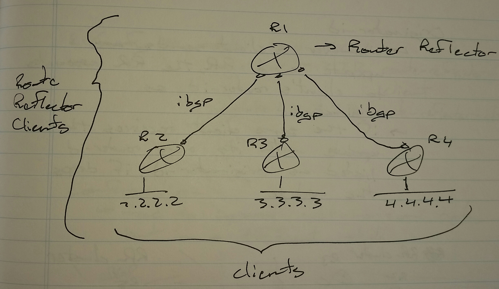
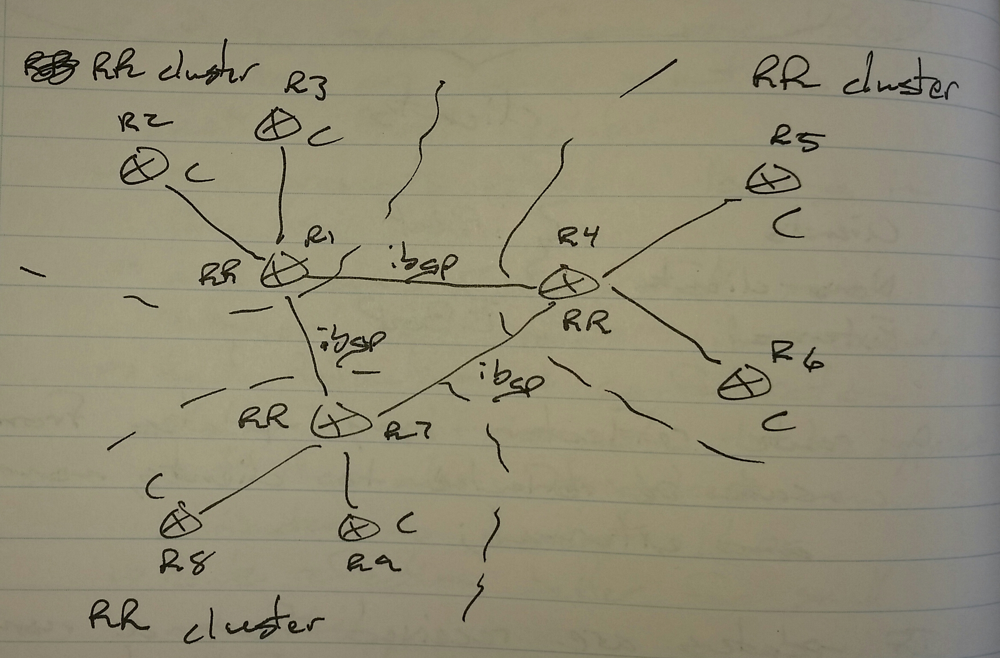
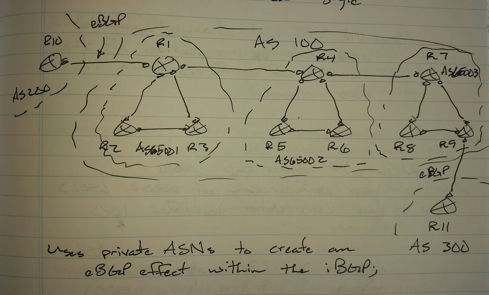

# BGP Route Reflection - Class Notes

**Route Reflection \(RR\) and Confederation** \(25 Aug 2014\)Lab:  BGP 1 \- 6
**Split\-horizon rule of BGP**

\- Updates received from one iBGP neighbor are never sent to another iBGP neighbor

\- This prevents possible looping in the AS

\- Also means that a full mesh between iBGP routers is necessary

\- Route Reflection and Confederation allow for split\-horizon to be bypassed, but also introduces new attributes to prevent loops

\- Route Reflection works better on small networks

\- Confederation works better on large networks

Clients \- iBGP

Non\-clients \- iBGP

External \- eBGP

On the route reflector \(will also be referred to as RR\), any updates from clients can be reflected to clients, non\-clients, and external.

If updates are received from a non\-client, the updates can be reflected to clients and external.

The router reflector does not change the next\-hop information when reflecting routers to clients.

To prevent loops, RR introduces two attributes

 \- originator\-id

     \-\> router\-id of the originating router

 \- cluster\-id

     \-\> router\-id of route reflector

**Originator\-id**

 \- Whenever a client sends an update to a RR, the RR associates the client's router\-id as the originator\-id

 \- If a client receives an update with its own router\-id listed as originator\-id, the update is dropped

**Cluster\-id**

 \- Whenever an update is sent out of the cluster, the cluster\-id is associated with the update

 \- When a RR receives an update which lists its own router\-id as the cluster\-id, the update is dropped

R1\(config\)\# router bgp 100

 neighbor 2.2.2.2 remote\-as 100

 neighbor 2.2.2.2 route\-reflector\-client

 neighbor 3.3.3.3 remote\-as 100

 neighbor 3.3.3.3 route\-reflector\-client

**Confederation**

 \- Used to bypass the split\-horizon rule, but in a different way

 \- Routers are separated into private ASNs to create an eBGP effect within the iBGP AS

Confederation introduces 2 attributes to prevent loops

 \- AS\_CONFED\_SET

     \-\> Orderly list of confederated ASs the update has traversed

 \- CONFED\_External

     \-\> CONFED\_Internal

Whenever an update is sent to an eBGP neighbor, the real ASN will be used

AS\_PATH\_SET is always counted as one, regardless of the number of confederations the update has traversed.

R1\(config\)\# router bgp 65001

 bgp confederation peer 65002 65003

     \-\> If 65003 is not a direct neighbor, it does not need to be listed

     \-\> It's a good practice to list all of the confederation ASNs

 bgp confederation indentifier 100

     \-\> The real ASN used the eBGP

 neighbor 2.2.2.2 remote\-as 65001

 neighbor 3.3.3.3 remote\-as 65001

 neighbor 4.4.4.4 remote\-as 65002

 neighbor 10.0.0.10 remote\-as 200
