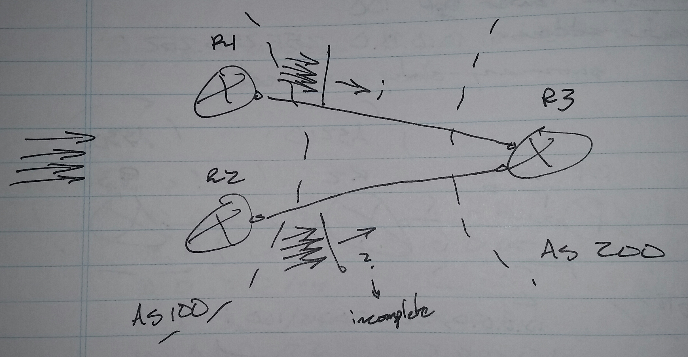
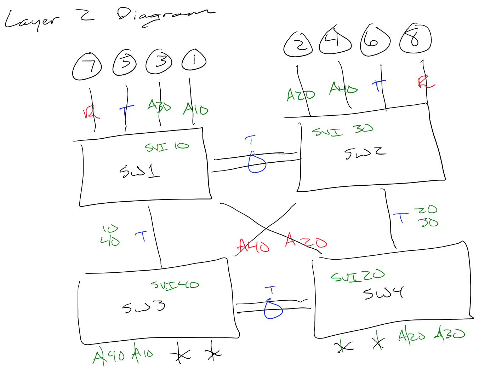

```python

---
---
**CCIE Lab Recommendations**

**==The test is a reading comprehension test.==**

**Troubleshooting Section:**
 - “There is no troubleshooting section.  There is a misconfiguration section.” - Narbik
     -> “There is no spoon.” - The Matrix
 - "Troubleshoot as if you were configuring the protocol.” - Narbik
     -> Review Narbik’s steps for configuring protocols (repeatedly)
     -> Go through the Cisco360 Student Guide flow charts for configuring protocols (repeatedly)
     -> Go through the Cisco360 Student Guide charts on troubleshooting pre-existing configurations (repeatedly)
     -> Some protocols are easy to configure, but can be broken in many different ways
          -> MPLS
          -> L3VPN
 - You don’t troubleshoot 30 devices at the same time
     -> You only have to troubleshoot 4 to 5 devices for any given ticket
 - In the Cisco360 Troubleshooting assessments, the routers tended to be configured with “**==no logging console==**.”  This is to mask the symptoms and log messages that would help you troubleshoot.
     -> First thing to do when connecting to a new device, configure “**==logging console==**."
 - Read all of the tickets before trying to fix any of them
     -> From the Cisco360 Advanced Workshop 1 Student Guide:
          -> “Some tickets depend on other tickets.  Most do not."
     -> Look for tickets that are interrelated or overlap
          -> Core network
               -> Switching
               -> DMVPN
          -> Redistribution
     -> Look for devices that are involved in multiple tickets
          -> May rule out resolution options
          -> A solution for one ticket may break the solution for another ticket

**[JP Cedeno, #47408](https://routergods.slack.com/team/jpcedeno47408)** 
95% of the TS section you are going to be asked to configure... SOOOO if you struggle with DMVPN, take the working config from TS and copy it into notepad. 
you can use that template for your config section 
you can save that notepad file on the desktop during the exam

**Diagnostic Section:**
 - "Something to do while your lab environment is changed from troubleshooting to configuration.” - don’t remember….
 - “Diagnostics, this is the worst thing Cisco has ever done.  It’s for kids.  It’s a mini-written in the lab.  If you dump the lab, you’ll have problems with diagnostics." - Narbik
 - The challenge is being able to go through and process a large amount of show commands and being able to spot any errors and problems.
 - Look at the answers to help led you in the right direction. - Some post on IOEC

**Configuration Section:**

**Read the entire lab:**
 **==- The test is a reading comprehension test.==**
     -> The Cisco360 assessment labs do a good job at pointing this out
 - If you do the test in the order as written, you will fail.
     -> You’ll run out of time when you have to go back of reconfigured devices
          -> Potentially introducing configuration errors
 - Look for:
     -> Tasks needed to reach Golden Moment
     -> Interdependencies between tasks
          -> Authentication required for IGPs, but mentioned with security tasks and not when the IGP is configured
          -> Authentication method may force named mode configuration of an IGP, but IGP configuration method is not mentioned
          -> EIGRP hmac-sha-256
     -> Layer 2 configuration tasks later in the lab
     -> “Use ACL 1….” later in the lab, when you already used ACL 1 for something else
     -> Restrictions about removing certain configurations
          -> “Do not remove access-list 111…."
 - Pay very close attention to the following words:
     -> They rule out potential configuration options
          -> **not**
          -> **only**
          -> **without**
 - Lab is based on Cisco’s internal version of IOU, not the one you can find on the Internet

**Things to look for in the lab diagram:**
 - Loops
 - Stubs
 - Count the VLANs
 - Look for important routers
     -> OSPF ABR
     -> OSPF ASBR
     -> BGP RR
     -> extra loopbacks
 - Look for important switches
 - Interfaces in two protocols
 - Discontiguous OSPF area 0
     -> Virtual links
 - Multicast across DMVPN
 - Redistribution points
     -> Watch out for mutual redistribution
          -> Use Narbik’s method of tagging routes with the admin distance of the originating routing protocol:

route-map RIPtoEIGRP deny 10
 match tag 90
route-map RIPtoEIGRP permit 20
 set tag 120

     -> If route is tagged with 90, originated from EIGRP, deny so they will not be redistributed back into EIGRP
     -> RIP originated routes will be tagged with 120

route-map EIGRPtoRIP deny 10
 match tag 120
route-map EIGRPtoRIP
 set tag 90

     -> If route is tagged with 120, originated from RIP, deny so they will not be redistributed back into RIP
     -> EIGRP originated routes will be tagged with 90

router rip
 redistribute eigrp 1 route-map EIGRPtoRIP metric 1
router eigrp 1
 redistribute rip route-map RIPtoEIGRP metric 100000 1 255 1 1500

     -> Don’t use a metric of “1 1 1 1 1” with wide metrics
          -> The resulting composite metric will be too large and will not be advertised

**Make copies of default configurations**
  **-** When logging into any device for the first time
 - Note:  IOL images may not have a flash:, copy to nvram: or unix:
    -> **copy run nvram:run.orig**
 - Remember to go back through and delete the copies
    -> **delete nvram:run.orig**

**Existing pre-configuration may not be correct**
 - “Trust, but verify.” - Reagan
 - Verify connectivity between devices
     -> **ping 255.255.255.255 rep 2**
 - Be very careful when defaulting an interface (default int s1/0)  or removing a router section configuration (no router rip).
    -> Check to see if there is any pre-exisiting configuration.

**Drawing Diagrams**
 - Only create your own layer 2 diagram when there are more than 2 switches
     -> Useful for visualizing spanning-tree tasks
          -> Root bridges
          -> Ports in blocking state
 - There is not enough time to draw the entire topology
 - Use Cisco360’s second method (not the colored pencil method)
     -> Access ports
          -> A + VLAN number
          -> “A20"
     -> Trunk ports
          -> “T"
          -> Allowed VLANs, write next to the “T"
          -> "T 10, 20, 30"
     -> Routed ports
          -> “R"
     -> Port-channels
          -> Circle or oval over the links
     -> SVI
          -> Write inside the box that represents the switch
     -> Disabled ports
          -> “X"


![[./_resources/CCIE_Lab_Recommendations.resources/Screen Shot 2015-08-30 at 1.17.38 PM.png]]



```




```python
**Watch for land mind questions**
 - Easy 2 point questions that can break 20 points from somewhere else
 - Don’t chase the rabbit down the rabbit hole

**Never touch layer 2 in the last 30 minutes of the lab**
 - Read the test and identify all layer 2 items

**It’s possible to pass all of the sections and still fail**
 - Because you don’t make the cut score
 - It is possible now to fail a section (just barely) and still pass (if you did awesome in another section).
\- From Narbik:
     -> You may pass each section individual.  Each section  may have cut off scores such as:
          -> Troubleshooting:  70
          -> Diagnostics:  50
          -> Configuration:  70
     -> But if you don't meet or exceed the overall cutoff score, say 80, you'll fail the lab.
     -> It’s unknown what the cutoff score is for each section, how the sections are weighted, or what the overall cutoff score is.
~~\- From another source ( have heard from several sources this is not true ):~~
     ~~-> You will be graded against all of the other people taking the test that day~~
     ~~-> 10 people may pass, but only 8 are allowed to pass for the day.~~

**Save text files to the desktop.**

**Cisco360’s Golden Moment:**
 - “All IPv4 and IPv6 addresses are reachable from all devices."
 - Per link configuration
 - Per IGP configuration
 - Inter-IGP configuration (redistribution)
 - BGP (sometimes)
 - It is recommend by Cisco360 to skip any filtering and summarization to reach the Golden Moment
     -> Me: not sure I want to do this 
 - tclsh
     -> **WARNING!!**
          -> The tcl script had a habit of locking up the switches during the Cisco360 assessment labs
          -> Make sure to save the configuration of all devices before using the tcl script
               -> If you haven’t been configuring with notepad….
          -> If the device locks up, you can reload the device and not have to reconfigure the device from scratch.  Just paste the configuration back into the device.
          -> **==Don’t use it.==**

\# tchsh
 foreach address {
 12.1.1.1
 12.1.1.2
} {ping $address}

     -> Instead, list “ping <ip address>” separately on each line.

ping 12.1.1.1
ping 12.1.1.2
 . . . .

**Cisco360’s Configuration Order**
 - Data Link Layer
 - IGPs
 - Redistribution
 - BGP
     -> Should reach Golden Moment
 - VPN Technologies
 - Multicast
 - QoS
 - IP Services
 - Cisco IOS Software features
     -> Exception, if there are VRFs, configure those first
          -> Should be MPLS, VRF, MP-BGP
          -> L2 may need to be configured before VRF / MPLS / MP-BGP connectivity is possible.
          -> The fact that you may be doing a CE-PE protocol configuration will probably not be pointed out by the tasks
               -> "Configure IGP between routers….."
               -> If you follow the lab tasks in order, you’ll end up having to reconfigure the PE routers for VRF later (waste time, potentially introduce configuration errors)
          -> “Configure the core first, whether it's MPLS or DMVPN.  Then attach each site to that core.” - Narbik
 - So, modified configuration order:
     -> Layer 2
     -> DMVPN (core)
     -> MPLS (core, especially if there are VRFs)
     -> IGPs
     -> Redistribution
     -> BGP
     -> VPN Technologies ( whatever tasks are left for DMVPN and MPLS / L3VPN )
     -> QoS
     -> IP Services
     -> Cisco IOS Software features

**DOC-CD:**
 - “If you have to go to the DOC-CD more than once, you are going to run out of time.” - Narbik
 - My mind map of lab exam topics to DOC-CD locations
     <http://feralpacket.org/?p=286>

**Access-list, route-map, prefix-list naming convention:**
 - Use task numbers if possible
     -> Helps avoid numbering conflicts
     -> Helps you remember or lookup why it was configured in the first place
     access-list 21 permit host 1.1.1.1
 - Be careful when using punctuation in names
     **-> I==n fact, do not use any punctuation==**
     **->** **==This is a restriction that is listed in the lab ( mentioned by many people )==**
     route-map **==TASK2.1==** permit 10
          . . .
     router bgp 100
          nei 12.1.1.2 route-map **==TASK2,1==** in
               -> You’d have to run debug to catch it if you cannot spot the typo (comma vs. period)
 - Otherwise, use something meaningful
     -> List the protocol and the direction with redistribution
          route-map OSPF->RIP deny 10
     -> Use NET plus the network portion of the IP address for prefix-lists
          ip prefix-list NET3 permit 3.0.0.0/8

**Notepad:**
 - Very helpful with XR router configuration on the SP lab
     -> XR router configuration can be long, but is mostly repeatitive
 - Very helpful if you happen to lock up a device and it needs to be reset or reloaded
 - Be aware of self-inflected configuration errors
     -> Copy and paste errors
          -> Pasting configuration into the wrong device
          -> Not copying the entire configuration
     -> Not changing router-ids
          -> Duplicate router-ids
     -> Misconfigured network statements
     -> Misconfigured interfaces
     -> Extra interfaces
          -> loopback101 is on both R1 and R2, but R2 should only have loopback102
     -> Configuration not completely copied to the devices
          -> Did you verify?
          -> Just because you didn’t see any errors when you pasted the configuration, doesn’t mean that the configuration is correct
     -> Making configuration changes on the devices, but not updating the configuration in notepad

**When you get stuck:**
 - Redistribution
     -> Idea to get around redistribution if you are having problems, use a static route and loose points here, but maintain connectivity.  Count points later.  If you have enough, leave it.
     -> Don’t actually use a static route, you can redistribute an individual route to establish connectivity.
 - DMPVN
     -> So many other protocols ride over DMVPN.  If you are not able to make it work as the task specified, use whatever ugly configuration you can to get reachability
     -> At least this way, you may be able to get points with the other protocols and tasks.

**Example config:**

! R1

! Task 1
router ospf 1
 router-id 0.0.0.1
int s1/0
 ip ospf 1 area 0
int lo0
 ip ospf 1 area 0

! Task 2
ip vrf TST
 rd 1:10
 route-target both 34:34
int s1/1
 ip vrf forwarding TST
 ip add 13.1.1.1 255.255.255.0
router eigrp asdf
 address-family ipv4 vrf TST auto 100
  netw 13.1.1.1 0.0.0.0
mpls ldp router-id lo0
mpls label protocol ldp
int s1/0
mpls ip
router bgp 65001
 no bgp default ipv4-unicast
 nei 2.2.2.2 remote-as 65001
 nei 2.2.2.2 up lo0
 address-family vpnv4 unicast
  nei 2.2.2.2 activate
  nei 2.2.2.2 send-community extended
!
router eigrp asdf
 address-family ipv4 vrf TST auto 100
  topology base
   no redistribute bgp 65001 metric 1 1 1 1 1
   redistribute bgp 65001 metric 1000000 1 255 1 1500
router bgp 65001
 address-family ipv4 vrf TST
  redistribute eigrp 100

! Task 3
route-map SOO permit 10
 set extcommunity soo 1:111
int s1/1
 ip vrf sitemap SOO
!
route-map SOO permit 10
 no set extcommunity soo 1:111
 set extcommunity soo 1:121

! R2

! Task 1
router ospf 1
 router-id 0.0.0.2
int s1/0
 ip ospf 1 area 0
int lo0
 ip ospf 1 area 0

! Task 2
ip vrf TST
 rd 1:20
 route-target both 34:34
int s1/2
 ip vrf forwarding TST
 ip add 24.1.1.2 255.255.255.0
router eigrp asdf
 address-family ipv4 vrf TST auto 100
  netw 24.1.1.2 0.0.0.0
!
mpls ldp router-id lo0
mpls label protocol ldp
int s1/0
mpls ip
!
router bgp 65001
 no bgp default ipv4-unicast
 nei 1.1.1.1 remote-as 65001
 nei 1.1.1.1 up lo0
 address-family vpnv4 unicast
  nei 1.1.1.1 activate
  nei 1.1.1.1 send-community extended
!
router eigrp asdf
 address-family ipv4 vrf TST auto 100
  topology base
   no redistribute bgp 65001 metric 1 1 1 1 1
   redistribute bgp 65001 metric 1000000 1 255 1 1500
router bgp 65001
 address-family ipv4 vrf TST
  redistribute eigrp 100

! Task 3
route-map SOO permit 10
 set extcommunity soo 2:222
int s1/2
 ip vrf sitemap SOO
!
route-map SOO permit 10
 no set extcommunity soo 2:222
 set extcommunity soo 1:121

! Task 4
route-map SOO permit 10
 no set extcommunity soo 1:121
 set extcommunity soo 2:222
!
route-map SOO permit 10
 no set extcommunity soo 2:222
 set extcommunity soo 1:121
ip sla 1
 icmp-echo 34.1.1.4 source-interface s1/2
 threshold 500
 timeout 500
 freq 5
 vrf TST
ip sla schedule 1 life forever start-time now
track 2 ip sla 1 reachability
event manager applet DOWN
 event track 2 state down
 action 1.1 cli command “enable”
 action 1.2 cli command “config 1”
 action 1.3 cli command “route-map SOO permit 10”
 action 1.4 cli command “no set extcommunity soo 1:121”
 action 1.5 cli command “set extcommunity soo 2:222”
event manager applet UP
 event trace 2 state up
 action 1.1 cli command “enable”
 action 1.2 cli command “config t”
 action 1.3 cli command “route-map SOO permit 10”
 action 1.4 cli command “no set extcommunity soo 2:222”
 action 1.5 cli command “set extcommunity soo 1:121” possible now to fail a section (just barely) and still pass (if you did awesome in another section).

**Recommendations that only work with a printed copy of the network diagram:**

**Things to look for in the lab diagram:**
 - Loops
     -> Circle them
 - Stubs
     -> Bracket them
 - Count the VLANs
     -> Slash through them

**Draw a big red “X” on interfaces that have the following applied:**
 - ACL
 - Port-security

```
