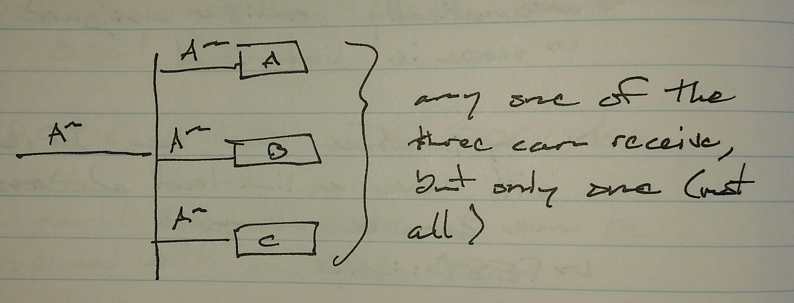
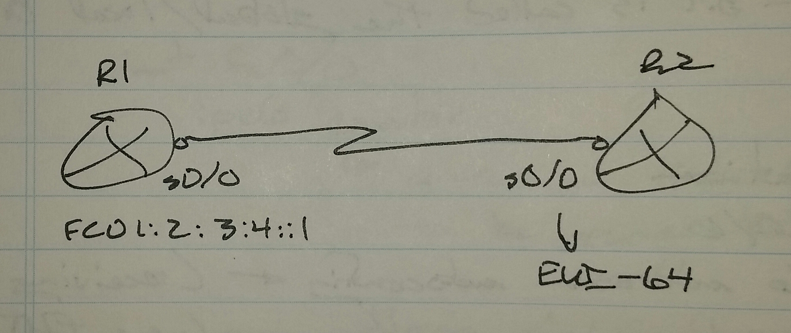
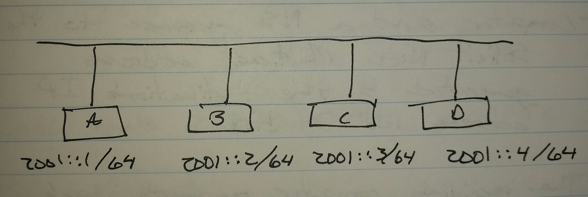

# IPv6 - Class Notes

**IPv6** \(28 Aug 2014\)

Lab:  IPv6 1 and 2

 \- 128 bit address represented in HEX format

     \-\> 1 hex = 4 bits

     \-\> 32 HEX numbers = 1 IPv6 address

 \- 8 quartets \(16\-bit blocks\) or 4 HEX numbers each

12CD:0000:0000:0000:0635:0000:0000:0001 /64

If a quartet has all zeros, it can be replaced with a single zero

12CD:0:0:0:0635:0:0:001 /64

Leading zeros in a quartet can be dropped

12CD:0:0:0:635:0:0:1 /64

Consecutive quartets of zeros can be replaced with a double colon \(::\) once

12CD::635:0:0:1 /64

**Unicast**

 \- Globally unique \(public IPs

 \- Range \- 2000:: /3

 \- 001x \-\> first 3 bits will always be the same

 \- Will always start with 2 or 3

     \-\> 0010 \- 2

     \-\> 0011 \- 3

**local\-link addresses**

 \- Automatically assigned

     \-\> scope is link\-local

 \- Any interface that has IPv6 activated will have a link\-local address

     \-\> Can be changed

 \- Range \- FE80:: /10

**Multicast**

 \- Range \- FF00:: /8

 \- The fourth HEX character in the first quartet is called the scope field

     \-\> 2 \- scope is link\-local

     \-\> 5 \- scope is site\-local

     \-\> E \- scope is global

          \-\> FF0E:: /16 \- used on the Internet

**Well known multicast addresses**

 \- FF02::1 \-\> all nodes in the segment

 \- FF02::2 \-\> all routers in the segment

 \- FF02::5 \-\> OSPF all routers

 \- FF02::6 \-\> OSPF all DRs

 \- FF02::9 \-\> RIPng

 \- FF02::A \-\> EIGRPv6

 \- FF05::1:2 \-\> DHCPv6

 \- FF02::1:FF00:0000 /104 \-\> Solicit Node Multicast Address

     \-\> first 104 bits stay the same

          \-\> FF02::1:FF

     \-\> last 24 bits can change

          \-\> 00:0000

**Anycast**

 \- One \- to \- one of many

 \- Any IPv6 address can be flagged as Anycast

**IPv6 Address Assignment**

int fa0/0

 ipv6 enable

     \-\> Causes a link\-local address to be generated

 ipv6 address \<ipv6 add\>/\<network mask\>

     \-\> Manual addressing

 ipv6 address dhcp

     \-\> Receive address from DHCPv6 server

 ipv6 address [x:x:x:x::](file:///x:x:x:x::) /64 eui\-64

     \-\> EUI\-64 method

 ipv6 address autoconfig

     \-\> Autoconfiguration

EUI\-64 Method

 \- last 64 bits \(host part\) id derived from the MAC address of the interface

     \-\> MAC address \-\> 48 bits

     \-\> FFFE \-\> inserted in the middle of the MAC address

     \-\> The 7th bit is then flipped

     \-\> The 7th bit is called the global / local bit

0001.0002.0003 plus FFEE

 \- Becomes

     \-\> 0001.00FF.FE02.0003

0001 in HEX

 \- 0000000000000001 in decimal

7th bit flipped

 \- 0000001000000001 in decimal

 \- 0201 in HEX

So, 0001.0002.0003 plus FFFE plus 7th bit flipped becomes

 \- 0201.00FF.FE02.0003

     \-\> host part of the EUI\-64 address

**Autoconfiguration**

R2\(config\)\# int fa0/0

 ipv6 enable

 ipv6 address autoconfig

     \-\> Receiving side

     \-\> Uses EUI\-64

R1 sends periodic Router Advertisement \(RA\) messages

 \- Clients can also request an address by sending Router Solicitaion \(RS\) messages

 \- RA contains the first 64 bits of router's address

     \-\> FC01:2:3:4 in this case

 \- When the client receives the RA message, it uses the 64 bits in the message as the network part and calculates the host 64 bits by using the EUI\-64 method

RA / RS messages

 \- Part of the family of ICMPv6

By default, RA messages are suppressed on serial interfaces

R1\(config\)\# int s0/0

 no ipv6 nd ra suppress

R2\(config\)\# int s0/0

 ipv6 enable

 ipv6 address autoconfig

Serial interfaces don't have MAC addresses

 \- Autoconfig on a serial interface will use \(borrow\) the MAC address of an ethernet interface on the router

**IPv6 Neighbor Discovery \(ARP\)**

 \- NS \-\> Neighbor Solicitation

 \- NA \-\> Neighbor Advertisement

FF02::1 \-\> all nodes

Solicite Node Multicast group is joined by every IPv6 enabled device

FF02::1:FF00:0000 /104

     \-\> Last 24 bits are taken from IPv6 address of the device

2000:0:0:0:0:0:0:1

     \-\> Last 24 bits \- 00:0001

The multicast group the computer will join

     \-\> FF02::1:FF:00:001 \- Computer A

     \-\> FF02::1:FF:00:002 \- Computer B

     \-\> FF02::1:FF:00:003 \- Computer C

     \-\> FF02::1:FF:00:004 \- Computer D

Computer1\> ping 2001::3

 \- Computer sends a NS message to the Solicit Node Multicast addressed generated by the last 24 bits of the destinations IP address

 \- The receiving computer responds back with a unicast NA message which contains the MAC address

**Duplicate Address Detection \(DAD\)**

 \- Devices send NS to the multicast group that itself has joined asking for it's own IPv6 address

 \- If anyone else replies, then there is a conflict
