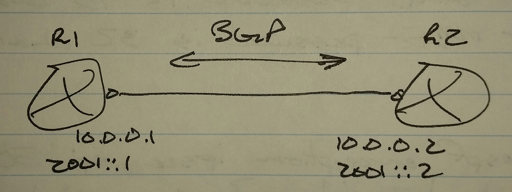

# IPv6 BGP - Class Notes

**IPv6 BGP** \(28 Aug 2014\)Lab:  IPv6 1 and 2

Forming neighbors

\- Enpoint IP addresses

     \-\> IPv4

     \-\> IPv6

Exchanging networks \(payload\)

\- Address families

     \-\> IPv4

     \-\> IPv6

     \-\> VPNv4

     \-\> VPNv6

     \-\> VRF

When other address families are activated, the IPv4 address family is added

Address Family Identifier \(AFI\)

 \- ipv4

 \- ipv6

 \- vpnv4

 \- vpnv6

Subsequent Address Family Identifier \(SAFI\)

 \- unicast

 \- multicast

 \- vrf

router bgp 100

 address\-family \<afi\> \<safi\>

IPv4 is the default address family

 \- To disable

router bgp 100

 no bgp default ipv4\-unicast

 

router bgp 100

 no bgp default ipv4\-unicast

 neighbor 2001::2 remotes\-as 200

 address\-family ipv6 unicast

  neighbor 2001::2 activate

  network 1111::1/128

sh bgp ipv6 unicast
