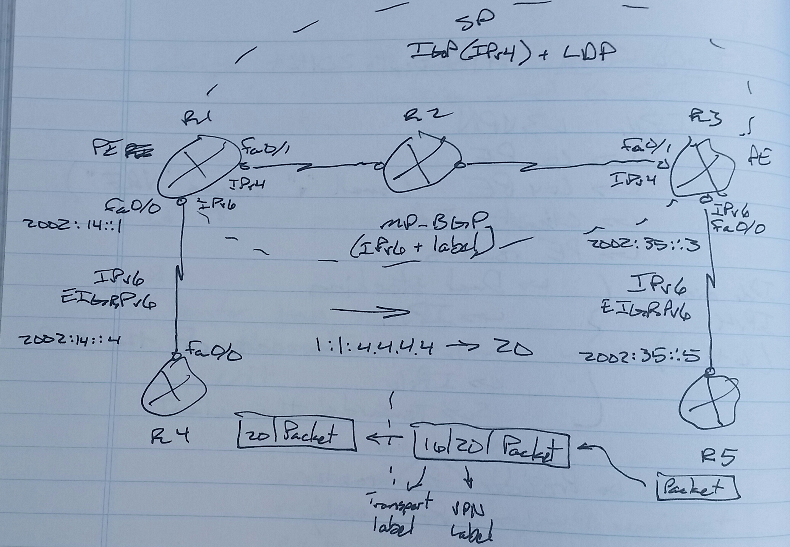
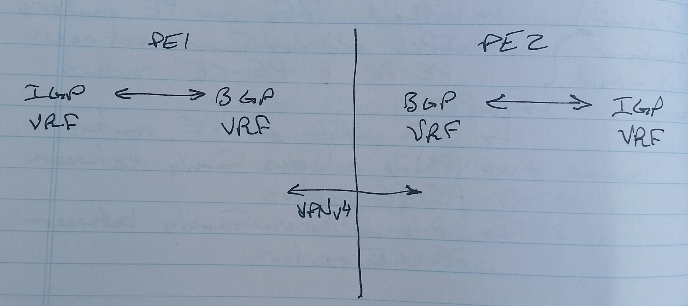
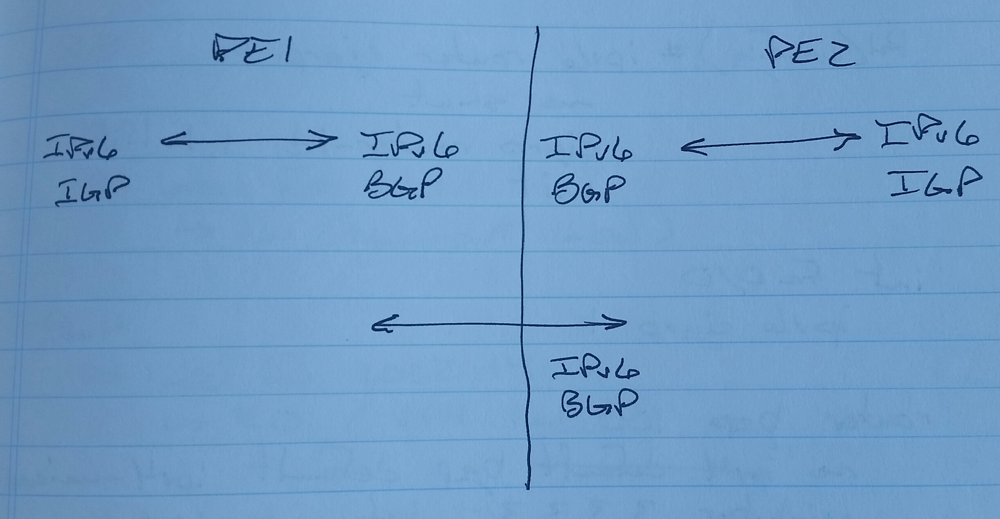
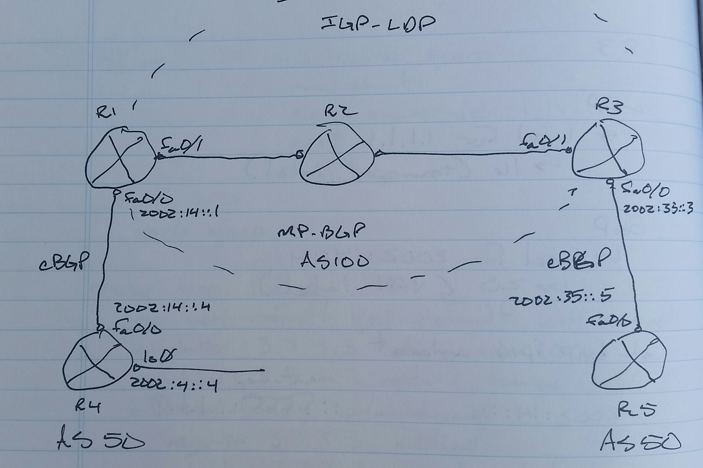

# IPv6 MPLS L3VPN (6PE) - Class Notes

**IPv6 MPLS L3VPN \(6PE\)** \(15 Sept 2014\)
Lab: 6PE

 \- 6PE
 \- 6vPE
     \-\> Small "v" means VRF
 \- Client side
     \-\> IPv6
 \- PE routers
     \-\> IPv6 over IPv4 \(6to4\)
     \-\> Dual stack
          \-\> IPv4 towards core of SP
          \-\>IPv6 towards the client
 \- P \(provider\) routers
     \-\> IPv4 only

LDP only works with IPv4

**6PE**
 \- Without VRFs on PE routers
 \- IPv6 address\-family between PE \- PE  and PE \- CE routers
 \- Not as easy to configure as it should seem

**6vPE**
 \- with VRFs on PE routers
 \- VPNv6 address\-family between PE \- PE routers
 \- IPv6 address\-family between PE \- CE routers

Transport label
 \- LDP
     \-\> for BGP next\-hop

VPN label
 \- BGP VPNv4
     \-\> for client networks

IPv6 Table

               next\-hop
               ::ffff:\<ipv4 address of the PE router\>

**6PE Rules**
 1. Client has an IPv6 neighbor relationship with PE router
 2. PE routers will perform mutual redistribution between "IPv6 IGP / eBGP" and "MP\-BGP IPv6"
 3. PE \- PE will be IPv6 \+ label

**6PE on IOS Routers**

R4\(config\)\# ipv6 eigrp 1
 no shut
 eigrp router\-id 4.4.4.4
int fa0/0
 ipv6 eigrp 1
int lo0
 ipv6 eigrp 1

R1\(config\)\# ipv6 router eigrp 1
 no shut
 eigrp router\-id 1.1.1.1
int fa0/0
 ipv6 eigrp 1
router bgp 100
 no bgp default ipv4\-unicast
 neghbor 3.3.3.3 remote\-as 100
 neighbor 3.3.3.3 update\-source lo0
 address\-family ipv6 unicast
  neighbor 3.3.3.3 activate
  neighbor 3.3.3.3 send\-label
     \-\> Have to force the router to send labels in IPv6
     \-\> Sending labels is the default in IPv4
  redistribute eigrp 1
ipv6 router eigrp 1
 redistribute bgp 100 metric 1 1 1 1 1

Problem with 6PE
 \- There is no isolation that can be provided by VRFs
 \- PE routers have to be dedicated for each customer
     \-\> Otherwise, the customers will see the IPv6 routes of any other customer connected to the PE router

R3
 \- LDP
     \-\> Label for 1.1.1.1
          \-\> 16 \(transport label\)
 \- BGP
     \-\> Label for 2002:14::4
          \-\> 20 \(VPN label\)

sh bgp ipv6 unicast
                         next\-hop
2002:14::4         ::ffff:1.1.1.1

sh bgp ipv6 u label
 \- If labels are not present, then "neighbor x.x.x.x send\-label" configuration is missing

     | 16 | 20 | IPv6 |

To check PE \- PE IPv6 communicastion, the following command is required

R1\(config\)\# mpls ipv6 source\-interface \<int\>

**eBGP is required for PE \- CE on XR routers**

R1\(config\)\# router bgp 100
 address\-family ipv6 unicast
  allocate\-label all
 neighbor 3.3.3.3
  remote\-as 100
  update\-source lo0
  address\-family ipv6 labeled\-unicast
 neighbor 2002:14::4
  remote\-as 50
  address\-family ipv6 unicast
   route\-policy PASS in
   route\-policy PASS out
   as\-override
route\-pocily PASS
 pass
 root
 show config
 commit

**IOS:**

sh bgp vpnv4 u all sum
sh bgp vpnv4 u all

sh bgp vpnv6 u all sum
sh bgp vpnv6 u all

**XR:**

sh bgp vpnv4 u sum
sh bgp vpnv4 u

sh bgp vpnv6 u sum
sh bgp vpnv6 u

.png)

**\! R1**
router bgp 50
 bgp router\-id 1.1.1.1
 address\-family ipv6 unicast
  network 2002:1:1:1::1/128
 neighbor 2002:12::2
  remote\-as 100

  address\-family ipv6 unicast

  route\-policy allow\-all in

  route\-policy allow\-all out

route\-policy allow\-all

 pass

 end
 
**\! R2**
router ospf 1

 router\-id 2.2.2.2

 area 0
  int lo0
  int gi0/0/0/1
\!
mpls ldp

router ospf 1

 mpls ldp auto\-config
\!
router bgp 100

 bgp router\-id 2.2.2.2

 address\-family ipv6 unicast
  allocate\-label all
 neighbor 2002:12::1
  remote\-as 50

  address\-family ipv6 unicast

   route\-policy allow\-all in

   route\-policy allow\-all out

   as\-override

route\-policy allow\-all

 pass

 end
\!
router bgp 100
 neighbor 5.5.5.5
  remote\-as 100

  update\-source lo0

  address\-family ipv6 labeled\-unicast

**\! R3**
int lo0

 ip ospf 1 area 0

int e1/0

 ip ospf 1 area 0

int e1/1

 ip ospf 1 area 0
router ospf 1
 router\-id 3.3.3.3
\!
mpls label protocol ldp
mpls ldp router\-id lo0 force
int e1/0
 mpls ip

int e1/1
 mpls ip

**\! R4**
router ospf 1

 router\-id 4.4.4.4

 area 0
  int lo0
  int gi0/0/0/0
  int gi0/0/0/1
\!
mpls ldp
router ospf 1
 mpls ldp auto\-config

**\! R5**
router ospf 1

 router\-id 5.5.5.5

 area 0
  int lo0
  int gi0/0/0/0
  int gi0/0/0/1
\!
mpls ldp

router ospf 1

 mpls ldp auto\-config
\!
router bgp 100
bgp router\-id 5.5.5.5
address\-family ipv6 unicast
 allocate\-label all
 neighbor 2002:56::6
  remote\-as 50

  address\-family ipv6 unicast

   route\-policy allow\-all in

   route\-policy allow\-all out

   as\-override

route\-policy allow\-all

 pass

 end
\!
router bgp 100
 neighbor 2.2.2.2
  remote\-as 100

  update\-source lo0

  address\-family ipv6 labeled\-unicast

**\! R6**
router bgp 50

 bgp router\-id 6.6.6.6
 no bgp default ipv4\-unicast
 neighbor 2002:56::5 remote\-as 100
 address\-family ipv6
  network 2002:6:6:6::6/128
  neighbor 2002:56::5 activate

**Verification:**
**\! R1 and R6**
sh bgp ipv6 u sum
sh bgp ipv6 u
sh route ipv6
ping ipv6 2002:6:6:6::6 source 2002:1:1:1::1
ping ipv6 2002:1:1:1::1 source 2002:6:6:6::6

**\! R2 and R5**
sh mpls int

sh mpls ldp nei bri
sh mpls forwarding
sh bgp ipv6 u sum
sh bpg ipv6 u
sh bgp ipv6 all sum
     \-\> To see information about the MP\-BGP neighbor

sh bgp ipv6 labeled\-unicast sum
     \-\> To see information about the MP\-BGP neighbor
sh bgp ipv6 labeled\-unicast
sh bgp ipv6 u 2002:1:1:1::1
sh bgp ipv6 u 2002:6:6:6::6
sh bgp ipv6 u labels
sh route ipv6

