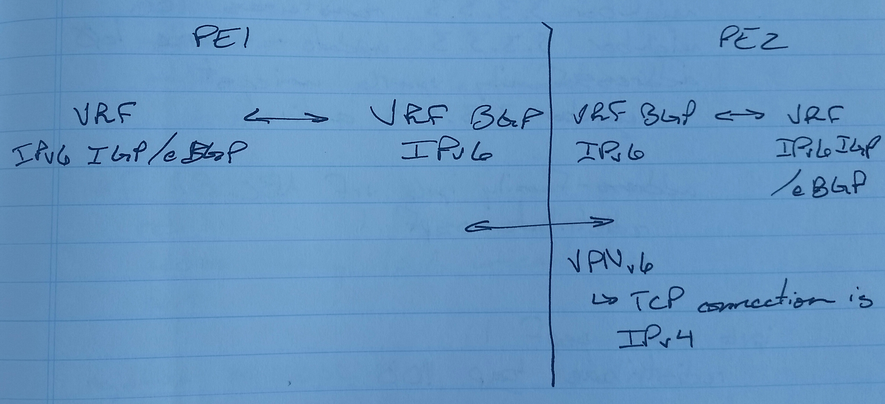

# IPv6 MPLS L3VPN (6vPE) - Class Notes

**IPv6 MPLS L3VPN \(6vPE\)** \(15 Sept 2014\)

Lab: 6vPE

\- with VRFs on PE routers

\- VPNv6 address\-family between PE \- PE routers

\- IPv6 address\-family between PE \- CE routers

RD \+ IPv6 = VPNv6

64 bits \+ 128 bits = 192 bits

**VPNv6**

\- VRF required on PE \- CE

\- VPN label exchange is automatic

**6vPE on IOS Routers**

1. VRF creation

2. Interface association

3. VRF IGP association

4. Mutual redistribution between VRF IGP and MP\-BGP

R1\(config\)\# vrf definition ABC

rd 1:1

address\-family ipv6 unicast

  route\-target both 1:1

int fa0/0

vrf forwarding ABC

ip add 14.0.0.1 255.0.0.0

ipv6 router ospf 1 vrf ABC

exit

int fa0/0

ipv6 ospf 1 area 0

router bgp 100

no bgp default ipv4\-unicast

neighbor 3.3.3.3 remote\-as 100

neighbor 3.3.3.3 update\-source lo0

address\-family vpnv6 unicast

  neighbor 3.3.3.3 activate

address\-family ipv6 vrf ABC

  redistribute ospf 1

ipv6 router ospf 1

redistribute bgp 100

**6vPE on XR Routers**

R1\(config\)\# vrf ABC

address\-family ipv6 unicast

  import route\-target 1:1

  export route\-target 1:1

int g0/0/0/0

no ipv6 add

vrf ABC

ipv6 add \<ip add\>/\<nm\>

router bgp 100

address\-family vpnv6 unicast

neighbor 3.3.3.3

  remote\-as 100

  update\-source lo0

  address\-family vpnv6 unicast

vrf ABC

  rd 1:1

  address\-family ipv6 unicast

neighbor 2002:14::4

  remote\-as 50

  address\-family ipv6 unicast

  route\-policy PASS in

  route\-policy PASS out

  as\-override

.png)

**\! R1**
router bgp 50
 bgp router\-id 1.1.1.1
 address\-family ipv6 unicast
  network 2002:1:1:1::1/128
 neighbor 2002:12::2
  remote\-as 100

  address\-family ipv6 unicast

   route\-policy allow\-all in

   route\-policy allow\-all out

route\-policy allow\-all

 pass

 end

**\! R2**
router ospf 1

 router\-id 2.2.2.2

 area 0
  int lo0
  int gi0/0/0/1
\!
mpls ldp

router ospf 1

 mpls ldp auto\-config
\!
vrf ABC

 address\-family ipv6 unicast

  export route\-target 1:1
  import route\-target 1:1
int gi0/0/0/0
 no ipv4 address 9.9.12.2 255.255.255.0

 no ipv6 address 2002:9:9:12::2/64

 vrf ABC

 ipv4 address 9.9.12.2 255.255.255.0

 ipv6 address 2002:9:9:12::2/64

router bgp 100

 vrf ABC

   rd 1:1

\!

router bgp 100

 bgp router\-id 9.9.0.2

 address\-family vpnv6 unicast

 \! \-\> needed before “address\-family ipv6 unicast” can be configured inside “vrf ABC”

 vrf ABC
  address\-family ipv6 unicast
   network 2002:2:2:2::2/128
  neighbor 2002:12::1
   remote\-as 50

   address\-family ipv6 unicast

    route\-policy allow\-all in

    route\-policy allow\-all out

    as\-override

route\-policy allow\-all

 pass

 end
\!
router bgp 100

 neighbor 3.3.3.3

  remote\-as 100

  update\-source lo0
  address\-family vpnv6 unicast

**\! R3**
int lo0

 ip ospf 1 area 0

int e1/0

 ip ospf 1 area 0

int e1/1

 ip ospf 1 area 0

router ospf 1

 router\-id 3.3.3.3
\!
mpls label protocol ldp

mpls ldp router\-id lo0 force

router ospf 1

 mpls ldp autoconfig

**\! R4**
router ospf 1
 router\-id 4.4.4.4
 area 0
  int lo0
  int gi0/0/0/0
  int gi0/0/0/1
\!
mpls ldp

router ospf 1
 mpls ldp auto\-config

**\! R5**
router ospf 1
 router\-id 5.5.5.5
 area 0
  int lo0
  int gi0/0/0/1
\!

mpls ldp

router ospf 1

 mpls ldp auto\-config
\!
vrf ABC

 address\-family ipv6 unicast

  export route\-target 1:1
  import route\-target 1:1
int gi0/0/0/0
 no ipv6 address 2002:56::5/64
 vrf ABC
 ipv6 address 2002:56::5/64
router bgp 100

 vrf ABC

   rd 1:1
\!
router bgp 100
 bgp router\-id 5.5.5.5
 address\-family vpnv6 unicast
\! \-\> needed before “address\-family ipv6 unicast” can be configured inside “vrf ABC”

 vrf ABC
  address\-family ipv6 unicast
  neighbor 200256::6
   remote\-as 50

   address\-family ipv6 unicast

    route\-policy allow\-all in

    route\-policy allow\-all out

    as\-override

route\-policy allow\-all

 pass

 end
\!
router bgp 100
 neighbor 2.2.2.2
  remote\-as 100

  update\-source lo0

  address\-family vpnv6 unicast

**\! R6**
router bgp 50
 bgp router\-id 6.6.6.6
 no bgp default ipv4\-unicast
 neighbor 2002:56::5 remote\-as 100
 address\-family ipv6
  network 2002:6:6:6::6/128
  neighbor 2002:56::5 activate
