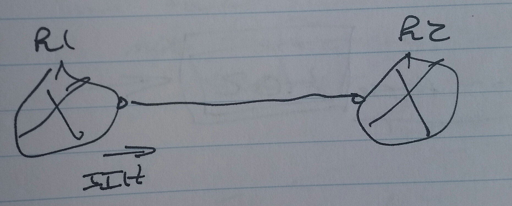
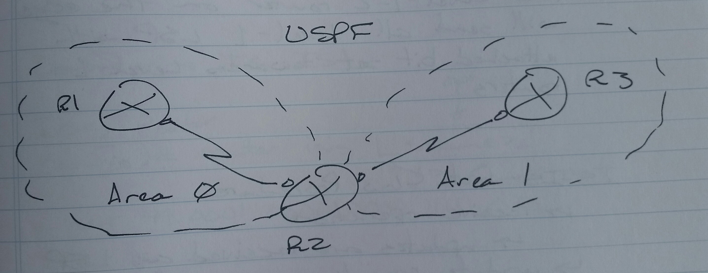
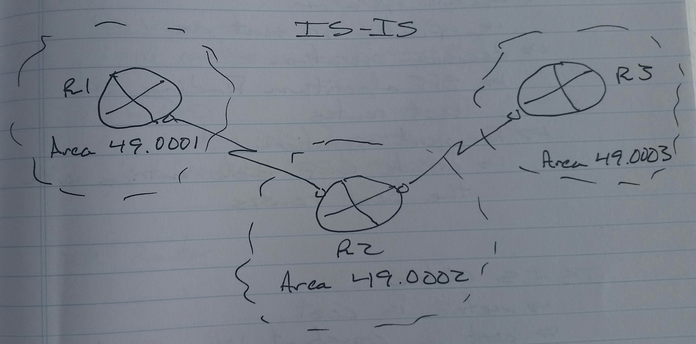
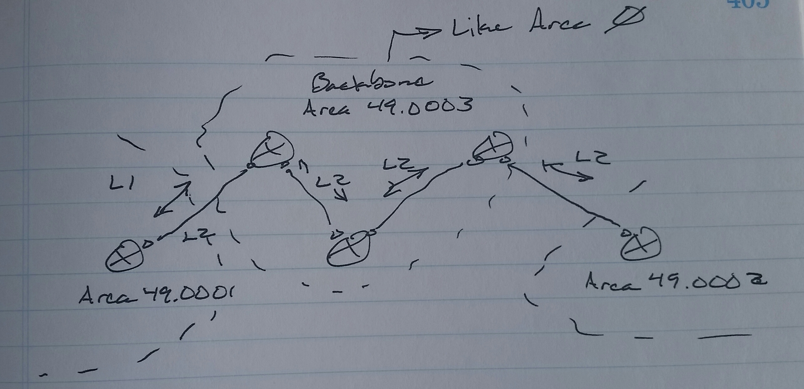

# IS-IS - Class Notes

**IS\-IS** 

\- Link state routing protocol

     \-\> 0xFEFE

     \-\> 0x0800

\- Connectionless Network Protocol \(CLNP\)

\- Like an IP protocol suite in OSI model

     \-\> Router

          \-\> Intermediate System \(IS\)

     \-\> End host

          \-\> End System \(ES\)

     \-\> OSI protocol

          \-\> Directly works over layer 2

     \-\> Integrated IS\-IS can have payload of IPv4 or IPv6

**IS\-IS uses the following parameters**

\- IS\-IS Hello \(IIH\)

\- Link State Packet \(LSP\)

     \-\> Database IS\-IS

\- Complete Sequence Number PDU \(CSNP\)

     \-\> A list of database entries

\- Partial Sequence Number PDU \(PSNP\)

     \-\> A request to send LSPs

**Neighbor Formation**
 \- IIH must match the following
     \-\> Authentication
     \-\> IS type
     \-\> MTU
     \-\> Priority
     \-\> system\-id / area\-id

**Link can be point\-to\-point or multi\-access**
 \- Network types
     \-\> Point\-to\-point
     \-\> Broadcast
          \-\> DIS is elected \(Designated Intermediate System\)
          \-\> Highest priority selected
          \-\> Highest Subnet Point of Attachment \(SNPA\)
          \-\> MAC address \(ethernet\)
          \-\> Frame\-relay DLCI
          \-\> Highest system\-id
          \-\> DIS election is pre\-emptive

**SNAP Address**
 \- Subnetwork Access Point
 \- 20 butes represented in HEX
     \-\> Bytes 1 \- 13
          \-\> area\-id
     \-\> Bytes 14 \- 20
          \-\> Network Selector Field
               \-\> Always equal to "00"

A SNAP address with a NSEL part 0 Network Entity Title \(NET\) address
     \-\> Must be an even number of bytes

**IS\-IS Area and Backbone Network**
 \- Level\-1
     \-\> Router configuration mode
     \-\> Similar to a NSSA
 \- Level\-2
     \-\> Interface configuration mode
     \-\> Similar to Area 0 routers
 \- Level\-1\-2
 \- The level decides which updates can be received
 \- Two routers can be in different areas and still form neighbors
     \-\> This means IS\-IS areas are per router, as opposed to OSPF which is area per\-link

All routers and links, by default, are Level\-1\-2
 \- Within an area, L\-1\-2 neighbors can be formed
 \- Between areas, only L\-2 neighbors can be formed
 \- A consecutive set of Level\-2 adjacencies is called a backbone, which may include several routers
     \-\> The Level\-2 adjacencies cannot be discontiguous
 \- The Level\-1\-2 router on the edge will send all Level\-1 LSP with attached it set towards Level\-1 routers

**IS\-IS Data Flow Procedures**
 \- Receive operation
     \-\> Updates are received as LSP
 \- Update operation
     \-\> Updates are sent as LSP
 \- Decision operation
     \-\> SPF algorithm finding the best routes
 \- Forward operation
     \-\> Create CEF table entries with the best routes

**IS\-IS Metric**
 \- Metric is cost
 \- Cost is constant 10 everywhere
     \-\> No calculation
 \- By default, "narrow metric" is used
     \-\> 6 bit
     \-\> 1 \- 63
 \- Can be changed to "wide metric"
     \-\> 2^24
 \- “Wide metric” is needed for MPLS TE

**IS\-IS Topology**
 \- Single topology
     \-\> IPv4 and IPv6 address\-families share the same path calculation
     \-\> IPv4 and IPv6 has to be enabled on all interfaces configured for IS\-IS
          \-\> The interfaces doesn’t necessarily need both IPv4 and / or IPv6 addresses configured
 \- Multi topology
     \-\> IPv4 and IPv6 address\-families calculate best paths independently
     \-\> IPv4 and IPv6 configuration independent
          \-\> Interfaces configured for IS\-IS can have IPv4 enabled, IPv6 enabled, or both
 \- For IOS routers, the default configuration is single topology
 \- For XR routers, the default configuration is multi topology

**Configuring IS\-IS**

IOS Router

\(config\)\# router isis \[\<name\>}
     \-\> default name is NULL
 net 49.001.0000.0000.1111.00
int lo0
 ip routing isis
 ipv6 routing isis
int fa0/0
 ip routing isis
 ipv6 routing isis

XR Router

\(config\)\# router isis \<name\>
 net 49.0001.0000.0000.1111.00
     \-\> area: area 49.0001
     \-\> system:  .0000.0000.1111
     \-\> NSEL:  .00

 int lo0
  address\-family ipv4 unicast
  address\-family ipv6 unicast
 int g0/0/0/0
  address\-family ipv4 unicast
  address\-family ipv6 unicast

show clns neighbor
show isis neighbor
     \-\> "L1 L2 neighbors"

IOS \(Level type, interface\)

int e0/0
 isis circuit\-type level\-1

XR \(Level type, interface\)

router isis ABC
 int g0/0/0/0
  circuit\-type level\-1

IOS \(Level type, entire router\)

router isis
 is\-type level\-1

XR \(Level type, entire router\)

router isis ABC
 is\-type level\-1

IOS \(Timers\)

int e0/0
 isis hello\-interval \<sec\>
 isis hello\-multiplier \<count\>

XR \(Timers\)

router isis ABC
 int g0/0/0/0
  hello\-interval \<sec\>
  hello\-multiplier \<count\>

IOS 

int e0/0
 isis priority \<value\>
     \-\> 0 \- 127
     \-\> 64 is default
 isis metric \<value\> \[ level\-1 | level\-2 \]
 isis password \<password\>
 isis network { point\-to\-point | broadcast }

**Route Leaking**
 \- Routes can be leaked from Level\-1 to Level\-2
 \- and visa versa

On IOS Level\-1\-2 Router

router isis
 redistribute isis ip level\-2 into level\-1 { distribute\-list \<name\> | route\-map \<name\> }

access\-list \<number\> permit | deny \<protocol\> \<source\> \<wildcard\> \<destination\> \<wildcard\>
     \-\> network leaked \- \<source\> \<wildcard\>
     \-\> subnet mask to match \- \<destination\> \<wildcard\>

Scenario \-\> Leak the loopback of R3 to R1

R2\(config\)\# access\-list 100 permit ip 3.3.3.3 0.0.0.0 255.255.255.255 0.0.0.0
ip prefix\-list ABC permit 3.3.3.3 255.255.255.255
route\-map LEAK
 match ip add prefix\-list ABC

XR

\(config\)\# router\-policy POLICY1
 if destination in \(3.3.3.3/32\)
  pass
  end if
router isis ABC
 address\-family ipv4
 propagate level\-2 into level\-1 route\-policy POLICY1

IOS

\(config\)\# mpls ip
 mpls label protocol ldp
 ip cef
 int fa0/0
  mpls ip

XR

\(config\)\# mpls ldp
 int fa0/0
 int s0/0
 root
 commit

sh run mpls ldp
