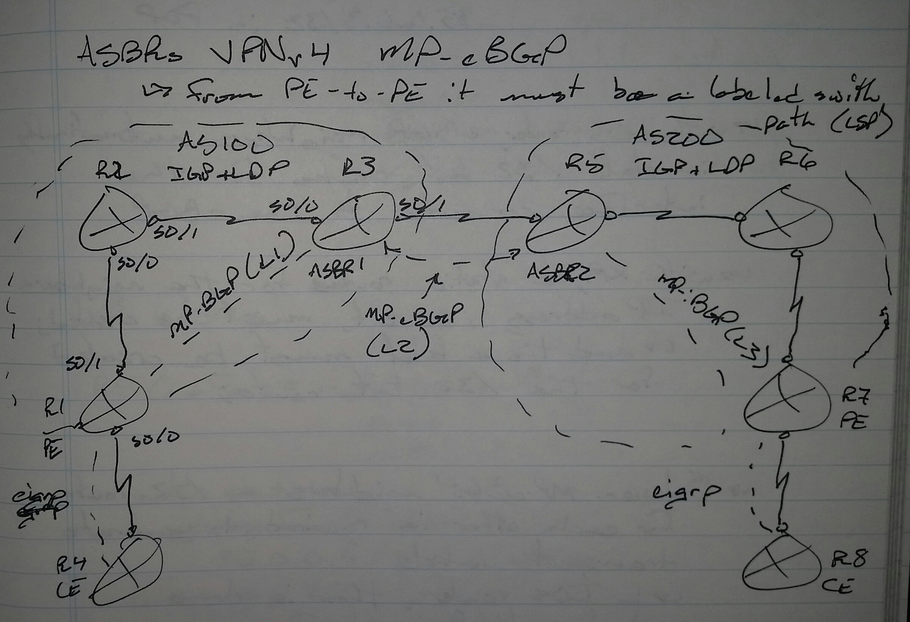
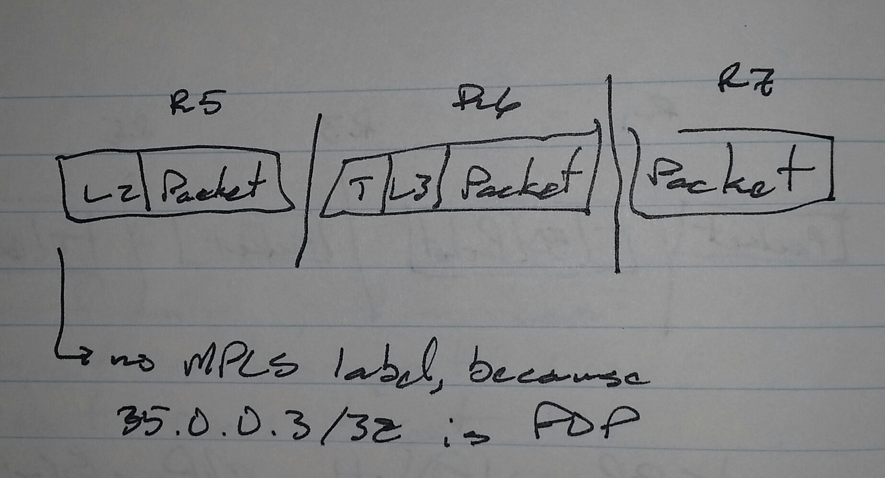

# Inter-AS VPN Option (10) B - Class Notes

**Inter\-AS VPN Option \(10\) B** \(16 Sept 2014\)
Lab: Inter\-AS A, Inter\-AS B, Inter\-AS C
 \- ASBR VPNv4 MP\-eBGP
     \-\> From PE to PE, it must be a Labeled Switched Path \(LSP\)
     \-\> At every next\-hop rewrite on a BGP VPNv4 router, the VPN label is also rewritten
     \-\> When updates come from MP\-eBGP neighbor and go to MP\-iBGP neighbor, the next\-hop will be unchanged by default
     \-\> Between MP\-eBGP neighbors, a /32 bit route for other is required to generate transport labels
          \-\> With IOS routers, eBPG neighbors automatically install /32 bit routes for the interface connected to the eBGP
          \-\> With XR routers, a static route for the neighbors IP addresses, /32 bit, must be created
               \-\> The label must be created for the /32 bit route
     \-\> POP shows the neighbor does MPLS
          \-\> no label says the neighbor does not do MPLS

**IOS Router**

R3\(config\)\# router bgp 100
 no bgp default ipv4\-unicast
 neighbor 1.1.1.1 remote\-as 100
 neighbor 1.1.1.1 update\-source lo0
 neighbor 35.0.0.5 remote\-as 200
 address\-family vpnv4 unicast
  neighbor 1.1.1.1 activate
  neighbor 1.1.1.1 next\-hop\-self
  neighbor 35.0.0.5 activate

**XR Router**

R5\(config\)\# route\-policy PASS
 pass
router static
 address\-family ipv4 unicast
  35.0.0.3/32 s0/0
router bgp 200
 address\-family vpnv4 unicast
 neighbor 7.7.7.7
  remote\-as 200
  update\-source lo0
  address\-family vpnv4 unicast
   next\-hop\-self
 neighbor 35.0.0.3
  remote\-as 100
  address\-family vpnv4 unicast
   route\-policy PASS in
   route\-policy PASS out

**To check the transport label**

sh mpls forwarding\-table
     \-\> IOS
sh mpls forwarding
     \-\> XR

**To check the VPN label**

sh bgp vpnv4 unicast all labels
     \-\> IOS

sh bgp vpnv4 unicast labels
     \-\> XR

**To check updates received**

sh bpg vpnv4 unicast all
     \-\> IOS
     \-\> On any VPNv4 router

sh bgp vpnv4 unicast
     \-\> XR

**The check updates sent**

sh bgp vpnv4 unicast all neighbor \<ip add\> advertised\-routes
     \-\> IOS

sh bgp vpnv4 unicast neighbor \<ip add\> advertised\-routes

**To see which routes are received after incoming filtering**

sh bgp vpnv4 unicast all neighbor \<ip add\> routes
     \-\> IOS

sh bgp vpnv4 unicast neighbor \<ip add\> routes
     \-\> XR

.png)

**\! R1**
int lo0

 ip ospf 1 area 0

int e1/1

 ip ospf 1 area 0
router ospf 1

 router\-id 1.1.1.1

**\! R2**
mpls label protocol ldp

mpls ldp router\-id lo0 force

int lo0

 ip ospf 100 area 0

int e1/0

 ip ospf 100 area 0
router ospf 100
 router\-id 2.2.2.2
 mpls ldp autoconfig
\!
vrf definition ABC

 rd 1:1

 address\-family ipv4

  route\-target both 1:1

int e1/1
 vrf forwarding ABC
 ip address 12.0.0.2 255.255.255.0
\!
router ospf 1 vrf ABC
 network 12.0.0.2 0.0.0.0 area 0
\!
router bgp 100
 bgp router\-id 2.2.2.2
 no bgp default ipv4\-unicast
 neighbor 4.4.4.4 remote\-as 100
 neighbor 4.4.4.4 update\-source lo0
 address\-family vpnv4
  neighbor 4.4.4.4 activate
  neighbor 4.4.4.4 send\-community extended
\!

router ospf 1 vrf ABC

 redistribute bgp 100 subnets

router bgp 100

 address\-family ipv4 vrf ABC

  redistribute ospf 1 vrf ABC match internal external 1 external 2

vrf definition ABC

 address\-family ipv4
  route\-target import 2:2

**\! R3**
mpls ldp

router ospf 100

 router\-id 3.3.3.3

 mpls ldp auto\-config

 area 0
  int lo0
  int gi0/0/0/0
  int gi0/0/0/1

**\! R4**
mpls ldp
router ospf 100
 router\-id 4.4.4.4
 mpls ldp auto\-config

 area 0
  int lo0
  int gi0/0/0/0
\!
router bgp 100
 bgp router\-id 4.4.4.4
 address\-family vpnv4 unicast
  retain route\-target all
 neighbor 2.2.2.2
  remote\-as 100

  update\-source lo0

  address\-family vpnv4 unicast
\!
router bgp 100
 neighbor 2.2.2.2
  address\-family vpnv4 unicast
   next\-hop\-self
 neighbor 45.0.0.5
  remote\-as 200

  address\-family vpnv4 unicast

   route\-policy allow\-all in

   route\-policy allow\-all out

router static
 address\-family ipv4 unicast
  45.0.0.5/32 gi0/0/0/1
route\-policy allow\-all

 pass

 end

**\! R5**
mpls ldp
router ospf 100
 router\-id 5.5.5.5
 mpls ldp auto\-config

 area 0
  int lo0
  int gi0/0/0/0
\!
router bgp 200
 bgp router\-id 5.5.5.5
 address\-family vpnv4 unicast
  retain route\-target all
 neighbor 7.7.7.7
  remote\-as 200

  update\-source lo0

  address\-family vpnv4 unicast
\!
router bgp 200
 neighbor 7.7.7.7
  address\-family vpnv4 unicast
   next\-hop\-self
 neighbor 45.0.0.4
  remote\-as 100

  address\-family vpnv4 unicast

   route\-policy allow\-all in

   route\-policy allow\-all out

router static
 address\-family ipv4 unicast
  45.0.0.4/32 gi0/0/0/1
route\-policy allow\-all

 pass

 end

**\! R6**
mpls label protocol ldp

mpls ldp router\-id lo0 force

int lo0

 ip ospf 200 area 0

int e1/0
 ip ospf 200 area 0
int e1/1
 ip ospf 200 area 0

router ospf 200

 router\-id 6.6.6.6

 mpls ldp autoconfig

**\! R7**

mpls label protocol ldp

mpls ldp router\-id lo0 force

int lo0
 ip ospf 200 area 0
int e1/0
 ip ospf 200 area 0
router ospf 200
 router\-id 7.7.7.7
 mpls ldp autoconfig
\!
vrf definition DEF

 rd 2:2

 address\-family ipv4

  route\-target both 2:2

int e1/1
 vrf forwarding DEF
 ip address 78.0.0.7 255.255.255.0
\!
router ospf 1 vrf DEF
 network 78.0.0.7 0.0.0.0 area 0
\!
router bgp 200
 bgp router\-id 7.7.7.7
 no bgp default ipv4\-unicast
 neighbor 5.5.5.5 remote\-as 200
 neighbor 5.5.5.5 update\-source lo0
 address\-family vpnv4
  neighbor 5.5.5.5 activate
  neighbor 5.5.5.5 send\-community extended
\!
router ospf 1 vrf DEF
 redistribute bgp 200 subnets

router bgp 200

 address\-family ipv4 vrf DEF

  redistribute ospf 1 vrf DEF match internal external 1 external 2

vrf definition DEF

 address\-family ipv4

  route\-target import 1:1

**\! R8**
router ospf 1

 router\-id 8.8.8.8

 area 0
  int lo0
  int gi0/0/0/0

**Verification:**

**\! R1**
sh ip ospf int bri
sh ip ospf nei
sh ip route ospf
ping 8.8.8.8

**\! R2**
sh ip ospf int bri
sh ip ospf nei
sh ip route ospf
sh mpls int
sh mpls ldp nei
sh mpls ldp dis
sh vrf detail
sh ip ospf int bri
sh ip ospf nei
sh ip route vrf ABC ospf
sh bgp vpnv4 u all sum
sh ip route vrf ABC ospf
sh bgp vrf ABC
sh bgp vrf ABC vpnv4 u all
sh bgp vrf ABC vpnv4 u all labels
sh ip route vrf ABC bgp
sh ip ospf database
sh mpls forwarding

**\! R3**
sh ospf int bri
sh ospf nei
sh route ospf
sh mpls int
sh mpls ldp nei bri
sh mpls ldp dis

**\! R4**
sh ospf int bri
sh ospf nei
sh route ospf
sh mpls int

sh mpls ldp nei bri
sh mpls ldp dis

sh bgp vpnv4 u sum
sh bgp vpnv4 u
sh bgp vpnv4 u labels
sh mpls forwarding

**\! R5**
sh ospf int bri
sh ospf nei
sh route ospf
sh mpls int

sh mpls ldp nei bri
sh mpls ldp dis

sh bgp vpnv4 u sum
sh bgp vpnv4 u
sh bgp vpnv4 u labels
sh mpls forwarding

**\! R6**
sh ip ospf int bri
sh ip ospf nei
sh ip route ospf
sh mpls int
sh mpls ldp nei
sh mpls ldp dis

**\! R7**
sh ip ospf int bri
sh ip ospf nei
sh ip route ospf
sh mpls int

sh mpls ldp nei
sh mpls ldp dis

sh vrf detail
sh ip ospf int bri

sh ip ospf nei
sh ip route vrf DEF ospf
sh bgp vpnv4 u all sum
sh ip route vrf DEF ospf
sh bgp vrf DEF
sh bgp vrf DEF vpnv4 u all
sh bgp vrf DEF vpnv4 u all labels
sh ip route vrf DEF bgp
sh ip ospf database
sh mpls forwarding

**\! R8**
sh ospf int bri
sh ospf nei
sh route ospf
ping 1.1.1.1
