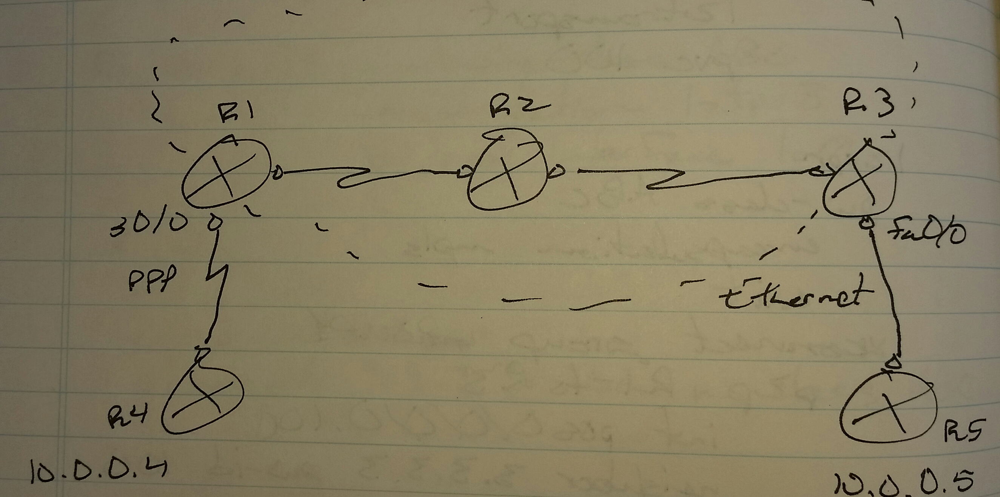
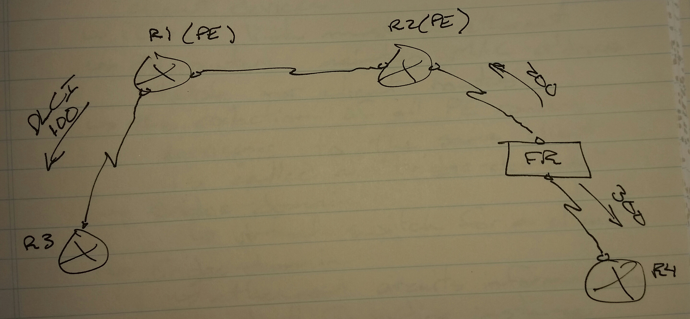
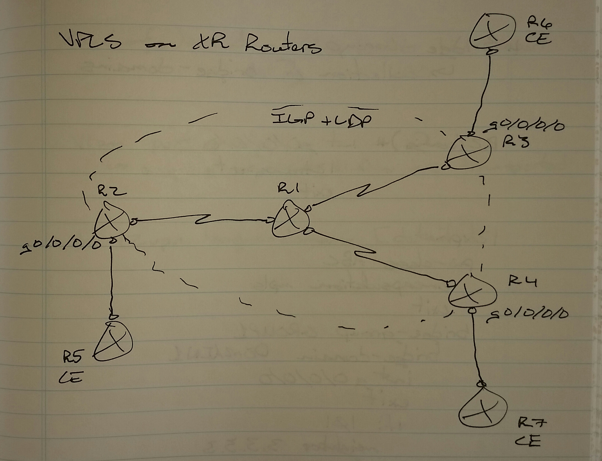

# L2VPN Interworking - Class Notes

**L2VPN Interworking** \(20 Sept 2014\)

Lab: EoMPLS, PPP\_ETHERNET, PPP\_ETHERNET

 \- Mechanism to connect two different layer 2 protocols over a L2VPN network

R1\(config\)\# pweudowire\-class ABC

 encapsulation mpls

 interworking ip

int s0/0

 encapsulation ppp

 xconnect 3.3.3.3 100 pw\-class ABC

XR Router

l2vpn

 pw\-class ABC

  encapsulation mpls

  interworking ip

 xconnect group GROUP1

  p2p R1\-to\-R3

   int g0/0/0/0

    neighbor 3.3.3.3 pw\-id 100 pw\-class ABC

Frame\-relay special scenario

R2\(config\)\# int s0/0

 encapsulation frame\-relay

do sh frame\-relay pvc

     \-\> To get the DLCI information

 frame\-relay interface\-dlci 200 switched

connect fr x0/0 200 l2transport

 xconnect 1.1.1.1 100 encapsulation mpls

During the lab, you will only be asked to configure VPLS on the XR routers

 \- All other L2VPN configuration will be done on the IOS routers

     \-\> Virtual 7200 for IOS doesn't support VPLS

sh mpls l2transport vc \<id\> \(IOS\)

sh l2vpn xconnect \[detail\] \(XR\)

