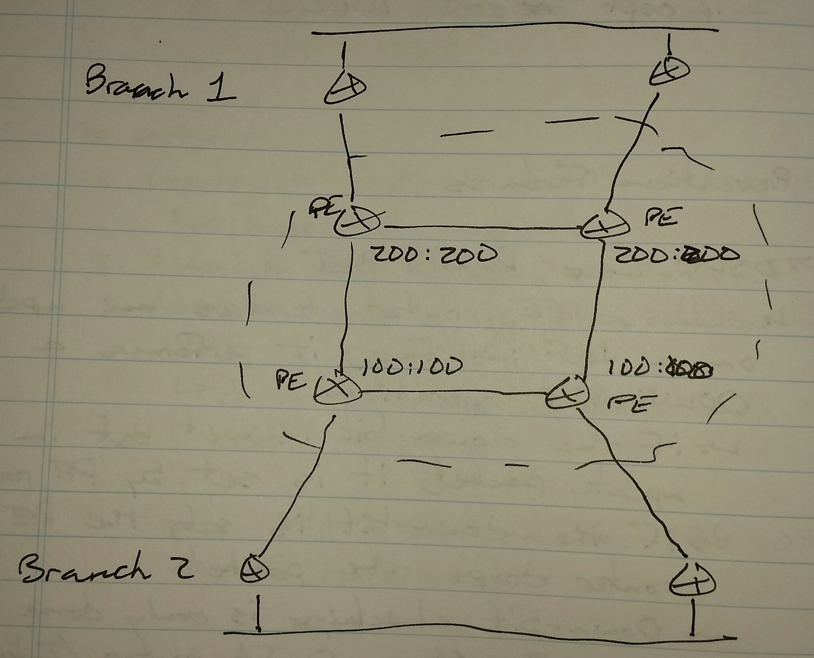

# L3VPN Loop Prevention Features - Class Notes

**L3VPN Loop Prevention Featurees** \(3 Sept 2014\)

Lab:  MPLS 1 \- 3

**OSPF**

\- Uses DOWN\-BIT

     \-\> When a PE router receives an update on a VRF interface, it performs a DOWN\-BIT operation

          \-\> If the down\-bit is not set in the update packet, it is set by the PE router

          \-\> If the down\-bit is set, the PE router drops the packet

          \-\> Down\-bit checking is only done on type 3 LSAs \(Inter\-Area\)

          \-\> Doesn't work for type 1 LSAs used by sham\-links

          \-\> No configuration required

**BGP**

\- Can use extended community called "site\-of\-origin"

     \-\> Can be set on incoming VRF interface

     \-\> SoO = 64 bit value represented at [X:Y](file:///X:Y%5D)

          \-\> Must be different on each PE router

R1\(config\)\# router bgp 100

address\-family ipv4 vrf c1b1

  neighbor 14.0.0.4 soo 100:100

R3\(config\)\# router bgp 100

address\-family ipv4 vrf c1b2

  neighbor 35.0.0.5 soo 200:200

SoO value should be the same on PE routers connected to the same branch.

**EIGRP**

 \- Can use "site\-of\-origin" to prevent loops

R1\(config\)\# router\-map SOO

 set ext\-community soo 100:100

int s0/0

 ip vrf sitemap SOO

Sitemap

 \- If SoO is not set, then set

 \- If SoO is set, then drop
