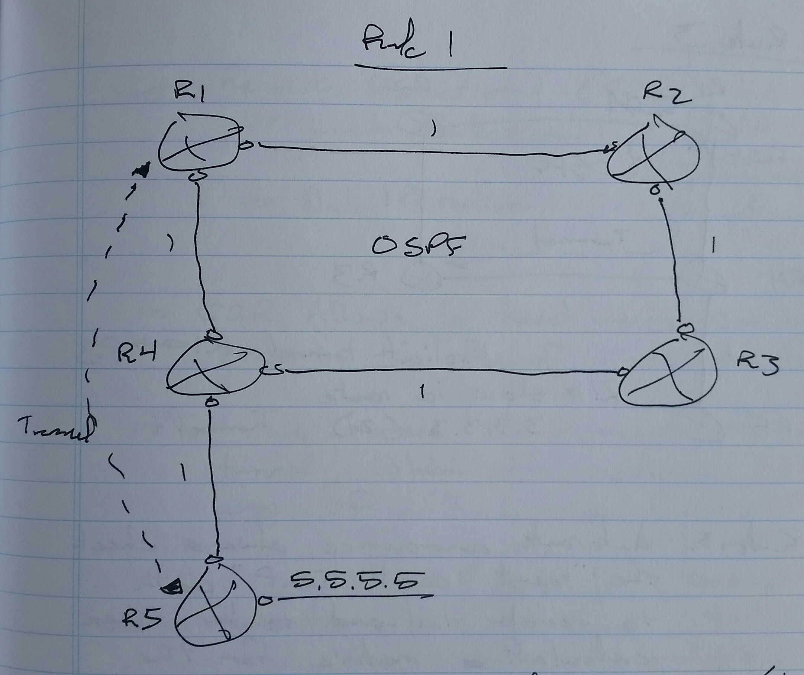

# MPLS Traffic Engineering (MPLS TE) - Class Notes

**MPLS Traffic Engineering \(MPLS TE\)** \(10 Sept 2014\)Lab: MPLS TE 1 \- 2
\- This mechanism allows for a predefined route from source to destination

\- It can use a path that meets the interface property requirements

     \-\> Bandwidth

     \-\> Delay

Starting point

\- MPLS tunnel head end

End point

\- MPLS tunnel tail end

**TE Components**

1. Interface constraints

     \-\> Bandwidth

     \-\> Delay

     \-\> Jitter

2. Link state routing protocol

     \-\> To advertise the link constaints

3. Algorithm

     \-\> To calculate the best routes according to tunnel requirements of interface constraints

     \-\> PCALC

          \-\> Path Calculation

     \-\> OSPF constraint\-based SPF

4. Tunnel signaling

     \-\> The process of requesting and receiving MPLS labels

     \-\> Resource Reservation Protocol

5. Fowarding traffic over the tunnel

Interface Constraints

\- Max bandwidth

     \# bandwidth \<kbps\>

\- Max reservable bandwidth

     \# ip rsvp bandwidth \<kbps\>

\- Available bandwidth

     \-\> Variable which the router calculates

\- Administrative groups

     \-\> Optional

     \-\> 32 bit value used to define other attributes

          \-\> Delay

          \-\> Jitter

R1\(config\)\# mpls traffic\-eng tunnels

int fa0/0

  bandwidth \<kbps\>

     \-\> all interfaces have to set

  mpls traffic\-eng tunnels

  ip rsvp bandwidth \<kbps\>

  mpls traffic\-eng administrative\-group \<value in hex\>

**Routing Protocols**

\- OSPF and IS\-IS can be used

\- OSPF

     \-\> Opaque LSAs 9, 10, and 11 are used

     \-\> LSA 9

          \-\> Link\-local

     \-\> LSA 10

          \-\> Area\-local

          \-\> Intra\-area MPLS\-TE

     \-\> LSA 11

          \-\> Domain\-local

          \-\> Inter\-area MPLS\-TE

\- IS\-IS

     \-\> Introduces two new TVLs

          \-\> Extended IS Reachability

          \-\> Extended IP Reachability

**OSPF**

\- On all routers

\(config\)\# router ospf 1

mpls traffic\-eng router\-id lo0

mpls traffic\-end area 0

**IS\-IS**

\- On all routers

\(config\)\# router isis ABC

mpls traffic\-eng router lo0

mpls traffic\-eng level\-2

RSVP

\- RSVP Path Message

\- RSVP Reserve Message

Explicit Router Object \(ERO\)

\- Headend router sends path message with the ERO in the message

     \-\> ERO contains a collection of next\-hops to be used

          \-\> 16.0.0.1

          \-\> 13.0.0.3

          \-\> 34.0.0.4

          \-\> 45.0.0.5

When any router receives the path message, it checks the ERO and removes its own IP address and sends the message to the next\-hop

The path message also contains the bandwidth requirement of the tunnel

When the path message reaches the tailend router, the tailend router generates a RESV message that contains the label to be used

\- Each router that receives the RESV message changes the message with its generated label to be used

     \-\> RSVP label, not an MPLS label

**Headend Tunnel Configuration**

\- Tunnel IP address

     \-\> Unnumbered

     \-\> Linked to a loopback interface

\- Destination IP address

     \-\> Router\-id of the tailend router

\- Bandwidth required

\- Path options

     \-\> Manual

          \-\> Explicit path

     \-\> Dynamic

          \-\> PCALC

          \-\> SPF

\- Setup and holding priorities

     \-\> Tunnel parameters

\- Affinity

\- Tunnel metric

     \-\> IGP

     \-\> TE

R6 \(headend\) \-\> R1 \-\> R3 \-\> R4 \-\> R5 \(tailend\)

R6\(config\)\# int tu0

unnumbered lo0

tunnel mode mpls traffic\-eng

tunnel destination 5.5.5.5

tunnel mpls traffic\-eng bandwidth \<kbps\>

tunnel mpls traffic\-eng path\-option explicit name \<name\>

ip explicit\-path name \<name\> enable

next\-address 16.0.0.1

next\-address 13.0.0.3

next\-address 34.0.0.4

next\-address 45.0.0.5

show mpls traffic\-eng tunnels \[name\]

**Path Option Priority**

\- Multiple path\-option commands can be configured for some tunnel with different priority value

     \-\> 1 to 1000

     \-\> Priority

          \-\> Lower value

Scenario \-\>

\- Configure MPLS TE on all routers to support max reservable bandwidth 2Mbps

\- Configure OSPF area 0

\- Configure an MPLS TE tunnel from R1 to R3 with 1Mbps bandwidth requirement

\- Use dynamic path option

R1\(config\)\# mpls traffic\-eng tunnels

int fa0/0

  mpls traffic\-eng tunnels

  ip rsvp bandwidth 2000

router ospf 1

network 12.0.0.1 0.0.0.0 area 0

network 1.1.1.1 0.0.0.0 area 0

mpls traffic\-eng router\-id lo0

mpls traffic\-eng area 0

int tu0

ip unnumbered lo0

tunnel mode mpls traffic\-eng

tunnel destination 3.3.3.3

tunnel mpls traffic\-eng bandwidth 1000

tunnel mpls traffic\-eng path\-options 1 dynamic

**Path Option Exclude Address**

R1\(config\)\# ip explicit\-path name NOR3 enable

exclude\-address 3.3.3.3

tunnel mpls traffic\-eng path\-option 1 explicit name NOR3

**Affinity and Administrative Group**

Tunnel interface

\- Affinity

     \-\> Requirement

     \-\> 32 bit variable in HEX

     \-\> 0x00000000

On any other router in the path, administrative group a a viable resource

     \-\> 32 bit variable in HEX

     \-\> 0x0000FFFF

On headend router

int tu0

tunnel mpls traffic\-eng affinity 0x01000000 mask 0x0000FFFF

On all of the interfaces of routers in the path

R2\(config\)\# int g0/0/0/0

mpls traffic\-eng attribute\-flag 0x01000000

**Setup and Holding Priorities**

\- Every tunnel is assigned two priorities

     \-\> Setup Priority

          \-\> Decides whether a tunnel can ask for specific bandwidth or not in case bandwidth is already assigned to another tunnel

          \-\> Preemptive

          \-\> 0 \- 7 \(lower is better\)

     \-\> Holding Priority

          \-\> Decides whether a tunnel can still reserve the bandwidth in cast another tunnel is requesting bandwidth

\- Setup priority cannot be lower than holding priority

Headend Router

int tu0

  tunnel mpls traffic\-eng priority \<setup\> \<holding\>

**Re\-Optimization**

\- When new links or more resources are available

\- 3 ways to re\-optimize

     \-\> Periodic

          \# mpls traffic\-eng reoptimize timers frequency \<minutes\>

     \-\> Event Driven

          \# mpls traffic\-ing reoptimize event linkup

     \-\> Manual

          \# mpls traffic\-eng reoptimize \[tunnel \<number\>\]

**RSVP**

\- Tailend router uses explicit null

     \-\> But penultimate router consider it as implicit null

\- On penultimate router \(hidden command\)

     \# mpls traffic\-eng signalling interpret explicit\-null

**Forwarding Traffic over Tunnel Interface**

1. Static route

R1\(config\)\# ip route 50.0.0.0 255.0.0.0 tu1

2. Policy Based Routing \(PBR\)

     \- Scenario \-\> Traffic from R6 shoulduse tunnel 1 and traffic from R7 should use tunnel 2

R1\(config\)\# route\-map MAP1

set interface tu1

route\-map MAP2

set interface tu2

int fa0/0

ip policy route\-map MAP1

int fa0/1

ip policy route\-map MAP2

3. Autoroute Announce

     \-\> The tunnel is included in SPF calculation as a valid exit interface

     \-\> All of the up stream network connected to the tailend router will have tunnel as the exit interface

     \-\> If multiple tunnels are available, then the nearest TE router to the destination is used as the exit interface

\(config\)\# int tu1

tunnel mpls traffic\-eng autoroute\-announce

**Forwading Adjacency**

\- The tunnel is considered as a single link

\- All of the non\-TE enabled routers will also consider the link when calculating best path

\- The tunnels must be two way to be considered a link

On the Headend Routers

\(route\)\# int tu1

tunnel mpls traffic\-eng forwarding\-adjacency

**MPLS TE on XR Routers**

1. On all routers, activate MPLS TE

     \-\> for interfaces

     \-\> routing protocols

     \-\> RSVP max reservable bandwidth

2. To configure tunnel interface on headend router

     \-\> IOS

router ospf 1

mpls traffic\-eng router\-id lo0

mpls traffic\-eng area 0

int fa0/0

mpls traffic\-eng tunnels

ip rsvp bandwidth \<kbps\>

     \-\> XR

mpls traffic\-eng

int fa0/0

int s0/0

rsvp

int fa0/0

  bandwidth 50000

int s0/0

  bandwidth 50000

router ospf 1

mpls traffic\-eng router\-id lo0

area 0

  mpls traffic\-eng

IOS \(attribute flag\)

int fa0/0

mpls traffic\-eng attribute\-flags 0x01000000

XR \(attribute flag\)

mpls traffic\-eng

int fa0/0

  attribute\-flag 0x01000000

IOS \(tunnel configuration\)

int tu1

ip unnumbered lo0

tunnel mode mpls traffic\-eng

tunnel destination 3.3.3.3

tunnel mpls traffic\-eng bandwidth 5000

tunnel mpls traffic\-eng path\-option 1 explicit name EXP1

exit

ip explicit\-path name EXP1 enable

next\-address 12.0.0.2

next\-address 23.0.0.3

XR \(tunnel configuration\)

int tunnel\-te 1

ipv4 unnumbered lo0

destination 3.3.3.3

signalled\-bandwidth 5000

path\-option 1 explicit name EXP1

explicit\-path name EXP1

index 10 next\-address strict ipv4

  unicast 12.0.0.2

index 20 next\-address strict ipv4

  unicast 23.0.0.3

sh mpls traffic\-eng tunnels \[tunnel\-id\]

     \-\> both IOS and XR

IOS \(reoptimization timers\)

\(config\)\# mpls traffic\-eng reoptimization timers frequency \<minutes\>

XR \(reoptimization timers\)

\(config\)\# mpls traffic\-eng

reoptimization timers frequency \<minutes\>

**TE Metric**
 \- There are two metrics
     \-\> IGP metric
     \-\> TE metric
 \- By default, TE metric is used to setup the tunnel if the dynamic path\-option is used
 \- By default, TE metric is equal to IGP metric
     \-\> To change change the TE metric

R1\(config\)\# int fa0/0
 mpls traffic\-eng administrative\-weight \<value\>

Tunnel R1 \- R4

R1\(config\)\# int fa0/0
 mpls traffic\-eng administrative\-weight 65

**TE Metric Autoroute Announce**
 \- Autoroute announce the best route metric calculation
     \-\> It uses the tunnel interface as exit for all the prefixes connected to and beyond tail\-end router

R1 \-\> R3 \+ autoroute announce

sh ip route
                    exit interface
4.4.4.4          Tunnel1
3.3.3.3          Tunnel1
34.0.0.0        Tunnel1

The metric calculated for these prefixes follow some specific rules \(four\)

**Rule 1**
 \- For prefixes directly connected to the tail\-end router, the tunnel path is always used

Tunnel R1 \- R5 \(dynamic\)
 \- Both the IGP and TE metric will be the same

**Rule 2**
 \- Load balancing for the prefixes beyond the tail\-end router is possible with IGP, provided that autoroute announce metric and IGP metric is the same

**Rule 3**
 \- Autoroute announce always checks the "least cost IGP" path to reach the tail\-end router when calculating metric for the prefixes connected to and beyond the tail\-end router

**Rule 4**
 \- If the tail\-end router is in the path of the IGP route, the IGP route is not considered at all

**Fast Reroute Protection \(FRR\)**
 \- Fault tolerance mechanism
     \-\> Link protection
     \-\> Node protection
 \- FRR allows for the tunnel to continue being used in the case of link or node failure
 \- For this, it uses the concept of a backup tunnel which gets activated in the case of a link or node failure
 \- For any router that wants to protect the link, a backup tunnel is configured to become active when the protected link goes down
 \- The backup tunnel is inactive as long as the protected link is active
     \-\> Very fast switch over
          \-\> Less than 50 ms
 \- Starting point of the backup tunnel is called the Point of Local Repair \(PLR\)
 \- End point of the backup tunnel is called the merge point

An explicit tunnel is created on the PLR to reach the merge point by using the backup path
 \- This tunnel is then flagged as a backup tunnel inside the protected link's interface
     \-\> R2's fa0/1
     \-\> By doing this, the backup tunnel becomes inactive as long as the protected link is up

R1 must be configured for FRR
 \- The head\-end router of the main tunnel must be configured with the fast reroute feature
     \-\> So that it will continue sending traffic after receiving a path error message

Fast Reroute Configuration 

R1\(config\)\# int tu1
 tunnel mpls traffic\-eng fast\-reroute

R2\(config\)\# ip explicit\-path name 243 enable
 next\-address 24.0.0.4
 next\-address 34.0.0.3
int tu100
 ipv4 unnumbered lo0
 tunnel mode mpls traffic\-eng
 tunnel mpls traffic\-eng path\-option 1 explicit name 243
 tunnel destination 3.3.3.3
     \-\> The merge point
     \-\> The bandwidth command is not needed
int fa0/1
 mpls traffic\-eng backup\-path tu100

PLR
 \- sh mpls traffic\-eng backup
     \-\> 1 configured \(0 active\)

XR Routers

R1\(config\)\# int tunnel\-te 1
 fast\-reroute
 root
 commit

R2\(config\)\# explicit\-path name 243
 index 10 next\-address strict ipv4 unicast 24.0.0.4
 index 20 n s i u 34.0.0.3
int tunnel\-te 100
 ipv4 unnumbered lo0
 path\-option 1 explicit 243
 destination 3.3.3.3
mpls traffic\-eng
 int fa0/1
  backup\-path tunnel\-te 100
  root
  commit

**Node Protection**
 \- Next\-to\-next hop protection
     \-\> NNHOP
 \- In node protection, next\-to\-next hop router from PLR is the merge point
 \- The backup tunnel is created with the merge point as the destination and explicit path\-option excluding the failed node
 \- When the merge point receives the PATH message, it replies with the RESV message including it's "incoming label" expected from the failed node
 \- The main tunnel's head\-end router should be configured with the fast reroute option

IOS Routers

R1\(config\)\# int tu1
 tunnel mpls traffic\-eng fast\-reroute node\-protect

R2\(config\)\# ip explicit\-path 245 enable
 exclude\-address 3.3.3.3
int tu100
 ip unnumbered lo0
 tunnel mode mpls traffic\-eng
 tunnel destination 5.5.5.5
 tunnel mpls traffic\-eng path\-option 1 explicit name 245
int fa0/0
 mpls traffic\-eng backup\-path tu100

On PLR
 \- sh mpls traffic\-eng fast\-reroute database \[detail\]

**Inter\-Area Traffic Engineering**
 \- OPSF
     \-\> Multiple areas
     \-\> Opaque LSA 11
          \-\> Scope \- global \(inter\-area\)
 \- IS\-IS
     \-\> Level\-1 and Level\-2 domains
          \-\> TLV 22 \(type\-length\-value\)
               \-\> within a level
          \-\> TLV 125
               \-\> Between levels \(Level\-1 and Level\-2\)
 \- Behaves like a link state protocol only within the same area
 \- Behaves like a distance vector protocol between multiple areas

R1\(config\)\# int tu1
 ip unnumbered lo0
 tunnel mode mpls traffic\-eng
 tunnel mpls traffic\-eng bandwidth 2000
 tunnel mpls traffic\-eng path\-option 1 explicit name ABC
 tunnel destination 6.6.6.6
ip explicit\-path name ABC enable
 next\-address loose 3.3.3.3
     \-\> ABR
 next\-address loose 5.5.5.5
     \-\> ABR
 next\-address loose 6.6.6.6
     \-\> Destination

 \- On head\-end router, the tunnel is configured with an explicit path\-option with loose next\-address
 \- Loose next\-addresses are the mpls router\-ids of ABRs in the path or Layer\-1\-2 routers
 \- When the path message is to be sent, these loose addresses are expanded to a collection of strict addresses by head\-end router and every ABR

XR Routers
 
explicit\-path name ABC
 index 10 next\-address loose ipv4 unicast \<ABR address\>

**Restriction on Inter\-Area Traffic Engineering**
 1. Cannot use dynamic path\-option
 2. Cannot use affinity / attribute\-flag
 3. Cannot use autoroute announce

.png)

**\! R1**
mpls ldp
router ospf 1
 router\-id 1.1.1.1
 mpls ldp auto\-config

 area 0
  int lo0
  int gi0/0/0/0
  int gi0/0/0/1
\!
router ospf 1

 mpls traffic\-eng router\-id lo0

 area 0

  mpls traffic\-eng

  exit
  exit
**\!     \-\> One of the problems with typing the configuration into a text editor and copying and pasting the configuration into the router**
**\!     \-\> “root” also works;  if not, “mpls traffic\-eng” and the interfaces in the next section will get pasted into the “area 0"**
**\!     \-\> The other option is to configure “mpls traffic” before “router ospf 1"**

mpls traffic\-eng
 int gi0/0/0/0
 int gi0/0/0/1
rsvp
 int gi0/0/0/0
  bandwidth 25000
 int gi0/0/0/1
  bandwidth 25000
\!
int tunnel\-te 16

 ipv4 unnumbered lo0
 destination 6.6.6.6
 signalled\-bandwidth 4000
 path\-option 1 explicit name 16

explicit\-path name 16
 index 10 next\-address strict ipv4 unicast 18.0.0.8
 index 20 n s i u 78.0.0.7
 index 30 n s i u 27.0.0.2
 index 40 n s i u 23.0.0.3
 index 50 n s i u 34.0.0.4
 index 60 n s i u 46.0.0.6
\!
int lo1
 ipv4 add 1.1.1.11/32

router static
 address\-family ipv4 unicast
 6.6.6.66/32 tunnel\-te 16
 
**\! R2**
mpls ldp
router ospf 1
 router\-id 2.2.2.2
 mpls ldp auto\-config

 area 0
  int lo0
  int gi0/0/0/0
  int gi0/0/0/1
  int gi0/0/0/2
\!
router ospf 1

 mpls traffic\-eng router\-id lo0

 area 0

  mpls traffic\-eng

  exit
  exit
mpls traffic\-eng
 int gi0/0/0/0
 int gi0/0/0/1
 int gi0/0/0/2
rsvp
 int gi0/0/0/0
  bandwidth 25000
 int gi0/0/0/1
  bandwidth 25000
 int gi0/0/0/2
  bandwidth 25000

**\! R3**
mpls ldp
router ospf 1
 router\-id 3.3.3.3
 mpls ldp auto\-config

 area 0
  int lo0
  int gi0/0/0/0
  int gi0/0/0/1
  int gi0/0/0/2
\!
router ospf 1

 mpls traffic\-eng router\-id lo0

 area 0

  mpls traffic\-eng

  exit

  exit
mpls traffic\-eng
 int gi0/0/0/0
 int gi0/0/0/1
 int gi0/0/0/2
rsvp
 int gi0/0/0/0
  bandwidth 25000
 int gi0/0/0/1
  bandwidth 25000
 int gi0/0/0/2
  bandwidth 25000

**\! R4**
mpls ldp
router ospf 1
 router\-id 4.4.4.4
 mpls ldp auto\-config

 area 0
  int lo0
  int gi0/0/0/0
  int gi0/0/0/1
  int gi0/0/0/2
\!
router ospf 1

 mpls traffic\-eng router\-id lo0

 area 0

  mpls traffic\-eng

  exit

  exit
mpls traffic\-eng
 int gi0/0/0/0
 int gi0/0/0/1
 int gi0/0/0/2
rsvp
 int gi0/0/0/0
  bandwidth 25000
 int gi0/0/0/1
  bandwidth 25000
 int gi0/0/0/2
  bandwidth 25000

**\! R5**
mpls label protocol ldp

mpls ldp router\-id lo0 force

int lo0

 ip ospf 1 area 0

int e1/0

 ip ospf 1 area 0

int e1/1

 ip ospf 1 area 0
router ospf 1
 router\-id 5.5.5.5
 mpls ldp autoconfig
\!
mpls traffic\-eng tunnels

int e1/0
 mpls traffic\-eng tunnels
 ip rsvp bandwidth 25000
int e1/1
 mpls traffic\-eng tunnels
 ip rsvp bandwidth 25000
router ospf 1
 mpls traffic\-eng router\-id lo0

 mpls traffic\-eng area 0

**\! R6**
mpls label protocol ldp

mpls ldp router\-id lo0 force

int lo0

 ip ospf 1 area 0

int e1/0

 ip ospf 1 area 0

int e1/1

 ip ospf 1 area 0

router ospf 1

 router\-id 6.6.6.6

 mpls ldp autoconfig
\!
mpls traffic\-eng tunnels

int e1/0
 mpls traffic\-eng tunnels
 ip rsvp bandwidth 25000
int e1/1
 mpls traffic\-eng tunnels
 ip rsvp bandwidth 25000
router ospf 1

 mpls traffic\-eng router\-id lo0

 mpls traffic\-eng area 0
\!
int tu61

 ip unnumbered lo0
 tunnel mode mpls traffic\-eng
 tunnel mpls traffic\-eng bandwidth 4000
 tunnel mpls traffic\-eng path\-option 1 explicit name 61

 tunnel destination 1.1.1.1
ip explicit\-path name 61 enable
 next\-address 56.0.0.5
 ne 35.0.0.3
 ne 23.0.0.2
 ne 27.0.0.7
 ne 78.0.0.8
 ne 18.0.0.1
\!
int lo1
 ip add 6.6.6.66 255.255.255.255
ip route 1.1.1.11 255.255.255.255 tu61

**\! R7**
mpls label protocol ldp

mpls ldp router\-id lo0 force

int lo0

 ip ospf 1 area 0

int e1/0

 ip ospf 1 area 0

int e1/1

 ip ospf 1 area 0

int s2/0

 ip ospf 1 area 0

 ip ospf cost 1
router ospf 1
 router\-id 7.7.7.7
 mpls ldp autoconfig
\!
mpls traffic\-eng tunnels

int e1/0
 mpls traffic\-eng tunnels
 ip rsvp bandwidth 25000
int e1/1
 mpls traffic\-eng tunnels
 ip rsvp bandwidth 25000
int s2/0
 mpls traffic\-eng tunnels
 ip rsvp bandwidth 25000
router ospf 1
 mpls traffic\-eng router\-id lo0

 mpls traffic\-eng area 0

**\! R8**
mpls label protocol ldp

mpls ldp router\-id lo0 force

int lo0

 ip ospf 1 area 0

int e1/0

 ip ospf 1 area 0

int s2/0

 ip ospf 1 area 0

 ip ospf cost 1
router ospf 1
 router\-id 8.8.8.8
 mpls ldp autoconfig
\!
mpls traffic\-eng tunnels

int e1/0
 mpls traffic\-eng tunnels
 ip rsvp bandwidth 25000
int s2/0
 mpls traffic\-eng tunnels
 ip rsvp bandwidth 25000
router ospf 1

 mpls traffic\-eng router\-id lo0

 mpls traffic\-eng area 0

**Verification:**

**IOS:**
sh ip ospf int bri
sh ip ospf nei
sh ip route ospf
sh mpls int
sh mpls ldp nei
sh mpls ldp dis
sh mpls traffic\-eng topology
     \-\> You configured the MPLS TE router\-id right?

sh mpls traffic\-eng tunnels
sh ip explicit\-paths
sh ip rsvp nei
sh ip rsvp int
sh ip rsvp sender
sh ip rsvp reservation

**XR:**
sh ospf int rbi
sh ospf nei
sh route ospf
sh mpls int
sh mpls ldp nei bri
sh mpls ldp dis
sh mpls traffic\-eng topology
sh mpls traffic\-eng tunnels
sh explicit\-paths
sh rsvp nei
sh rsvp int
sh rsvp sender
sh rsvp reservation

**\! R1**
sh ip int bri
     \-\> Is the tunnel up?

sh mpls traffic\-eng tunnels
     \-\> Will tell you why the tunnel is not up
ping 6.6.6.66

traceroute 6.6.6.66
sh rsvp int
     \-\> Did the bandwidth get allocated?
sh rsvp sender
sh rsvp reservation

**\! R6**
sh ip int bri
sh mpls traffic\-eng tunnels
ping 1.1.1.11

traceroute 1.1.1.11
sh rsvp int
sh ip rsvp sender
sh ip rsvp reservation

.png)

**\! R1**
mpls ldp

router ospf 1

 router\-id 1.1.1.1

 mpls ldp auto\-config

 area 0
  int lo0
  int gi0/0/0/0
  int gi0/0/0/1
\!
mpls traffic\-eng
 int gi0/0/0/0
 int gi0/0/0/1

router ospf 1

 mpls traffic\-eng router\-id lo0

 area 0

  mpls traffic\-eng
rsvp
 int gi0/0/0/0
  bandwidth 15000
 int gi0/0/0/1
  bandwidth 15000
\!
int tunnel\-te 16
 ipv4 unnumbered lo0
 destination 6.6.6.6
 signalled\-bandwidth 4000
 path\-option 1 explicit name 16
explicit\-path name 16
 index 10 next\-address strict ipv4 unicast 12.0.0.2
 index 20 n s i u 23.0.0.3
 index 30 n s i u 35.0.0.5
 index 40 n s i u 56.0.0.6
\!
int tunnel\-te 16

 fast\-reroute
\!
router static
 address\-family ipv4 unicast
  6.6.6.66/32 tunnel\-te 16

**\! R2**
mpls ldp

router ospf 1

 router\-id 2.2.2.2

 mpls ldp auto\-config

 area 0
  int lo0
  int gi0/0/0/0
  int gi0/0/0/1
  int gi0/0/0/2
\!
mpls traffic\-eng
 int gi0/0/0/0
 int gi0/0/0/1
 int gi0/0/0/2
router ospf 1

 mpls traffic\-eng router\-id lo0

 area 0

  mpls traffic\-eng
rsvp
 int gi0/0/0/0
  bandwidth 15000
 int gi0/0/0/1
  bandwidth 15000
 int gi0/0/0/2
  bandwidth 15000
\!
int tunnel\-te 100
 ipv4 unnumbered lo0
 destination 3.3.3.3
 path\-option 1 explicit name 2743

explicit\-path name 2743
 index 10 n s i u 27.0.0.7
 index 20 n s i u 47.0.0.4
 index 30 n s i u 34.0.0.3
mpls traffic\-eng
 int gi0/0/0/1
  backup\-path tunnel\-te 100

**\! R3**
mpls ldp
router ospf 1
 router\-id 3.3.3.3
 mpls ldp auto\-config

 area 0
  int lo0
  int gi0/0/0/0
  int gi0/0/0/1
  int gi0/0/0/2
\!
mpls traffic\-eng
 int gi0/0/0/0
 int gi0/0/0/1
 int gi0/0/0/2
router ospf 1

 mpls traffic\-eng router\-id lo0

 area 0

  mpls traffic\-eng
rsvp
 int gi0/0/0/0
  bandwidth 15000
 int gi0/0/0/1
  bandwidth 15000
 int gi0/0/0/2
  bandwidth 15000

**\! R4**
mpls ldp
router ospf 1
 router\-id 4.4.4.4
 mpls ldp auto\-config

 area 0
  int lo0
  int gi0/0/0/0
  int gi0/0/0/1
  int gi0/0/0/2
\!
mpls traffic\-eng
 int gi0/0/0/0
 int gi0/0/0/1
 int gi0/0/0/2
router ospf 1

 mpls traffic\-eng router\-id lo0

 area 0

  mpls traffic\-eng
rsvp
 int gi0/0/0/0
  bandwidth 15000
 int gi0/0/0/1
  bandwidth 15000
 int gi0/0/0/2
  bandwidth 15000

**\! R5**
mpls label protocol ldp

mpls ldp router\-id lo0 force

int lo0

 ip ospf 1 area 0

int e1/0

 ip ospf 1 area 0

int e1/1

 ip ospf 1 area 0
router ospf 1
 router\-id 5.5.5.5
 mpls ldp autoconfig
\!
mpls traffic\-eng tunnel

router ospf 1

 mpls traffic\-eng area 0

 mpls traffic\-eng router\-id lo0

int e1/0
 mpls traffic\-eng tunnels
 ip rsvp bandwidth 15000
int e1/1
 mpls traffic\-eng tunnels
 ip rsvp bandwidth 15000

**\! R6**
mpls label protocol ldp

mpls ldp router\-id lo0 force

int lo0

 ip ospf 1 area 0

int e1/0

 ip ospf 1 area 0

int e1/1

 ip ospf 1 area 0
router ospf 1
 router\-id 6.6.6.6
 mpls ldp autoconfig
\!
mpls traffic\-eng tunnel

router ospf 1

 mpls traffic\-eng area 0

 mpls traffic\-eng router\-id lo0

int e1/0

 mpls traffic\-eng tunnels

 ip rsvp bandwidth 105000

int e1/1
 mpls traffic\-eng tunnels
 ip rsvp bandwidth 15000
\!
int lo1
 ip add 6.6.6.66 255.255.255.255

**\! R7**
mpls label protocol ldp

mpls ldp router\-id lo0 force

int lo0

 ip ospf 1 area 0

int e1/0

 ip ospf 1 area 0

int e1/1

 ip ospf 1 area 0

int s2/0

 ip ospf 1 area 0
router ospf 1
 router\-id 7.7.7.7
 mpls ldp autoconfig
\!
mpls traffic\-eng tunnel

router ospf 1

 mpls traffic\-eng area 0

 mpls traffic\-eng router\-id lo0

int e1/0
 mpls traffic\-eng tunnels
 ip rsvp bandwidth 15000
int e1/1
 mpls traffic\-eng tunnels
 ip rsvp bandwidth 15000
int s2/0
 mpls traffic\-eng tunnels
 ip rsvp bandwidth 15000

**\! R8**
mpls label protocol ldp

mpls ldp router\-id lo0 force

int lo0

 ip ospf 1 area 0

int e1/0

 ip ospf 1 area 0

int s2/0

 ip ospf 1 area 0
router ospf 1
 router\-id 8.8.8.8
 mpls ldp autoconfig
\!
mpls traffic\-eng tunnel

router ospf 1

 mpls traffic\-eng area 0

 mpls traffic\-eng router\-id lo0

int e1/0
 mpls traffic\-eng tunnels
 ip rsvp bandwidth 15000
int s2/0
 mpls traffic\-eng tunnels
 ip rsvp bandwidth 15000

Verification:

**IOS:**
sh ip ospf int bri
sh ip ospf nei
sh ip route ospf
sh mpls int
sh mpls ldp nei
sh mpls ldp dis

sh mpls traffic\-eng topology
sh mpls traffic\-eng tunnels
sh mpls traffic\-eng tunnels protection
sh mpls traffic\-eng tunnels backup

sh mpls traffic\-eng fast\-reroute database state complete
sh ip explicit\-paths
sh ip rsvp nei

sh ip rsvp int
sh ip rsvp sender
sh ip rsvp reservation

**XR:**
sh ospf int rbi
sh ospf nei
sh route ospf
sh mpls int
sh mpls ldp nei bri
sh mpls ldp dis
sh mpls traffic\-eng topology

sh mpls traffic\-eng tunnels
sh mpls traffic\-eng tunnels protection
sh mpls traffic\-eng tunnels backup

sh mpls traffic\-eng fast\-reroute database state complete
sh explicit\-paths
sh rsvp nei

sh rsvp int
sh rsvp sender
sh rsvp reservation

**\! R1**

sh ip int bri
sh mpls traffic\-eng tunnels
ping 6.6.6.66
traceroute 6.6.6.66
     \-\> Shutdown interface gi0/0/0/0 on R2 and run traceroute again
sh mpls traffic\-eng tunnels protection
sh rsvp int
sh rsvp sender
sh rsvp reservation

**\! R2**
sh mpls traffic\-eng tunnels backup

sh mpls traffic\-eng fast\-reroute database state complete
     \-\> Shutdown interface gi0/0/0/0 and run this commands again

**\! R6**
sh mpls traffic\-eng tunnels
