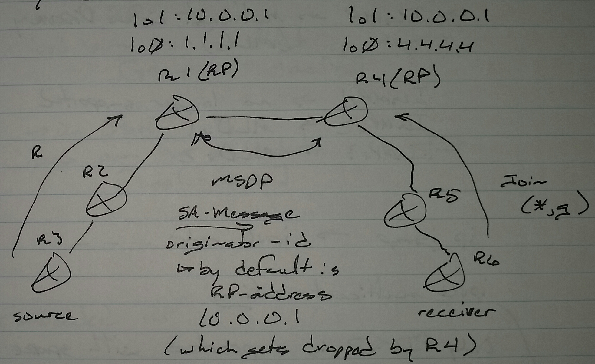

# Multicast Anycast RP - Class Notes

**Multicast Anycast RP** \(1 Sept 2014\)Lab: Multicast 1 \- 4

 \- Allows the load balancing between RPs based on IGP metric \(proximity\) instead of groups

R1\(config\)\# int lo1

 ip add 10.0.0.1 255.255.255.255

ip pim rp\-candidate lo1

ip pim bsr\-candidate lo1

router eigrp 100

 network 10.0.0.1 0.0.0.0

ip msdp peer 4.4.4.4 connect\-source lo0

R4\(config\)\# int lo1

 ip add 10.0.0.1 255.255.255.255

ip pim rp\-candidate lo1

ip pim bsr\-candidate lo1

router eigrp 100

 network 10.0.0.1 0.0.0.0

ip msdp peer 1.1.1.1 connect\-source lo0

ip msdp originator\-id lo0

     \-\> **Needed on one side, otherwise the other RP will drop the MSDP packets**
