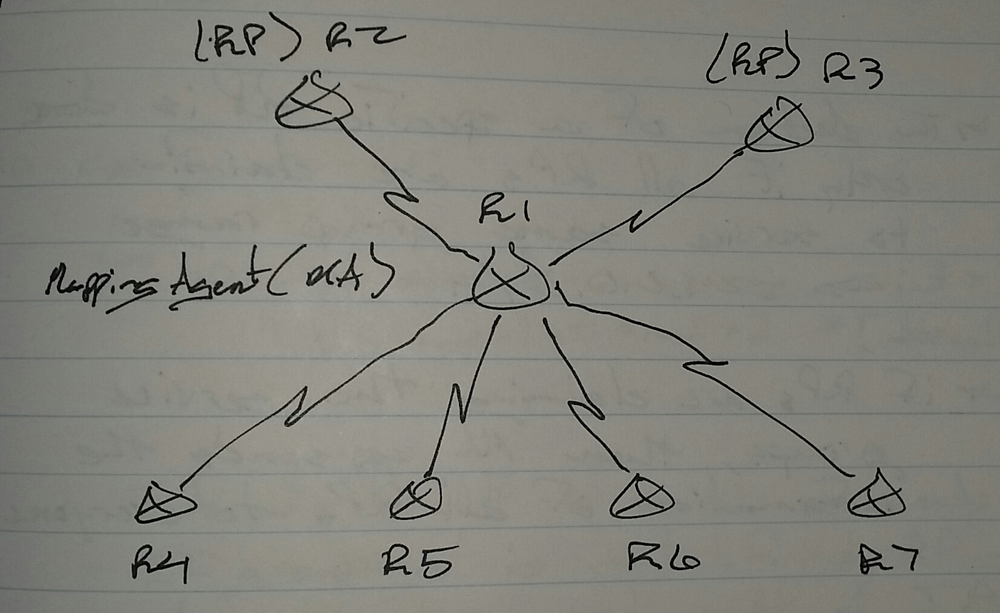

# Multicast Auto-RP - Class Notes

**Multicast Auto\-RP** \(1 Sept 2014\)

Lab: Multicast 1 \- 4

 \- Cisco proprietary

 \- Uses a Mapping Agent \(MA\) to distribute RP information

 \- RP informs the MA about themselves

     \-\> Announce message

 \- MA sends a Discovery message to all routes

 \- Announce message are multicast messages sent by RPs to the destination

     \-\> 224.0.1.39, UDP port 496

     \-\> Only MAs join the group and will receive the message

 \- Discovery messages are multicast messages sentby the MA to

     \-\> 224.0.1.40, UDP port 496

     \-\> All routers join this group and will receive the message

 \- If multiple RPs exist, only the higher IP address RP information is sent by the MA

 \- The election of a specific RP is done only if all RPs are claiming to service the same group range

     \-\> 224.0.0.0/4

 \- If RPs are claiming the service groups, then MA sends the information of all RPs to everyone

e.g. \-

R2 \-\> 224.0.0.0 \- 231.255.255.255

R3 \-\> 232.0.0.0 \- 239.255.255.255

     \-\> Both RPs will be used

Scenario \- R2 \(2.2.2.2\) \-\> 224.0.0.0 \- 235.255.255.255

R3 \(3.3.3.3\) \-\> 232.0.0.0 \- 239.255.255.255

     \-\> Overlapping range

          \-\> 232.0.0.0 \- 235.255.255.255

          \-\> R3 will be used for the RP because of the higher IP address

If multiple RPs are claiming the same range with different prefix\-lengths, then the longest matching prefix will be used

**Configuring the RP**

ip pim send\-rp\-announce \<int\> scope \<ttl\> \[group\-list \<acl\>\] \[interval \<sec\>\]

 \- The interval default is 60 seconds

 \- If group\-list is not definded, the RP will claim to serve all multicast IP addresses

**Configuring the MA**

ip pim send\-rp\-discovery \<int\> scope \<ttl\> \[interval \<sec\>\]

 

 \- The interval default is 60 seconds

R2\(config\)\# access\-list 1 permit 224.0.0.0 7.255.255.255

R3\(config\)\# access\-list 1 permit 224.0.0.0 15.255.255.255

 access\-list 1 permit 224.0.0.0 15.255.255.255

     \-\> This ACL covers the entire multicast IP address range

On any router

sh ip pim rp mapping

Configuring Auto\-RP

 1. Activate multicast routing

 2. Configure PIM sparse mode on all interfaces

 3. Configure RP and MA

Join messages have to be sent to

 \- Accounce \-\> 224.0.1.39

 \- Discovery \- 224.0.1.40

 \- Problem

     \-\> The router cannot join without knowing where to send the join messages

     \-\> The links are pruned

     \-\> This means that announce and discovery messages cannot be sent by default

 \- Solution

     \-\> Send messages in dense mode and flood the messages

          \-\> Change all ports to sparse\-dense\-mode

                    \- or \-

          \-\> Use sparse\-mode and configure all routers with ip pim autorp listener

               \-\> This commands converts the annouce and discovery groups to dense mode
