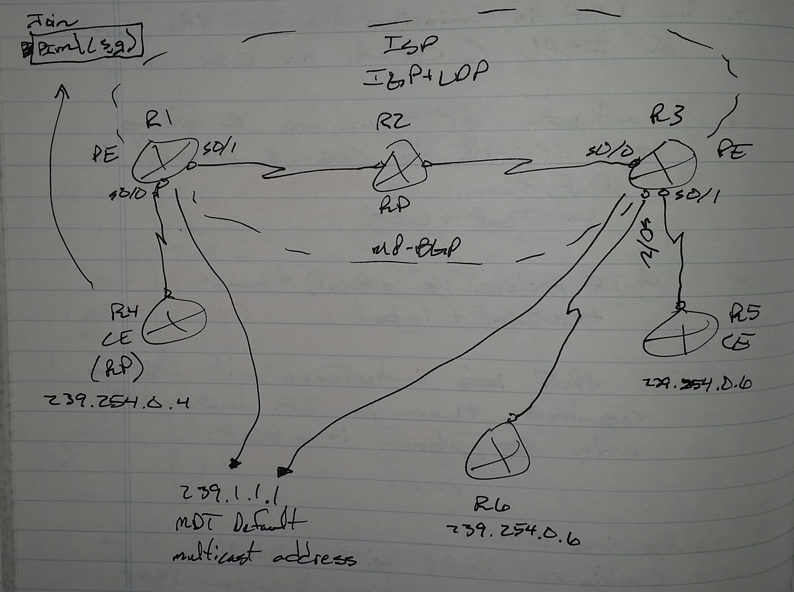
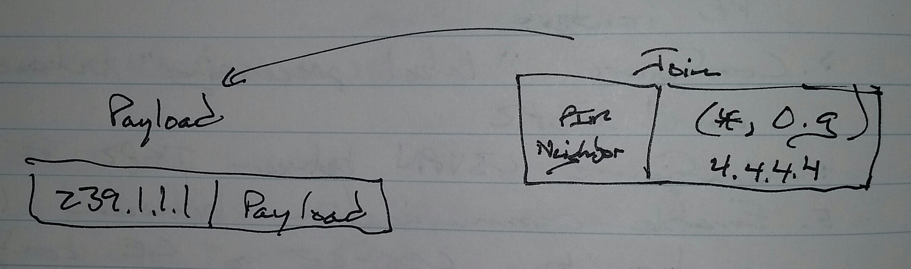
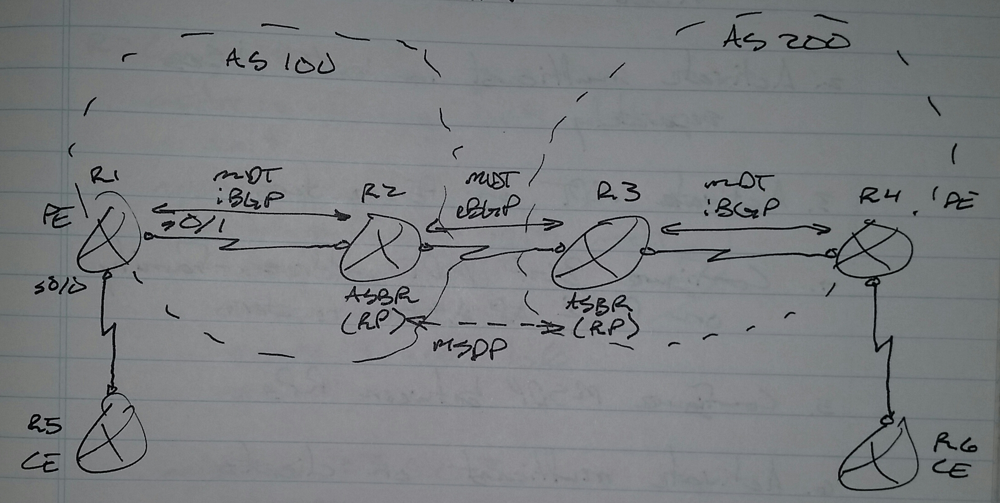
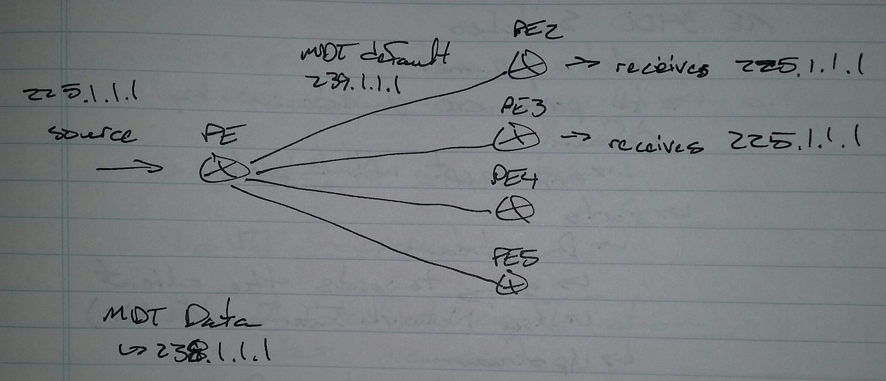

# Multicast Distribution Tree (MDT) - Class Notes

**Multicast Distribution Tree \(MDT\)** \(19 Sept 2014\)

Lab: MDT 1, MDT BGP, MDT with XR

 \- a.k.a

     \-\> Multicast VPN \(MVPN\)

     \-\> Multicast VRF \(MVRF\)

 \- Allows clients to exchange multicast traffic over MPLS L3VPN

**Configuration**

 1. Configure multicast in the ISP

 2. Configure VRF multicast on PE routers

 3. Configure multicast in the customer networks

 4. MDT address will be configured on all PE routers

 5. MDT address will be used to form an MDT tunnel between PE routers

 6. Any multicast traffic \( control plane / data plane \) coming from the customer will be encapsulated in MDT packets and sent to other PE routers

 7. The receiving PE routers deencapsulate the MDT packets if the internal multicast packet is destined for local VRF

IOS Router

R1\(config\)\# ip multicast\-routing

 ip multicast\-routing vrf ABC

int s0/0

 ip pim sparse\-mode

int s0/1

 ip pim sparse\-mode

ip pim rp\-address 2.2.2.2

ip pim vrf ABC rp\-address 4.4.4.4

ip vrf ABC

 mdt default 239.1.1.1

R4, R5, R6

 \- Basic multicast configuration

XR Router

R3\(config\)\# multicast\-routing

 address\-family ipv4

  int s0/0

   enable

 vrf ABC

  address\-family ipv4

   mdt default ipv4 239.1.1.1

   int s0/1

    enable

   int s0/2

    enable

router pim

 address\-family ipv4

  rp\-address 2.2.2.2

  int s0/0

   enable

 vrf ABC

 address\-family 4.4.4.4

  int s0/1

   enable

  int s0/2

   enable

**Inter\-AS Option A | B | C**

**MDT Tunnel**

 \- PE Address

     \-\> Not exchanged by default

          \-\> Solution is to send this information in BGP by using a special address\-family called "mdt"

 \- MDT Group

     \-\> Not exchanged by default

          \-\> Solution is to send this information in BGP by using a special address\-family called "mdt"

 \- ASBR routers add additional information to MDT updates called "Proxy RPF Vector"

 \- Proxy RPF Vector contains the intermediate next\-hop for RPF checks and join message propogation

 \- MSDP will be required once the PE address and MDT group of the other AS is known

     \-\> For this, the RP address for both ASs must be reachable from both ends

**Configuration**

 1. Configure MPLS L3VPN between ASs

 2. Activate multicast in both ASs separately

 3. Activate MDT on PE routers

 4. Configure BGP MDT address\-family on PE and ASBR routers

 5. Configure MSDP between RPs

 6. Activate multicast on customer network

IOS Router

R1\(config\)\# ip multicast\-routing

 ip multicast\-routing vrf ABC

int s0/0

 ip pim sparse\-mode

int s0/1

 ip pim sparse\-mode

ip pim rp\-address 2.2.2.2

ip pim vrf ABC rp\-address 5.5.5.5

router bgp 100

 no bgp default ipv4\-unicast

 neighbor 2.2.2.2 remotes\-as 100

 neighbor 2.2.2.2 update\-source lo0

 address\-family ipv4 mdt

  neighbor 2.2.2.2 activate

ip vrf ABC

 mdt default 239.1.1.1

XR Router

R2\(config\)\# router bgp 100

 address\-family ipv4 mdt

 neighbor 1.1.1.1

  address\-family ipv4 mdt

   next\-hop\-self

  remote\-as 100

  update\-source lo0

 neighbor 23.0.0.2

  address\-family ipv4 mdt

**IOS Router**

sh bgp ipv4 mdt all

sh ip pim mdt

sh ip pim mdt bgp

sh ip pim rp mapping

sh ip pim vrf ABC rp mapping

sh ip mspd summary

sh ip mroute

sh ip mroute vrf ABC

**XR Router**

sh bgp ipv4 mdt

sh pim mdt

sh pim range\-list

sh msdp summary

sh pim vrf ABC rp mapping

sh route ipv4 multicast

sh route vrf ABC ipv4 multicast

sh mfib route

sh mfib vrf ABC route

sh mfib mdt statistics

sh mfib vrf ABC mdt statistics

**MDT Tunnel Source Address**

 \- When MDT is configured between PE routers, they create an MDT tunnel

     \-\> The source address of the tunnel is the LDP router\-id;  or if BGP is configured, then the source address of the tunnel is the highest update\-source

     \-\> To configure the tunnel source manually

IOS Router

ip vrf ABC

 mdt defautl 239.1.1.1

 bgp next\-hop lo0

XR Router

multicast\-routing

 address\-family ipv4

  mdt source lo0

**MDT Data Groups**

 \- MDT default group is joined by all PE routers, so the traffic always goes to all PE routers

 \- If multicast traffic crosses a pre\-specified threshold, another tunnel can be created and joined only by interested PE routers

     \-\> This is called an MDT data group

Tunnel 239.1.1.1 \-\> Joined by PE 2, 3, 4, 5

TUnnel 238.1.1.1 \-\> Joined by PE 2, 3

Scenario \-\> MDT Default Group \- 239.1.1.1; MDT Data Group \- 238.1.1.0 \- 3

IOS Routers

 \- On all PE routers

ip vrf ABC

 mdt default 239.1.1.1

 mdt data 238.1.1.0 0.0.0.3 threshold 500

XR Routers

 \- On all PE routers

vrf ABC

 address\-family ipv4

  mdt default ipv4 239.1.1.1

  mdt data ipv4 238.1.1.0 0.0.0.3 threshold 500
