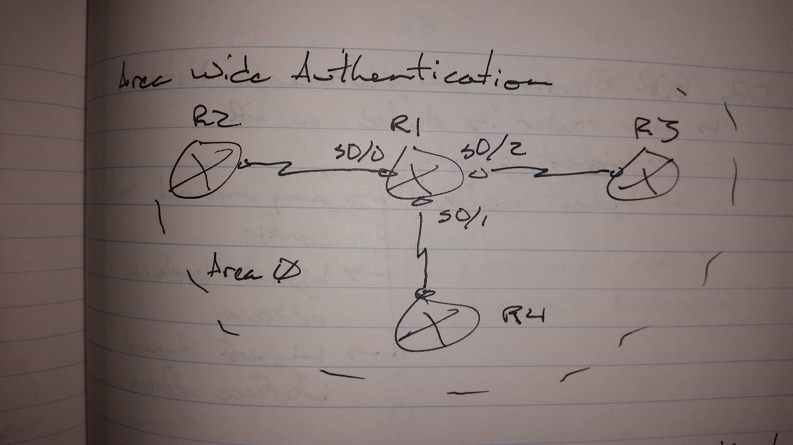
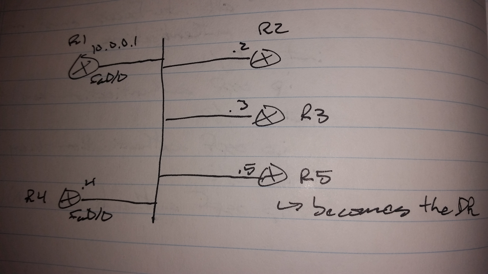
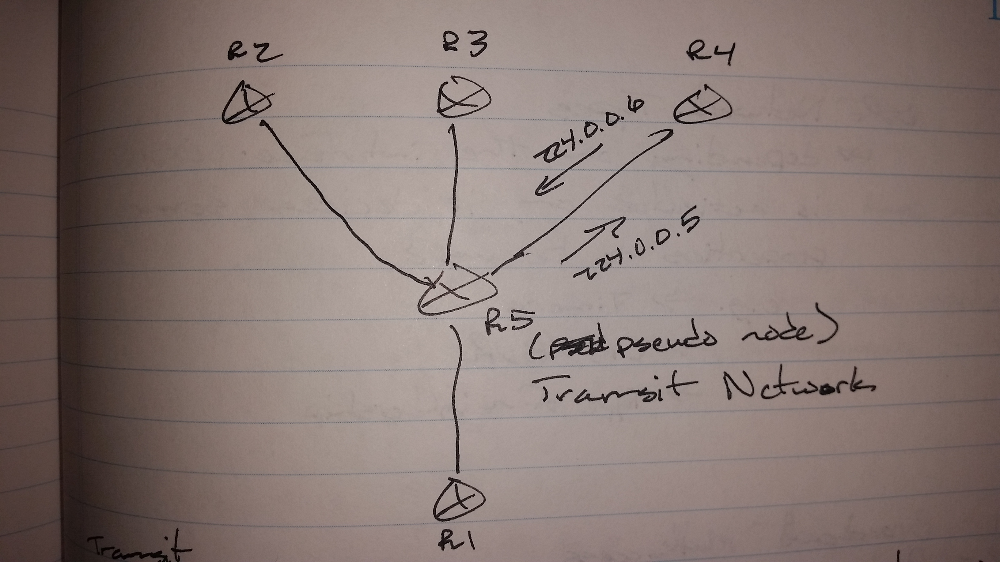
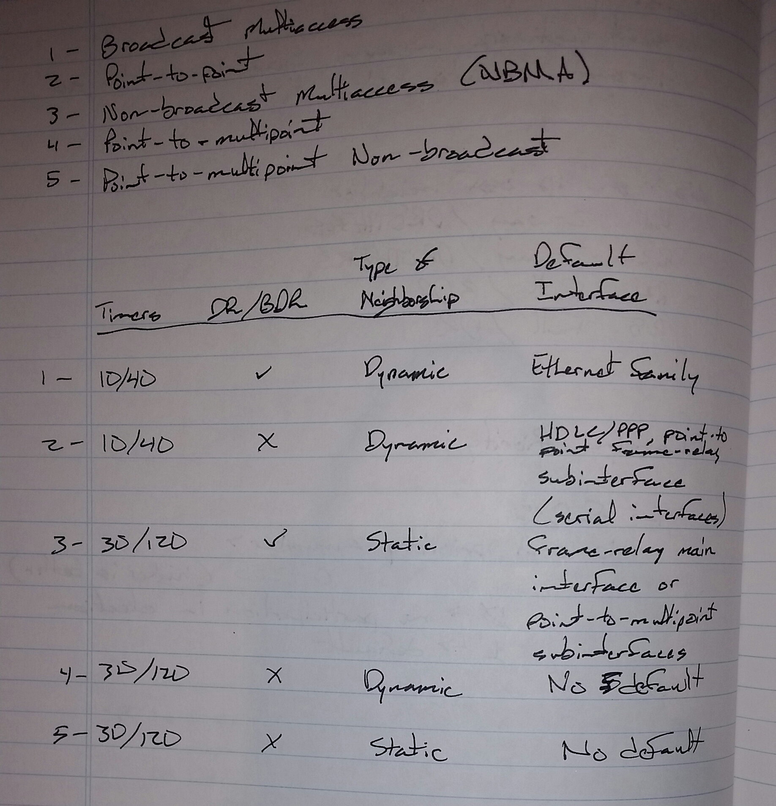
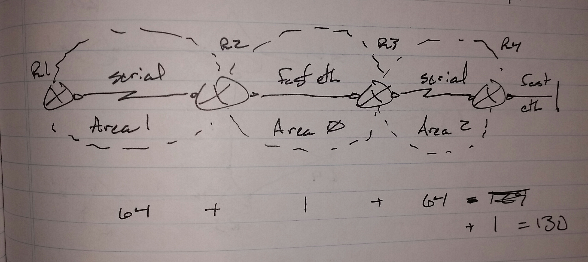
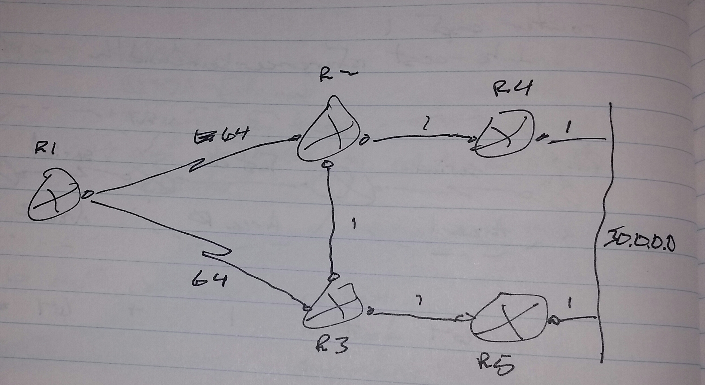
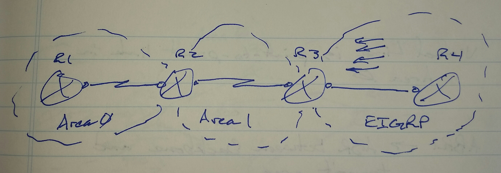
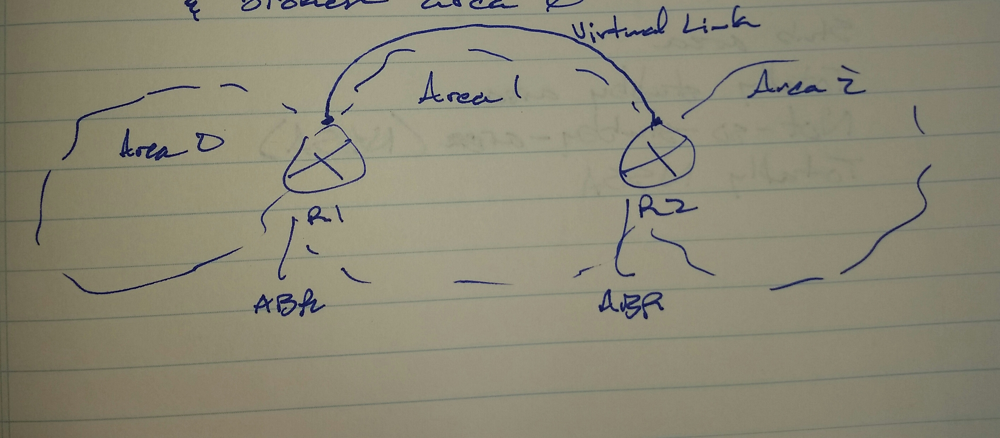
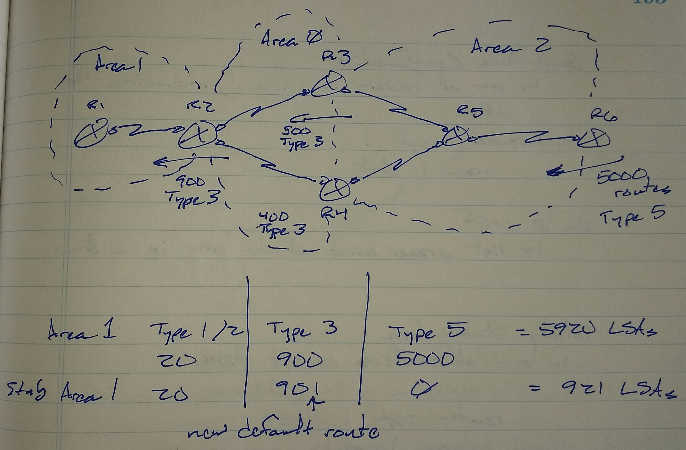

# OSPF - Class Notes

`classnotes`

**OSPF \-\> Open Shortest Path First**

Lab:  OSPF 1, OSPF 2a

\- Open standard
\- IP protocol 89 

\- Multicast addresses

     \-\> 224.0.0.5 \- all routers

     \-\> 224.0.0.6 \- all DR

\- Metric is cost

\- Link state protocol

\- Uses 3 tables

     \-\> Neighbor table

     \-\> Database table

     \-\> Routing table

\- SPF algorithm

\- Uses Designated Router and Backup Designated Router concept on multiaccess networks

     \-\>

\- Uses concept of areas

\- Types of packets

     \-\> Hello

     \-\> Database Descriptors \(DBD\)

     \-\> Link State Request \(LSR\)

     \-\> Link State Update \(LSU\)

     \-\> Link State Acknowledgment \(LSAck\)

**Neighbor formation**

\- Hellos are sent to 224.0.0.5

\- Hello packet

     \-\> Router\-id \(must be unique\)

     \-\> Area\-id \(must match\)

     \-\> Timers \(must match\)

          \-\> hello timer \- 10 sec \(LAN\) | 30 sec \(WAN\)

          \-\> dead timer \- 40 sec \(LAN\) | 120 sec \(WAN\)

     \-\> Authentication
     \-\> Network / subnet mask \(must match\)
     \-\> MTU \(must match\)
     \-\> Number of neighbors in the segment \(must match\)

**Finite State Machine \(FSM\)**

1. Down \- no hellos sent

2. Attempt \- frame\-relay or non\-broadcast networks where multicast hellos will not work

3. INIT \- Hello is sent to 224.0.0.5

4. 2\-WAY \- Parameters in hello packets match and both routers list each other as neighbors in hello packets

5. EXSTART \- Master / Slave election; router\-ids are compared \(higher is better\)

6. EXCHANGE \- DBDs are exchanged \(header information of the database, not the entire database\)

7. Loading \- Exchange of database

8. Full \- Both routers are completely synchronized

Steps 1 \- 4, a basic neighborship is formed

Step 8, fully adjacent neighborship

**Neighborship Control**

\- Timers \-\> 10 / 40

     int fa0/0

          ip ospf hello\-interval \<sec\>

          ip ospf dead\-interval \<sec\>

     sh ip ospf interface

     int fa0/0

          ip ospf dead\-interval minimal hello\-multiplier \<number of hellos\>

               \-\> dead interval set to 1 sec

               \-\> Hello \-\> e.g. \- 4 times a second, every 250 ms

\- Passive interface

     \-\> multicast hello processing is disabled

     router ospf 1

          passive\-interface { default | \<int\> }

     sh ip protocols

**Manual Neighborship**

\- Only allowed on non\-broadcast multi\-access \(NBMA\) networks

     router ospf 1

          neighbor \<ip address\>

**OSPF Authentication**

\- 3 types

     \-\> type 0 \- NULL

     \-\> type 1 \- plain text

     \-\> type 2 \- MD5

\- Configuration

     \-\> Interface \- connected neighbor must be configured

     \-\> Area\-wide \- all routers in the area must be configured

Interface level configuration

\- Plain text \(type 1\)

     int s0/0

          ip ospf authentication

          ip ospf authentication\-key \<password\>

\- MD5 \(type 2\)

     int s0/0

          ip ospf authentication

          ip ospf message\-digest\-key \<id\> md5 \<password\>

Area Wide Authentication

Scenario \-\> Configure area wide authentication on R1 for area 0, but R2 is not configured for authentication, so skip s0/0 of R1.

R1\(config\)\# router ospf 1

area 0 authentication

     \-\> all interfaces must now use authentication

int s0/1

  ip ospf authentication\-key \<password\>

int s0/2

  ip ospf authentication\-key \<password\>

int s0/0

  ip ospf authentication NULL

Interface configuration is preferred over area wide authentication

Virtual\-links are a special case with authentication and commonly comes up in the lab

**DR / BDR Election on multi\-access networks**

\- One router is elected the DR

     \-\> highest priority

     \-\> highest router\-id

          \-\> any manual router\-id config

          \-\> highest loopback address

          \-\> highest physical interface address

\- Another router which is second best is elected the BDR

\- All routers for a fully adjacent neighborship with the DR and BDR

     \-\> 2\-WAY neighborship is formed with all other routers

SPF is a point\-to\-point protocol

\- It doesn't work on multi\-access networks

\- DR becomes a pseudo node to create a logical point\-to\-point network

Transit network means you have to go through the pseudo node

R3\# sh ip ospf nei

     R1      2\-way / DROTHERS

     R2      2\-way / DROTHERS

     R4      Full / BDR

     R5      Full / DR

Changing Priority

     int fa0/0

          ip ospf priority \<number\>

               \-\> 0 \- 255 \(higher is better\)

               \-\> 0 \- no participation in election

               \-\> 1 \- default priority

**OSPF Network Types**

\- Depending on the interface OSPF is activated on, it decides some properties to be used

     \-\> Timers

     \-\> DR / BDR

     \-\> Type of neighborship

1. Broadcast Multi\-access

2. Point\-to\-point

3. Non\-broadcast Multi\-access \(NBMA\)

4. Point\-to\-multipoint

5. Point\-to\-multipoint Non\-broadcast

Frame\-relay default to NBMA

\- When it is setup as a hub and spoke

     \-\> If a spoke is elected DR, the other spokes will not be able to communicate with the DR

int s0/0

     ip ospf network \<options\>

sh ip ospf database

     \-\> shows database header information

**Link State Update \(LSU\)**

\- A set of LSAs \(Link State Advertisements\)

     \-\> LSA 1 \- Router LSA

          \-\> LSA\-ID \- router\-id

          \-\> neighbors connected to a router

          \-\> networks connected to a router

     \-\> LSA 2 \- Network LSA

          \-\> LSA\-ID \- IP address of DR

          \-\> Information about transit network \( DR / BDR / DROTHERS \)

          \-\> Originated by DR

     \-\> LSA 3 \- Summary LSA

          \-\> LSA\-ID \- for every network in the other area

          \-\> Created by ABR

          \-\> Cost to reach network from the ABR

     \-\> LSA 4 \- ASBR Summary

          \-\> LSA\-ID \- router\-id of ASBR

          \-\> Contains cost of ABR to reach ASBR

     \-\> LSA 5 \- AS\-External

          \-\> LSA\-ID \- external networks

          \-\> Created by ASBR

          \-\> Cost of ASBR to reach external networks

     \-\> LSA 7 \- Not\-so\-stubby\-area \(NSSA\)

          \-\> LSA\-ID \- external network

          \-\> Created by ASBR

          \-\> Cost of ASBR to reach external networks

sh ip ospf database \<LSA type\>

     \- router

     \- network

     \- summary

     \- asbr\-summary

     \- as\-external

     \- nsaa\-external

**OSPF Cost Calculation**

\- Cumulative cost of all exit interfaces towards destination

Cost of serial ethernet = 100 / 1.544 = 64

Cost of fast ethernet = 100 / 100 = 1

Cost of gigabit ethernet = 100 / 1000 = 1

Fast ethernet and Gigabit ethernet having the same cost is not a good thing

On the exam, if you see Gigabit ethernet interfaces, you may need to change the formula

     router ospf 1

          auto\-cost reference\-bandwidth \<Mbps\>

R3\# sh ip ospf database route 4.4.4.4

     \-\> shows the cost to R4's connected network from R4's point of view

The change cost

     \-\> bandwidth manipulation

     int s0/0

          bandwidth 2000

     int s0/0

          ip ospf cost \< 1 \- 65535 \>

R1 to 50.0.0.0

\- Route \#1 \- R1 \-\> R2 \-\> R4 \-\> 50.0.0.0 = cost of 66

\- Route \#2 \- R1 \-\> R3 \-\> R5 \-\> 50.0.0.0 = cost of 66

Scenario \-\> Change the cost in this diagram in such a way that R1 goes to 50.0.0.0 by following the route R1 \-\> R2 \-\> R3 \-\> R5 \-\> 50.0.0.0

When asked a question about traffic engineering, always start at the end

     \-\> R2's link to R4 \- ip ospf cost 3

     \-\> R1's link to R3 \- ip ospf cost 67

**OSPF Summarization**

\- Can be done on Area Border \(ABR\)

\- Can be done on Domain Border \(ASBR\)

     \-\> border between routing protocols

\-You cannot summarize within an area
     \-\> That would defeat the point of SPF
 \- summary\-address
     \-\> Used for external networks
 \- area \<num\> range
     \-\> Used for inter\-area networks

R2\(config\)\# router ospf 1

area \<source area\> range \<network\> \<subnet\>

router ospf 1

area 0 range 10.0.0.0 255.255.252.0

R3\(config\)\# router ospf 1

redistribute eigrp 1 subnets

summary\-address 192.168.0.0 255.255.254.0

**Default Route**

router ospf 1

default\-information originate \[always\] \[router\-map \<name\>\] \[metric \<value\>\] \[metric\-type \[1|2\]\]

     \-\> always

          \-\>without this keyword, the local router needs a default route in the routing table

          \-\> with this keyword, the default route is injected regardless of a default route being represent in the local routing table

     \-\> metric \- default is 1

**OSPF Filtering**

\- Filtering is only possible on Area Borders

router ospf 1

area \<number\> filter\-list prefix \<name\> in | out

Scenario \-\> Filter lo0 of R3 from Area 0

R2\(config\)\# ip prefix\-list ABC deny 3.3.3.3 255.255.255.255

ip prefix\-list ABC permit 0.0.0.0 0.0.0.0 le 32

router ospf 1

area 0 filter\-list prefix ABC in

It's preferable to filter out of an area when multiple areas are present

\- Filtering coming into an area does not stop the router from entering the database table

     \-\> it can be filtered and prevented from entering the routing table

R1\(config\)\# access\-list 1 deny 3.3.3.3

access\-list 1 permit any

router ospf 1

distribute\-list 1 in

Not a good method;  it can cause problems, but will likely come up in the exam

\- A static route pointing to NULL0 is much better, but static routes are heavily frowned upon in the exam

**Filtering by Distance**

router ospf 1

distance 255 \<source\> \<wildcard\> \<acl\>

**Filtering External Routes**

Scenario \-\> R3 is redistributing the following routes from EIGRP

     \- 10.0.0.0 /24

     \- 10.0.1.0 /24

     \- 10.0.2.0 /24

     \- 10.0.3.0 /24

          \-\> Filer 10.0.0.0 and 10.0.1.0 when redistributing

R3\(config\)\# router ospf 1

redistribute eigrp 1 subnets

summary\-address 10.0.0.0 255.255.254.0 not\-advertise

**Virtual Links**

\- Used to connect discontiguous areas and broken area 0

\- A virtual link is a point\-to\-point link in area 0

ABR1 \- ABR between backbone and transit area

ABR2 \- ABR between transit area and discontiguous area

ABR1 | ABR2

router ospf 1

area \<transit area\> virtual\-link \<router\-id of other ABR\>

R1\(config\)\# router ospf 1

area 1 virtual\-link 2.2.2.2

R2\(config\)\# rotuer ospf 1

area 1 virtual\-link 1.1.1.1

sh ip ospf interface

**Stub Areas**

\- Stub area

\- Totally stubby area

\- Not\-so\-stubby\-area \(NSSA\)

\- Totally NSSA

Stub area

\- Does not allow type 5 routes into the area

\- All external routes \(type 5\) are filtered by ABR and replaced with one type 3 default route

Totally stubby area

\- Do not allow type 3 or type 5 routes into the area

\- Replaced with a type 3 default route

**Stub Area Configuration**

\- On all routers in area 1, including the ABR

router ospf 1

area 1 stub

sh ip ospf

\- lists areas and which ones are stubs

**Totally Subby Area Configuration**

\- On all routers in the area except the ABR

router ospf 1

area 1 stub

\- On ABR

router ospf 1

area 1 stub no\-summary

NSSA

\- Stub area with redistribution possible

\- It's a stub area with an ASBR

\- External routes created inside the NSSA are type 7

     \-\> Because type 5 LSAs are not allowed in stub areas

\- When type 7 LSAs reach an ABR between the NSSA and area 0, the LSAs are translated to type 5 LSAs by a "translator ABR"

\- If multiple ABRs are present, there will be a translator election and the one with the highest router\-id wins

If area 2 is filtering R6's address from area 0, then after translation from type 7 to type 5, area 0 routes would not be able to reach the external routers from the NSSA

type 5

network 50.0.0.0

originator\-id 4.4.4.4

forwarding address 6.6.6.6 \-\> 0.0.0.0

     \-\> forwarding address would need to be suppressed when translated from type 7 to type 5

**NSSA Configuration**

\- On all routers in the area, including the ABR

router ospf 1

area 2 nssa

**Totally NSSA Configuration**

\- On all routers in the area, except the ABR

router ospf 1

area 2 nssa

\- On the ABR

router ospf 1

area 2 nssa no\-summary

To suppress forwarding address on translator ABR

router ospf 1

area 2 nssa translate type 7 supress\-fa

no\-redistribution
 \- When no\-redistribution is done, it will normally create type 5 and type 7 LSAs
 \- By using the keyword "no\-redistribution", the ABR is instructed not to generate type 7 LSAs

R4\(config\)\# router ospf 1
 area 2 nssa no\-redistribution
     \-\> Stub area \- injects a default router type 3 LSA
     \-\> Totally stubby area \- injects a default route type 3 LSA
     \-\> NSSA \- no default route is injected
     \-\> Totally NSSA \- default router type 3 LSA

To inject a default router in a NSSA

router ospf 1
 area 2 nssa default\-information\-originate
     \-\> This will create a type 7 default route be injected into the NSSA
