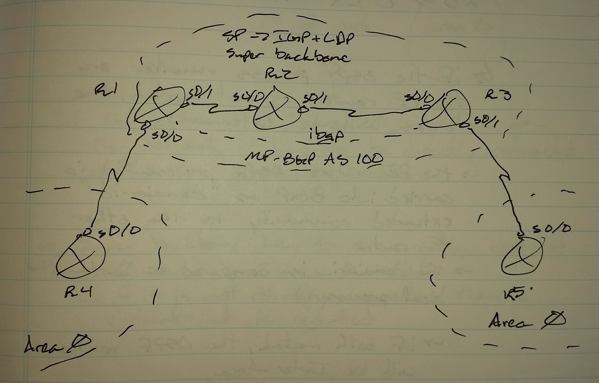
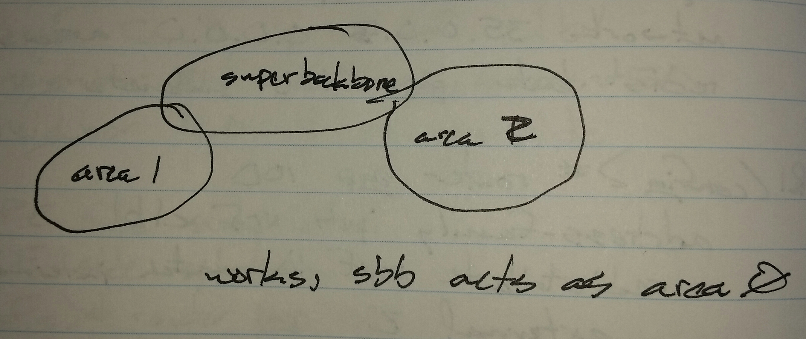
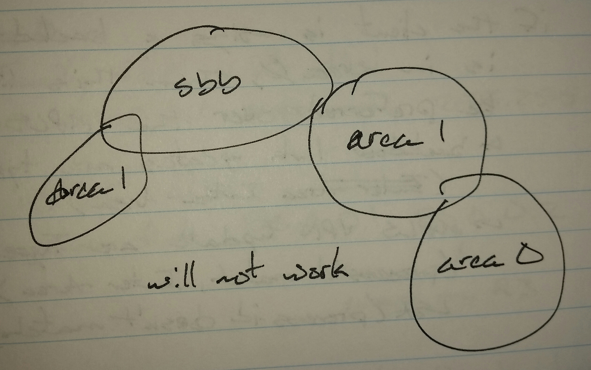

# OSPF as the PE - CE Protocol - Class Notes

**OSPF as the PE \- CE Protocol** \(3 Sept 2014\)

Lab:  MPLS 1 \- 3

Configuration assumes IGP \+ LDP is complete, MP\-BGP is complete, and CE IGP is complete

R1\(config\)\# router ospf 10 vrf c1b1

 network 14.0.0.1 0.0.0.0 area 0

 redistribute bgp 100 subnets

R3\(config\)\# router ospf 10 vrf c1b2

 network 35.0.0.3 0.0.0.0 area 0

 redistribute bgp 100 subnets

R1\(config\)\# router bgp 100

 address\-family ipv4 vrf c1b1

  redistribute ospf 100 match internal external 1 external 2

R3\(config\)\# router bgp 100

 address\-familty ipv4 vrf c1b2

  redistribute ospf 10 match internal external 1 external 2

sh ip route

 On R4 \-\> O IA 5.5.5.5

 On R5 \-\> O IA 4.4.4.4

If the OSPF process number on the CE routers do not match, the routes will be external.

 \- The PE router's OSPF process\-id is carried into BGP as the "domain\-id" extended community to the other PE router

 \- The domain\-id is compared with the local process\-id

     \-\> If they match, the OSPF routes will be Inter\-Area

     \-\> If the do not match, the OSPF routes will be external \(E2\)

The PE network acts as a super backbone area for the customer's OSPF.

Instructor comment, "The super backbone is like a higher, more intellignt area 0."

If the customer has area 0 anywhere on the network, it has to be directly connected with the super backbone

     \-\> If area 0 is not directly connected with the super backbone, virtual\-links are required
