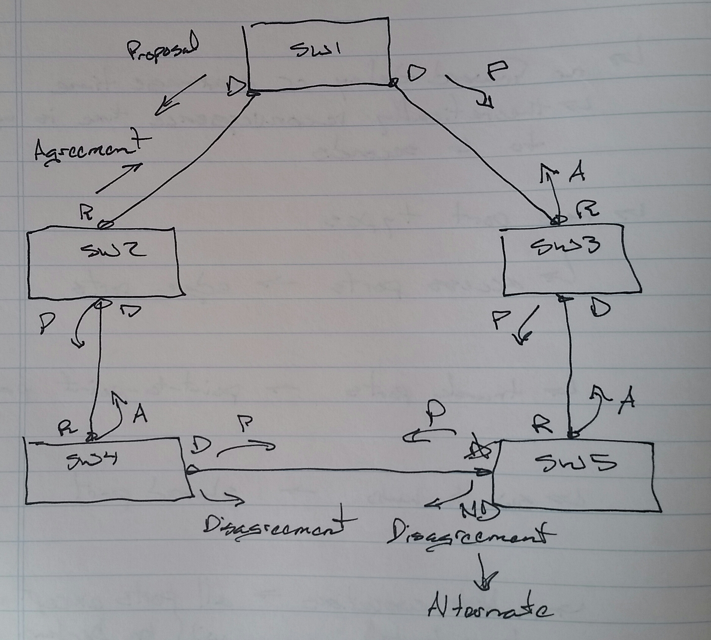
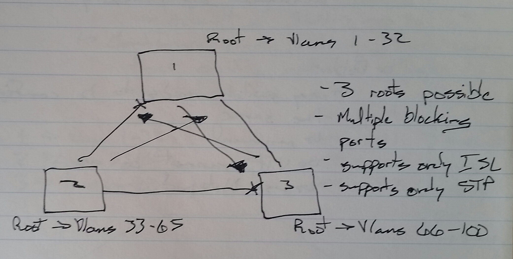

# Rapid STP (RSTP) - Class Notes

**Rapid STP \(RSTP\)**

 \- 802.1W

 \- STP plus fast convergence features

 \- No forward\-delay or max\-age\-time
     \-\> Theoretical reconvergence time is up to 6 seconds

**New Port Types**
 \- Access ports —\> Edge port
 \- Trunk port —\> Point\-to\-Point port
 \- Switch to Hub —\> Shared port
 \- Multiple connections to a Hub —\> All ports except one will become Backup ports
     \-\> Backup ports are ports that receive our own BPDUs

Failover does not have to wait for reconvergence

**Proposal**
 \- Please make this port a root port
 \- Receiving switch
     \-\> Disconnect from rest of topology
     \-\> Decide
     \-\> Send agreement
     \-\> Make port a root port
     \-\> Reconnect to the rest of topology
 \- Disagreement
     \-\> Both switches don’t want to change port to a root port
 \- The root bridge never sends an agreement

**Proposal and Agreement Procedure**
     1.  In RSTP once the root bridge is elected, it sends a Proposal message out all designated ports
     2.  The Proposal is a request to make the receiving port a root port
     3.  Whenever a switch receives a Proposal, it disconnects itself from the rest of the topology to decide to agree or disagree
     4.  If agree, an Agreement message is sent back and the sending port becomes a root port
     5.  Once the root port is decided, the switch sends Proposal messages further out potential designated ports

**Configuring RSTP**

SW1\(config\)\#  spanning\-tree mode rapid\-pvst

**Convergence Methods**
 \- Only two
     \-\> STP 
          \-\> Slower
     \-\> RSTP
          \-\> Faster
          \-\> Used by MST for convergence

**Topological Design**
  \- STP to VLAN mapping
     \-\> Common Spanning Tree \(CST\)
     \-\> Per\-VLAN Spanning Tree \(PVST\)
     \-\> Per\-VLAN Spanning Tree \+ \(PVST\+\)
     \-\> Multiple Spanning Tree \(MST\)

**Common Spanning Tree \(CST\)**
 \- One STP instance for all VLANs
 \- Only one root election
 \- Limited to 100 VLANs
 \- No load balancing between links or switches
 \- Only supports dot1q
 \- Only supports STP for convergence

**Per\-VLAN Spanning Tree \(PVST\)**
 \- One STP instance per VLAN
 \- 100 VLANs means
     \-\> 100 STP instances
     \-\> 100 root bridges
     \-\> 100 BPDUs
 \- Only supports ISL
 \- Only supports STP for convergence

**Per\-VLAN Spanning Tree \+ \(PVST\+\)**
 \- Supports both ISL and dot1q
 \- Supports both STP and RSTP for convergence
